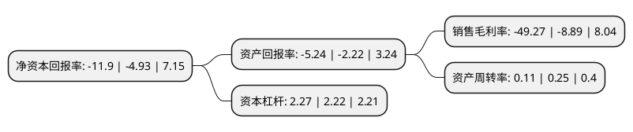

> 本页面由自动化程序生成于 2022年5月20日 01:01
> 内容可能存在错误，如有bug请提交issue至：https://github.com/Eroleice/doc-pi/issues
{.is-warning}

# 上市公司基本情况

## 基本资料

东旭光电科技股份有限公司（以下简称“东旭光电”）成立于1992年12月26日，石家庄市。于1996年09月25日在深交所主板上市。

东旭光电注册资本573,025.012万元，主要产品:电真空玻璃器件及配套的电子元器件。以下是详细信息：

- 公司名称: 东旭光电科技股份有限公司
- 股票代码: 000413.SZ
- 所在地: 河北 - 石家庄市
- 成立日期: 1992年12月26日
- 注册资本: 573,025.012万元
- 法定代表人: 郭轩
- 主营业务: 主要产品:电真空玻璃器件及配套的电子元器件
- 公司官网: www.dongxuguangdian.com.cn
- 公司介绍: 公司是国内领先的集液晶玻璃基板装备制造、技术研发及生产销售于一体的高新技术企业，也是全球领先的光电显示材料供应商。，公司从光电显示产业起步，逐渐发展成为集液晶玻璃基板、盖板玻璃、偏光片、彩色滤光片、蓝宝石等光电显示材料、高端装备制造及系统集成、石墨烯产业化应用、新能源汽车研发及制造、智慧城市建设等业务为一体的综合性高新技术企业，产业上下游纵向布局及横向联动不断深化，逐渐形成了具有综合竞争力的新兴产业集群。

## 股东及高管情况

上市公司第一大股东为东旭集团有限公司，持股915,064,091股，占比15.97%，**疑似为**上市公司实际控制人。

截至2022年03月31日，上市公司的前十大股东中，共有4名自然人股东，6名机构股东，其中5%以上大股东共有1名。上市公司前十大股东明细如下：

> 未能通过持股比例判定出上市公司实际控制人（持股30%以上）
> 可能存在通过间接持股、联合持股、协议控制等方式拥有实际控制权的主体，具体请参考上市公司定期公告！
{.is-warning}

> 截至2022年03月31日，上市公司前十大股东信息如下：

| 股东名称 | 持股数量（股） | 持股比例 |
| --- | --- | --- |
| 东旭集团有限公司 | 915,064,091 | 15.97% |
| 上海辉懋企业管理有限公司 | 262,626,262 | 4.58% |
| 石家庄宝石电子集团有限责任公司 | 251,665,471 | 4.39% |
| 深圳泰安尔信息技术有限公司 | 61,165,682 | 1.07% |
| 昆山开发区国投控股有限公司 | 41,838,269 | 0.73% |
| 李飚 | 32,954,706 | 0.58% |
| 绵阳科技城发展投资(集团)有限公司 | 11,380,165 | 0.2% |
| 林曙阳 | 11,360,021 | 0.2% |
| 徐开东 | 10,593,500 | 0.18% |
| 王勇 | 9,650,000 | 0.17% |

## 杜邦分析

> 数据列示周期：2020年 | 2019年 | 2018年
{.is-info}

上市公司的净资产收益率在近一年有所上升，上升幅度为141.38%，其变化情况分解如下：
- 上市公司的销售毛利率在近一年上升了454.22%，可能是生产效率的提升、商品原材料价格下跌或商品价格的上涨所致。
- 上市公司的资产周转率在近一年下降了-56%，可能是源自于更慢的销售回款或库存管理效果下降。
- 上市公司的财务杠杆比率在近一年上升了2.25%，可能是增加负债扩大生产规模。

