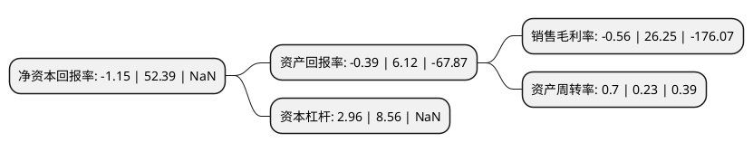

> 本页面由自动化程序生成于 2022年5月20日 01:02
> 内容可能存在错误，如有bug请提交issue至：https://github.com/Eroleice/doc-pi/issues
{.is-warning}

# 上市公司基本情况

## 基本资料

华塑控股股份有限公司（以下简称“*ST华塑”）成立于1990年10月18日，南充市。于1993年05月07日在深交所主板上市。

*ST华塑注册资本107,312.805万元，主要产品:建材(型材及门窗)，服装(来料加工)。以下是详细信息：

- 公司名称: 华塑控股股份有限公司
- 股票代码: 000509.SZ
- 所在地: 四川 - 南充市
- 成立日期: 1990年10月18日
- 注册资本: 107,312.805万元
- 法定代表人: 赵林
- 主营业务: 主要产品:建材(型材及门窗)，服装(来料加工)
- 公司官网: null
- 公司介绍: 公司已经从一家羊绒制品加工企业发展成为涵盖羊绒服装、资源矿产开发和能源综合利用等多元化经营的大型现代综合产业集团。公司主要业务可分为羊绒服装、电力冶金化工两大板块。其中，羊绒服装板块为公司所从事的羊绒品类服装及服饰为主的生产加工、品牌建设与市场销售；电力冶金化工板块为公司下属子公司电冶集团下属公司及联营公司所从事的煤炭采选、发电、硅类铁合金、氯碱化工、多晶硅等产品的加工及销售。公司是通过欧盟环保认定的硅铁生产企业，享受欧盟入口关税减半政策。是内蒙古自治区级循环经济示范企业，同时也是“资源节约型、环境友好型”的认证试点企业。

## 股东及高管情况

上市公司第一大股东为湖北省资产管理有限公司，持股247,644,935股，占比23.08%，**疑似为**上市公司实际控制人。

截至2022年03月31日，上市公司的前十大股东中，共有5名自然人股东，4名机构股东，1个产品账户，其中5%以上大股东共有2名。上市公司前十大股东明细如下：

> 未能通过持股比例判定出上市公司实际控制人（持股30%以上）
> 可能存在通过间接持股、联合持股、协议控制等方式拥有实际控制权的主体，具体请参考上市公司定期公告！
{.is-warning}

> 截至2022年03月31日，上市公司前十大股东信息如下：

| 股东名称 | 持股数量（股） | 持股比例 |
| --- | --- | --- |
| 湖北省资产管理有限公司 | 247,644,935 | 23.08% |
| 西藏麦田创业投资有限公司 | 199,205,920 | 18.56% |
| 上海迎水投资管理有限公司-迎水月异4号私募证券投资基金 | 29,192,000 | 2.72% |
| 沂水县新展贸易有限公司 | 16,509,600 | 1.54% |
| 王新生 | 6,886,900 | 0.64% |
| 陈敏芬 | 4,999,000 | 0.47% |
| 赵霄 | 4,167,004 | 0.39% |
| 何迟 | 3,950,000 | 0.37% |
| 青岛通产橡胶制品有限公司 | 3,827,200 | 0.36% |
| 蔡德山 | 3,169,722 | 0.3% |

## 利润表分析

上市公司2021年总收入为2.94亿元，净利润为-0.02亿元，**未实现盈利**。

## 杜邦分析

> 数据列示周期：2021年 | 2020年 | 2019年
{.is-info}

上市公司的净资产收益率在近一年有所下降，下降幅度为-102.2%，其变化情况分解如下：
- 上市公司的销售毛利率在近一年下降了-102.13%，可能是生产效率的下降、商品原材料价格上涨或商品价格的下跌所致。
- 上市公司的资产周转率在近一年上升了204.35%，可能是源自于更快的销售回款或库存管理效果提升。
- 上市公司的财务杠杆比率在近一年下降了-65.42%，可能是减少负债降低财务费用。

