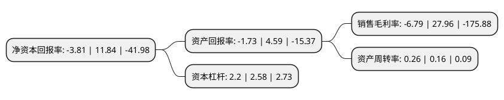

> 本页面由自动化程序生成于 2022年5月20日 01:02
> 内容可能存在错误，如有bug请提交issue至：https://github.com/Eroleice/doc-pi/issues
{.is-warning}

# 上市公司基本情况

## 基本资料

华映科技(集团)股份有限公司（以下简称“华映科技”）成立于1995年05月25日，福州市。于1993年11月26日在深交所主板上市。

华映科技注册资本276,603.28万元，主营业务液晶模组制程以下是详细信息：

- 公司名称: 华映科技(集团)股份有限公司
- 股票代码: 000536.SZ
- 所在地: 福建 - 福州市
- 成立日期: 1995年05月25日
- 注册资本: 276,603.28万元
- 法定代表人: 林俊
- 主营业务: 主营业务液晶模组制程
- 公司官网: www.cpttg.com
- 公司介绍: 公司是全球重要的核心平板显示零部件专业制造商。公司深耕中小尺寸面板产品加工，借力实际控制人面板技术研发、量产经验和客户资源，已基本形成以液晶模组为基础，兼有盖板玻璃(科立视)、面板(华佳彩)的触控一条龙产品的战略布局，从而为客户提供从玻璃、面板到液晶模组的触控一条龙解决方案。公司针对触控产业的迅猛发展势头积极调整经营战略，已就现有模组业务进行整合，切入主要应用于PAD、手机及电子书等中小触控产品的模组业务，同时整合上下游产业链，逐步收购具有触控一条龙产品业务的子公司，并向上游触控组件材料领域进军，投资设立触控组件材料公司。

## 股东及高管情况

上市公司第一大股东为福建省电子信息产业创业投资合伙企业(有限合伙)，持股379,867,047股，占比13.73%，**疑似为**上市公司实际控制人。

截至2022年03月31日，上市公司的前十大股东中，共有2名自然人股东，8名机构股东，其中5%以上大股东共有4名。上市公司前十大股东明细如下：

> 未能通过持股比例判定出上市公司实际控制人（持股30%以上）
> 可能存在通过间接持股、联合持股、协议控制等方式拥有实际控制权的主体，具体请参考上市公司定期公告！
{.is-warning}

> 截至2022年03月31日，上市公司前十大股东信息如下：

| 股东名称 | 持股数量（股） | 持股比例 |
| --- | --- | --- |
| 福建省电子信息产业创业投资合伙企业(有限合伙) | 379,867,047 | 13.73% |
| 莆田市国有资产投资集团有限责任公司 | 379,867,046 | 13.73% |
| 福建省电子信息(集团)有限责任公司 | 315,966,487 | 11.42% |
| 中华映管(百慕大)股份有限公司 | 297,889,715 | 10.77% |
| 中国长城资产管理股份有限公司 | 95,726,495 | 3.46% |
| 福能六期(平潭)创业投资合伙企业(有限合伙) | 92,535,618 | 3.35% |
| 夏重阳 | 30,890,000 | 1.12% |
| 中民国际通用航空有限责任公司 | 29,319,800 | 1.06% |
| 王儒 | 20,806,057 | 0.75% |
| 长城国融投资管理有限公司 | 15,970,000 | 0.58% |

## 利润表分析

上市公司2021年总收入为30.13亿元，净利润为-2.05亿元，**未实现盈利**。

## 杜邦分析

> 数据列示周期：2021年 | 2020年 | 2019年
{.is-info}

上市公司的净资产收益率在近一年有所下降，下降幅度为-132.18%，其变化情况分解如下：
- 上市公司的销售毛利率在近一年下降了-124.28%，可能是生产效率的下降、商品原材料价格上涨或商品价格的下跌所致。
- 上市公司的资产周转率在近一年上升了62.5%，可能是源自于更快的销售回款或库存管理效果提升。
- 上市公司的财务杠杆比率在近一年下降了-14.73%，可能是减少负债降低财务费用。

