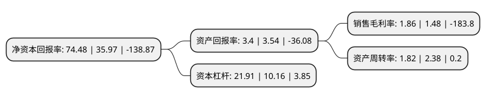

> 本页面由自动化程序生成于 2022年5月20日 01:03
> 内容可能存在错误，如有bug请提交issue至：https://github.com/Eroleice/doc-pi/issues
{.is-warning}

# 上市公司基本情况

## 基本资料

冠捷电子科技股份有限公司（以下简称“冠捷科技”）成立于1993年01月08日，南京市。于1997年05月20日在深交所主板上市。

冠捷科技注册资本452,956.698万元，主要业务包括显示器，电视及影音产品的研发，制造，销售与服务以下是详细信息：

- 公司名称: 冠捷电子科技股份有限公司
- 股票代码: 000727.SZ
- 所在地: 江苏 - 南京市
- 成立日期: 1993年01月08日
- 注册资本: 452,956.698万元
- 法定代表人: 宣建生
- 主营业务: 主要业务包括显示器，电视及影音产品的研发，制造，销售与服务
- 公司官网: www.tpv-tech.com
- 公司介绍: 公司为全球第一大显示器及领先的液晶电视智能制造企业。前身艾德蒙海外股份有限公司1967年于台湾成立。曾于1999年在香港与新加坡上市。2020年与深交所上市公司南京华东电子信息科技股份有限公司进行重大资产重组。重组完成后上市公司由液晶面板行业转型为智能显示终端制造行业，主要业务包括显示器、电视及影音产品的研发、制造、销售与服务。公司坚持自有品牌业务和智能制造服务双轨发展：不断改善升级制造工艺流程，探索形成了较为成熟的智能制造模式。旗下拥有多个显示器自有品牌AOC、AGON和Envision等，并长期获得飞利浦(Philips)独家授权运营其显示器、电视、耳机、音响及手机等业务，产品曾多次荣获德国红点产品设计奖、德国iF设计奖等国际工业设计大奖等。公司凭借多年的制造经验及优良的品质赢得了全球多家知名电视和个人电脑品牌商的青睐，长期保持合作关系。公司高度重视自主创新，持续推出满足不同终端消费者和商业客户需求的显示产品，致力于打造全行业、全场景、全尺寸的视讯解决方案。

## 股东及高管情况

上市公司第一大股东为南京中电熊猫信息产业集团有限公司，持股1,110,344,828股，占比24.51%，**疑似为**上市公司实际控制人。

截至2022年03月31日，上市公司的前十大股东中，共有4名自然人股东，4名机构股东，1个产品账户，1个海外主体，其中5%以上大股东共有3名。上市公司前十大股东明细如下：

> 未能通过持股比例判定出上市公司实际控制人（持股30%以上）
> 可能存在通过间接持股、联合持股、协议控制等方式拥有实际控制权的主体，具体请参考上市公司定期公告！
{.is-warning}

> 截至2022年03月31日，上市公司前十大股东信息如下：

| 股东名称 | 持股数量（股） | 持股比例 |
| --- | --- | --- |
| 南京中电熊猫信息产业集团有限公司 | 1,110,344,828 | 24.51% |
| 南京新工投资集团有限责任公司 | 432,336,244 | 9.54% |
| 南京机电产业(集团)有限公司 | 431,607,970 | 9.53% |
| 南京华东电子集团有限公司 | 163,832,956 | 3.62% |
| 富安达基金-南京新工投资集团有限责任公司-富安达睿选5号权益类单一资产管理计划 | 56,230,000 | 1.24% |
| 香港中央结算有限公司(陆股通) | 31,130,760 | 0.69% |
| 徐瑞 | 16,640,500 | 0.37% |
| 黄伟涛 | 13,495,319 | 0.3% |
| 胡大成 | 11,103,200 | 0.25% |
| 谢福琳 | 10,600,060 | 0.23% |

## 利润表分析

上市公司2021年总收入为706.1亿元，净利润为13.16亿元，实现盈利。

## 杜邦分析

> 数据列示周期：2021年 | 2020年 | 2019年
{.is-info}

上市公司的净资产收益率在近一年有所上升，上升幅度为107.06%，其变化情况分解如下：
- 上市公司的销售毛利率在近一年上升了25.68%，可能是生产效率的提升、商品原材料价格下跌或商品价格的上涨所致。
- 上市公司的资产周转率在近一年下降了-23.53%，可能是源自于更慢的销售回款或库存管理效果下降。
- 上市公司的财务杠杆比率在近一年上升了115.65%，可能是增加负债扩大生产规模。

