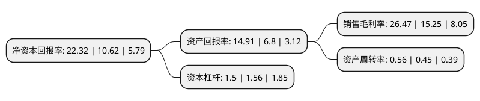

> 本页面由自动化程序生成于 2022年5月20日 01:03
> 内容可能存在错误，如有bug请提交issue至：https://github.com/Eroleice/doc-pi/issues
{.is-warning}

# 上市公司基本情况

## 基本资料

中国振华(集团)科技股份有限公司（以下简称“振华科技”）成立于1997年06月26日，贵阳市。于1997年07月03日在深交所主板上市。

振华科技注册资本51,813.362万元，主要产品:新型电子元器件，通信整机产品，机电一体化产品。以下是详细信息：

- 公司名称: 中国振华(集团)科技股份有限公司
- 股票代码: 000733.SZ
- 所在地: 贵州 - 贵阳市
- 成立日期: 1997年06月26日
- 注册资本: 51,813.362万元
- 法定代表人: 肖立书
- 主营业务: 主要产品:新型电子元器件，通信整机产品，机电一体化产品
- 公司官网: www.czst.com.cn
- 公司介绍: 公司为股份制大型企业，主要从事电子信息产品的研制生产和销售，其主导产品有：以片式钽电容器、片式电阻器、片式电感器、片式二、三极管、厚膜混合集成电路和高压真空开关管为代表的新型电子元器件；以程控交换机、电子电话机(移动、无绳及可视电话机)为代表的通信整机；以电力自动化控制系统为代表的光机电一体化设备等。主导产品在性能、质量以及市场占有率上均处于国内同类产品先进水平，并且全部通过ISO9001：2000质量管理体系认证和国军标质量体系认证。公司还拥有国家批准的技术中心和博士后科研工作站，被国家科技部认定为国家重点高新技术企业和国家高新技术研究发展计划(863计划)成果产业化基地。

## 股东及高管情况

上市公司第一大股东为中国振华电子集团有限公司，持股169,573,344股，占比32.73%，为上市公司实际控制人。

截至2022年03月31日，上市公司的前十大股东中，共有1名机构股东，8个产品账户，1个海外主体，其中5%以上大股东共有1名。上市公司前十大股东明细如下：

> 截至2022年03月31日，上市公司前十大股东信息如下：

| 股东名称 | 持股数量（股） | 持股比例 |
| --- | --- | --- |
| 中国振华电子集团有限公司 | 169,573,344 | 32.73% |
| 中国建设银行股份有限公司-易方达国防军工混合型证券投资基金 | 15,738,037 | 3.04% |
| 中国工商银行股份有限公司-农银汇理新能源主题灵活配置混合型证券投资基金 | 15,064,380 | 2.91% |
| 贵州省贵鑫瑞和创业投资管理有限责任公司-贵州新动能产业投资基金合伙企业(有限合伙) | 11,814,871 | 2.28% |
| 香港中央结算有限公司(陆股通) | 9,247,650 | 1.78% |
| 中国农业银行股份有限公司-交银施罗德先进制造混合型证券投资基金 | 5,313,723 | 1.03% |
| 中国农业银行股份有限公司-南方军工改革灵活配置混合型证券投资基金 | 4,556,383 | 0.88% |
| 招商银行股份有限公司-交银施罗德均衡成长一年持有期混合型证券投资基金 | 3,907,359 | 0.75% |
| 中国建设银行股份有限公司-交银施罗德经济新动力混合型证券投资基金 | 3,882,374 | 0.75% |
| 中国建设银行股份有限公司-国泰中证军工交易型开放式指数证券投资基金 | 3,822,704 | 0.74% |

## 利润表分析

上市公司2021年总收入为56.55亿元，净利润为14.96亿元，实现盈利。

## 杜邦分析

> 数据列示周期：2021年 | 2020年 | 2019年
{.is-info}

上市公司的净资产收益率在近一年有所上升，上升幅度为110.17%，其变化情况分解如下：
- 上市公司的销售毛利率在近一年上升了73.57%，可能是生产效率的提升、商品原材料价格下跌或商品价格的上涨所致。
- 上市公司的资产周转率在近一年上升了24.44%，可能是源自于更快的销售回款或库存管理效果提升。
- 上市公司的财务杠杆比率在近一年下降了-3.85%，可能是减少负债降低财务费用。

