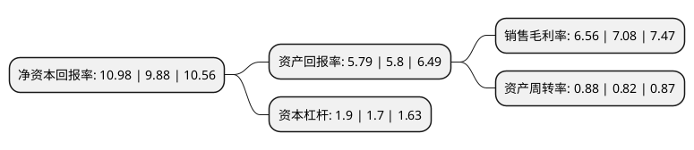

> 本页面由自动化程序生成于 2022年5月20日 01:03
> 内容可能存在错误，如有bug请提交issue至：https://github.com/Eroleice/doc-pi/issues
{.is-warning}

# 上市公司基本情况

## 基本资料

广东汕头超声电子股份有限公司（以下简称“超声电子”）成立于1997年09月05日，汕头市。于1997年10月08日在深交所主板上市。

超声电子注册资本53,698.676万元，主要业务:印制线路板，液晶显示器，超声电子仪器，超薄及特种覆铜板的研制，生产和销售。主要产品:印制线路板，液晶显示器，覆铜板，超声电子仪器。以下是详细信息：

- 公司名称: 广东汕头超声电子股份有限公司
- 股票代码: 000823.SZ
- 所在地: 广东 - 汕头市
- 成立日期: 1997年09月05日
- 注册资本: 53,698.676万元
- 法定代表人: 莫翊斌
- 主营业务: 印制线路板，液晶显示器，超声电子仪器，超薄及特种覆铜板的研制，生产和销售主要产品:印制线路板，液晶显示器，覆铜板，超声电子仪器
- 公司官网: www.gd-goworld.com
- 公司介绍: 公司是以电子元器件及超声电子仪器为主要产品的高新技术企业，从事无损检测仪器、印制电路板、液晶显示和触控器件、覆铜板等高新技术产品的研究、生产和销售。公司产品远销美国、欧盟、澳大利亚、日本等发达国家和中国香港地区。公司经国家人事部批准，建立了粤东地区首家企业博士后科研工作站。公司的开发中心是广东省省级重点工程技术研究开发中心。公司生产的“汕头牌”超声仪器累计至今已有多个型号的产品投产。公司旗下的汕头超声印制板公司(CCTC)享有“中国印制线路板之冠”的美誉，是国产移动通讯手机印制板的独家配套企业，数字移动通信手机用印制板产业化项目被国家发计委和信息产业部列入国家数字移动通讯产品国产化专项计划，并被国家计委认定为国家高技术产业示范工程。

## 股东及高管情况

上市公司第一大股东为汕头超声电子(集团)有限公司，持股162,741,800股，占比30.31%，为上市公司实际控制人。

截至2022年03月31日，上市公司的前十大股东中，共有7名自然人股东，2名机构股东，1个产品账户，其中5%以上大股东共有1名。上市公司前十大股东明细如下：

> 截至2022年03月31日，上市公司前十大股东信息如下：

| 股东名称 | 持股数量（股） | 持股比例 |
| --- | --- | --- |
| 汕头超声电子(集团)有限公司 | 162,741,800 | 30.31% |
| 中央汇金资产管理有限责任公司 | 16,931,100 | 3.15% |
| 中国工商银行股份有限公司-富国创新科技混合型证券投资基金 | 5,039,686 | 0.94% |
| 王克成 | 4,839,800 | 0.9% |
| 李成弟 | 4,049,355 | 0.75% |
| 张继华 | 3,362,500 | 0.63% |
| 常双军 | 3,063,010 | 0.57% |
| 李冠达 | 2,980,600 | 0.56% |
| 何泳霖 | 2,454,600 | 0.46% |
| 胡文刚 | 2,263,600 | 0.42% |

## 利润表分析

上市公司2021年总收入为67.31亿元，净利润为4.41亿元，实现盈利。

## 杜邦分析

> 数据列示周期：2021年 | 2020年 | 2019年
{.is-info}

上市公司的净资产收益率在近一年有所上升，上升幅度为11.13%，其变化情况分解如下：
- 上市公司的销售毛利率在近一年下降了-7.34%，可能是生产效率的下降、商品原材料价格上涨或商品价格的下跌所致。
- 上市公司的资产周转率在近一年上升了7.32%，可能是源自于更快的销售回款或库存管理效果提升。
- 上市公司的财务杠杆比率在近一年上升了11.76%，可能是增加负债扩大生产规模。

