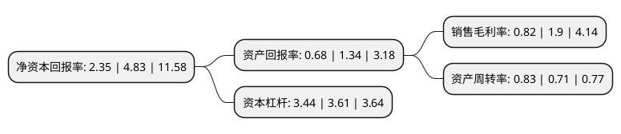

> 本页面由自动化程序生成于 2022年5月20日 01:05
> 内容可能存在错误，如有bug请提交issue至：https://github.com/Eroleice/doc-pi/issues
{.is-warning}

# 上市公司基本情况

## 基本资料

联创电子科技股份有限公司（以下简称“联创电子”）成立于1998年04月22日，南昌市。于2004年09月03日在深交所中小板上市。

联创电子注册资本106,282.546万元，主营业务:研发，生产及销售光学镜头，镜片，摄像头模组及触控显示一体化等关键光学，光电子产品。以下是详细信息：

- 公司名称: 联创电子科技股份有限公司
- 股票代码: 002036.SZ
- 所在地: 江西 - 南昌市
- 成立日期: 1998年04月22日
- 注册资本: 106,282.546万元
- 法定代表人: 曾吉勇
- 主营业务: 主营业务:研发，生产及销售光学镜头，镜片，摄像头模组及触控显示一体化等关键光学，光电子产品
- 公司官网: www.lcetron.com
- 公司介绍: 公司是一家在深圳证券交易所中小板上市的中外合资高科技公司，在江西省南昌、万年、重庆等地拥有产业园区，重点发展光学镜头及影像模组、触控显示器件等新型光学光电子产业，布局和培育集成电路模拟芯片产业，产品可广泛应用于智能终端、智能汽车、智慧家庭。公司是江西省电子信息重点企业和南昌市重点企业，南昌市唯一一家国家级专利运营试点制造业企业。公司秉承“联合共赢、创新发展”的企业精神和“品质为基、诚信为本”的经营理念，目标是将公司建设成规模超百亿、具有国际竞争力的中国一流的光学光电子研发制造企业。

## 股东及高管情况

上市公司第一大股东为江西鑫盛投资有限公司，持股92,300,986股，占比8.68%，**疑似为**上市公司实际控制人。

截至2022年03月31日，上市公司的前十大股东中，共有3名机构股东，5个产品账户，1个海外主体，1名其他股东，其中5%以上大股东共有3名。上市公司前十大股东明细如下：

> 未能通过持股比例判定出上市公司实际控制人（持股30%以上）
> 可能存在通过间接持股、联合持股、协议控制等方式拥有实际控制权的主体，具体请参考上市公司定期公告！
{.is-warning}

> 上市公司第一大股东持股不超过10%，请检查是否存在公司控制权风险！
{.is-danger}

> 截至2022年03月31日，上市公司前十大股东信息如下：

| 股东名称 | 持股数量（股） | 持股比例 |
| --- | --- | --- |
| 江西鑫盛投资有限公司 | 92,300,986 | 8.68% |
| 香港中央结算有限公司(陆股通) | 79,194,043 | 7.45% |
| 南昌市国金工业投资有限公司 | 61,425,594 | 5.78% |
| 兴业银行股份有限公司-兴全趋势投资混合型证券投资基金 | 27,022,230 | 2.54% |
| 招商银行股份有限公司-兴全合润混合型证券投资基金 | 21,594,884 | 2.03% |
| 招商银行股份有限公司-兴全轻资产投资混合型证券投资基金(LOF) | 18,720,593 | 1.76% |
| 中国光大银行股份有限公司-兴全商业模式优选混合型证券投资基金(LOF) | 15,744,050 | 1.48% |
| 科威特政府投资局 | 14,570,711 | 1.37% |
| 中国对外经济贸易信托有限公司-外贸信托-高毅晓峰鸿远集合资金信托计划 | 13,350,016 | 1.26% |
| 中信证券股份有限公司 | 13,347,829 | 1.26% |

## 利润表分析

上市公司2021年总收入为105.57亿元，净利润为0.86亿元，实现盈利。

## 杜邦分析

> 数据列示周期：2021年 | 2020年 | 2019年
{.is-info}

上市公司的净资产收益率在近一年有所下降，下降幅度为-51.35%，其变化情况分解如下：
- 上市公司的销售毛利率在近一年下降了-56.84%，可能是生产效率的下降、商品原材料价格上涨或商品价格的下跌所致。
- 上市公司的资产周转率在近一年上升了16.9%，可能是源自于更快的销售回款或库存管理效果提升。
- 上市公司的财务杠杆比率在近一年下降了-4.71%，可能是减少负债降低财务费用。

