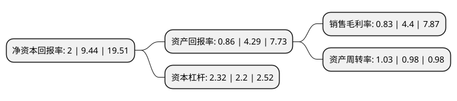

> 本页面由自动化程序生成于 2022年5月20日 01:05
> 内容可能存在错误，如有bug请提交issue至：https://github.com/Eroleice/doc-pi/issues
{.is-warning}

# 上市公司基本情况

## 基本资料

国光电器股份有限公司（以下简称“国光电器”）成立于1995年12月08日，广州市。于2005年05月23日在深交所中小板上市。

国光电器注册资本46,838.391万元，主要产品:音响系统产品，包括多媒体类音响，消费类音响，通讯类音响，专业类音响。主营业务:扬声器单元，音响系统，电池和其他电子零配件的设计，生产和销售。以下是详细信息：

- 公司名称: 国光电器股份有限公司
- 股票代码: 002045.SZ
- 所在地: 广东 - 广州市
- 成立日期: 1995年12月08日
- 注册资本: 46,838.391万元
- 法定代表人: 何伟成
- 主营业务: 主要产品:音响系统产品，包括多媒体类音响，消费类音响，通讯类音响，专业类音响主营业务:扬声器单元，音响系统，电池和其他电子零配件的设计，生产和销售
- 公司官网: www.ggec.com.cn
- 公司介绍: 公司是全球知名的电声制造厂商，成立至今一直从事电声、电子产品的设计、生产、销售，目前产品覆盖了电声配件、扬声器单元、音响系统、数字功放、聚合物锂电池等。公司具有从扬声器关键零部件，到扬声器单元、音箱系统及电子功放一体化的综合配套能力，多年的历史积淀凝聚了一批优秀的电声行业管理及研发人才，形成了自己独特、有效的科研攻关体系，建立了一支技术专业齐全、综合实力雄厚的研发队伍。在质量管理系统方面公司采用国际标准，通过了ISO/TS16949质量体系及ISO14001环境管理体系认证，公司检测中心还通过了CNAS的ISO/IEC17025认可，在生产中采用与国际同步的工艺、设备及控制流程，产品各项质量指标得到可靠保证，公司从设计到采购、进料检验、仓储物流、生产、成品检验、销售和售后服务形成了全过程质量控制系统。

## 股东及高管情况

上市公司第一大股东为广西国光投资发展有限公司，持股63,109,650股，占比13.47%，**疑似为**上市公司实际控制人。

截至2022年03月31日，上市公司的前十大股东中，共有4名自然人股东，5名机构股东，1个产品账户，其中5%以上大股东共有2名。上市公司前十大股东明细如下：

> 未能通过持股比例判定出上市公司实际控制人（持股30%以上）
> 可能存在通过间接持股、联合持股、协议控制等方式拥有实际控制权的主体，具体请参考上市公司定期公告！
{.is-warning}

> 截至2022年03月31日，上市公司前十大股东信息如下：

| 股东名称 | 持股数量（股） | 持股比例 |
| --- | --- | --- |
| 广西国光投资发展有限公司 | 63,109,650 | 13.47% |
| 智度科技股份有限公司 | 53,846,999 | 11.5% |
| 拉萨经济技术开发区智恒咨询有限公司 | 10,570,824 | 2.26% |
| 北京泛信壹号股权投资中心(有限合伙) | 8,602,801 | 1.84% |
| 东方证券股份有限公司-中庚价值先锋股票型证券投资基金 | 6,090,301 | 1.3% |
| 智度集团有限公司-苏州工业园区惠真股权投资中心(有限合伙) | 4,374,471 | 0.93% |
| 熊玲瑶 | 2,944,984 | 0.63% |
| 许景松 | 2,562,300 | 0.55% |
| 吕强 | 2,210,000 | 0.47% |
| 郑永明 | 2,099,300 | 0.45% |

## 杜邦分析

> 数据列示周期：2021年 | 2020年 | 2019年
{.is-info}

上市公司的净资产收益率在近一年有所下降，下降幅度为-78.81%，其变化情况分解如下：
- 上市公司的销售毛利率在近一年下降了-81.14%，可能是生产效率的下降、商品原材料价格上涨或商品价格的下跌所致。
- 上市公司的资产周转率在近一年上升了5.1%，可能是源自于更快的销售回款或库存管理效果提升。
- 上市公司的财务杠杆比率在近一年上升了5.45%，可能是增加负债扩大生产规模。

