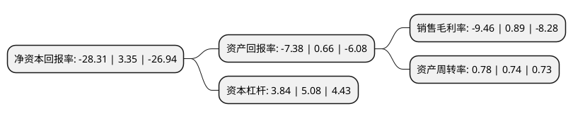

> 本页面由自动化程序生成于 2022年5月20日 01:05
> 内容可能存在错误，如有bug请提交issue至：https://github.com/Eroleice/doc-pi/issues
{.is-warning}

# 上市公司基本情况

## 基本资料

深圳市得润电子股份有限公司（以下简称“得润电子”）成立于1992年04月10日，深圳市。于2006年07月25日在深交所中小板上市。

得润电子注册资本60,449.002万元，主要产品:各类电子连接器产品的生产和销售，包括家电连接器产品，精密电子接插件产品，精密模具及精密组件产品，汽车连接器产品等。以下是详细信息：

- 公司名称: 深圳市得润电子股份有限公司
- 股票代码: 002055.SZ
- 所在地: 广东 - 深圳市
- 成立日期: 1992年04月10日
- 注册资本: 60,449.002万元
- 法定代表人: 邱建民
- 主营业务: 主要产品:各类电子连接器产品的生产和销售，包括家电连接器产品，精密电子接插件产品，精密模具及精密组件产品，汽车连接器产品等
- 公司官网: www.deren.com
- 公司介绍: 公司是一家电子连接器一体化解决方案提供商,主要经营家电和消费类电子、汽车相关电子连接器和精密组件和车联网相关技术。公司拥有多家集团控股公司、中外合资公司、海外合资公司、海外贸易公司，海外销售和服务分支机构。其研发、制造和销售基地在国内分布于深圳、中国香港，中国台北等多个地方；在国外分布于美国、意大利和卢森堡等地。公司主要分为家电和消费类电子事业部，汽车电气系统事业部和新能源汽车电子及车联网事业部。公司长期与创维、美的、TCL等家电龙头存在稳定的战略性合作关系;已进入众多国内外整车厂及汽车零部件厂商的供应链，初步形成包括国际品牌客户(如大众、宝马、奔驰等)、自主品牌客户以及设备客户(即汽车零部件客户，包括博世、大陆等)在内的汽车电子客户平台;公司立足打造大数据平台生态圈，实现互联网化的战略发展。

## 股东及高管情况

上市公司第一大股东为深圳市得胜资产管理有限公司，持股106,536,915股，占比17.62%，**疑似为**上市公司实际控制人。

截至2022年03月31日，上市公司的前十大股东中，共有6名自然人股东，1名机构股东，3个产品账户，其中5%以上大股东共有1名。上市公司前十大股东明细如下：

> 未能通过持股比例判定出上市公司实际控制人（持股30%以上）
> 可能存在通过间接持股、联合持股、协议控制等方式拥有实际控制权的主体，具体请参考上市公司定期公告！
{.is-warning}

> 截至2022年03月31日，上市公司前十大股东信息如下：

| 股东名称 | 持股数量（股） | 持股比例 |
| --- | --- | --- |
| 深圳市得胜资产管理有限公司 | 106,536,915 | 17.62% |
| 邱建民 | 17,511,017 | 2.9% |
| 杨桦 | 16,200,015 | 2.68% |
| 苏进 | 14,592,000 | 2.41% |
| 郭伟松 | 12,165,450 | 2.01% |
| 上海季胜投资管理有限公司-季胜汇缔科技创新私募证券投资基金 | 11,354,420 | 1.88% |
| 陈大魁 | 9,671,466 | 1.6% |
| 吕强 | 8,110,300 | 1.34% |
| 上海季胜投资管理有限公司-季胜激光二号私募证券投资基金 | 8,110,300 | 1.34% |
| 上海季胜投资管理有限公司-季胜激光三号私募证券投资基金 | 6,488,240 | 1.07% |

## 利润表分析

上市公司2021年总收入为75.86亿元，净利润为-7.18亿元，**未实现盈利**。

## 杜邦分析

> 数据列示周期：2021年 | 2020年 | 2019年
{.is-info}

上市公司的净资产收益率在近一年有所下降，下降幅度为-945.07%，其变化情况分解如下：
- 上市公司的销售毛利率在近一年下降了-1162.92%，可能是生产效率的下降、商品原材料价格上涨或商品价格的下跌所致。
- 上市公司的资产周转率在近一年上升了5.41%，可能是源自于更快的销售回款或库存管理效果提升。
- 上市公司的财务杠杆比率在近一年下降了-24.41%，可能是减少负债降低财务费用。

