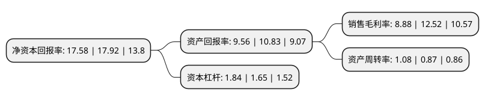

> 本页面由自动化程序生成于 2022年5月20日 01:05
> 内容可能存在错误，如有bug请提交issue至：https://github.com/Eroleice/doc-pi/issues
{.is-warning}

# 上市公司基本情况

## 基本资料

横店集团东磁股份有限公司（以下简称“横店东磁”）成立于1999年03月30日，金华市。于2006年08月02日在深交所中小板上市。

横店东磁注册资本162,671.207万元，主要产品或提供的劳务:晶体硅太阳能电池片，永磁铁氧体，软磁铁氧体。以下是详细信息：

- 公司名称: 横店集团东磁股份有限公司
- 股票代码: 002056.SZ
- 所在地: 浙江 - 金华市
- 成立日期: 1999年03月30日
- 注册资本: 162,671.207万元
- 法定代表人: 任海亮
- 主营业务: 主要产品或提供的劳务:晶体硅太阳能电池片，永磁铁氧体，软磁铁氧体
- 公司官网: www.chinadmegc.com
- 公司介绍: 公司是一家拥有磁性材料、太阳能光伏、新能源电池等多个产业群的高新技术民营企业。公司是国内规模最大的磁性材料生产企业，也是太阳能光伏产业链比较齐全、规模较大的生产企业。公司拥有雄厚的研发力量，是国际磁性材料技术交流的平台，设有国家级企业博士后工作站、国家级科技兴贸创新基地、国家磁性材料技术中心、浙江省磁性材料重点实验室、省级重点企业研究院、省级院士专家工作站、省级企业技术中心、浙江省科技文献共建共享平台、省级高新技术企业研发中心等创新平台。公司磁性材料产业的核心客户以全球500强企业或行业领先企业为主，如苹果、华为、特斯拉、博世、三星、法雷奥、松下、飞利浦等；太阳能产业的客户亦大多为行业内领先企业。

## 股东及高管情况

上市公司第一大股东为横店集团控股有限公司，持股823,000,000股，占比50.59%，为上市公司实际控制人。

截至2022年04月07日，上市公司的前十大股东中，共有3名自然人股东，2名机构股东，3个产品账户，1个海外主体，1名其他股东，其中5%以上大股东共有1名。上市公司前十大股东明细如下：

> 截至2022年04月07日，上市公司前十大股东信息如下：

| 股东名称 | 持股数量（股） | 持股比例 |
| --- | --- | --- |
| 横店集团控股有限公司 | 823,000,000 | 50.59% |
| 何时金 | 27,846,265 | 1.71% |
| 横店集团东磁股份有限公司-第二期员工持股计划 | 23,625,327 | 1.45% |
| 郑文淦 | 23,050,100 | 1.42% |
| 香港中央结算有限公司(陆股通) | 14,907,867 | 0.92% |
| 科威特政府投资局 | 12,399,881 | 0.76% |
| 中国银行股份有限公司-华泰柏瑞中证光伏产业交易型开放式指数证券投资基金 | 9,531,100 | 0.59% |
| 秦皇岛宏兴钢铁有限公司 | 9,206,900 | 0.57% |
| 中信建投证券股份有限公司-天弘中证光伏产业指数型发起式证券投资基金 | 7,723,002 | 0.47% |
| 王爱军 | 7,555,215 | 0.46% |

## 利润表分析

上市公司2021年总收入为126.07亿元，净利润为11.19亿元，实现盈利。

## 杜邦分析

> 数据列示周期：2021年 | 2020年 | 2019年
{.is-info}

上市公司的净资产收益率在近一年有所下降，下降幅度为-1.9%，其变化情况分解如下：
- 上市公司的销售毛利率在近一年下降了-29.07%，可能是生产效率的下降、商品原材料价格上涨或商品价格的下跌所致。
- 上市公司的资产周转率在近一年上升了24.14%，可能是源自于更快的销售回款或库存管理效果提升。
- 上市公司的财务杠杆比率在近一年上升了11.52%，可能是增加负债扩大生产规模。

