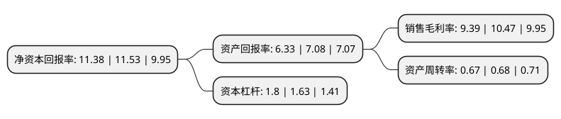

> 本页面由自动化程序生成于 2022年5月20日 01:05
> 内容可能存在错误，如有bug请提交issue至：https://github.com/Eroleice/doc-pi/issues
{.is-warning}

# 上市公司基本情况

## 基本资料

中钢天源股份有限公司（以下简称“中钢天源”）成立于2002年03月27日，马鞍山市。于2006年08月02日在深交所中小板上市。

中钢天源注册资本74,618.778万元，主要产品:四氧化三锰，钢丝(绳)，永磁器件及金属制品质量检验，检测服务。以下是详细信息：

- 公司名称: 中钢天源股份有限公司
- 股票代码: 002057.SZ
- 所在地: 安徽 - 马鞍山市
- 成立日期: 2002年03月27日
- 注册资本: 74,618.778万元
- 法定代表人: 毛海波
- 主营业务: 主要产品:四氧化三锰，钢丝(绳)，永磁器件及金属制品质量检验，检测服务
- 公司官网: www.ty-magnet.com
- 公司介绍: 公司主营业务为工业原料业务、金属制品业务、电子元件业务、装备业务和专业技术服务业务。公司的主要产品及服务包括四氧化三锰、钢丝(绳)、永磁器件及金属制品质量检验、检测服务。公司是磁性材料、金属制品、煤化工等方面的领先企业，是国家金属制品质量监督检验中心、磁性材料及其应用技术国家地方联合工程研究中心、河南省金属制品工程技术研究中心、湖南省认定企业技术中心等。公司建立了符合GB/T-19001、GB/T-24001、GB/T-28001标准要求的一体化管理体系。弹簧钢丝、永磁器件业务通过了ISO/TS-16949汽车行业质量体系要求认证。涉军工业务还通过了GJB9001B质量管理体系认证。

## 股东及高管情况

上市公司第一大股东为中钢资本控股有限公司，持股123,345,380股，占比16.53%，**疑似为**上市公司实际控制人。

截至2022年03月31日，上市公司的前十大股东中，共有2名自然人股东，7名机构股东，1个产品账户，其中5%以上大股东共有2名。上市公司前十大股东明细如下：

> 未能通过持股比例判定出上市公司实际控制人（持股30%以上）
> 可能存在通过间接持股、联合持股、协议控制等方式拥有实际控制权的主体，具体请参考上市公司定期公告！
{.is-warning}

> 截至2022年03月31日，上市公司前十大股东信息如下：

| 股东名称 | 持股数量（股） | 持股比例 |
| --- | --- | --- |
| 中钢资本控股有限公司 | 123,345,380 | 16.53% |
| 中钢集团郑州金属制品工程技术有限公司 | 54,322,377 | 7.28% |
| 中钢集团马鞍山矿山研究总院股份有限公司 | 37,131,430 | 4.98% |
| 中国银行股份有限公司-华夏行业景气混合型证券投资基金 | 34,919,446 | 4.68% |
| 天津振诚信息咨询有限公司 | 21,582,734 | 2.89% |
| 中国冶金科技成果转化有限公司 | 15,546,879 | 2.08% |
| 谭若闻 | 14,388,773 | 1.93% |
| 毛玉霞 | 12,700,600 | 1.7% |
| 中国中钢股份有限公司 | 9,900,000 | 1.33% |
| 中钢集团鞍山热能研究院有限公司 | 9,075,195 | 1.22% |

## 利润表分析

上市公司2021年总收入为25.87亿元，净利润为2.43亿元，实现盈利。

## 杜邦分析

> 数据列示周期：2021年 | 2020年 | 2019年
{.is-info}

上市公司的净资产收益率在近一年有所下降，下降幅度为-1.3%，其变化情况分解如下：
- 上市公司的销售毛利率在近一年下降了-10.32%，可能是生产效率的下降、商品原材料价格上涨或商品价格的下跌所致。
- 上市公司的资产周转率在近一年下降了-1.47%，可能是源自于更慢的销售回款或库存管理效果下降。
- 上市公司的财务杠杆比率在近一年上升了10.43%，可能是增加负债扩大生产规模。

