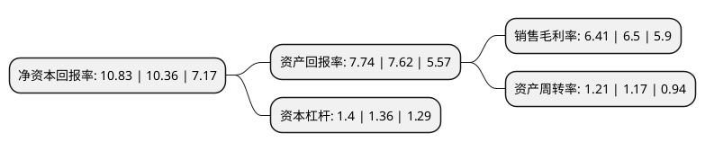

> 本页面由自动化程序生成于 2022年5月20日 01:06
> 内容可能存在错误，如有bug请提交issue至：https://github.com/Eroleice/doc-pi/issues
{.is-warning}

# 上市公司基本情况

## 基本资料

深圳莱宝高科技股份有限公司（以下简称“莱宝高科”）成立于1992年07月21日，深圳市。于2007年01月12日在深交所中小板上市。

莱宝高科注册资本70,581.616万元，主营业务:ITO导电玻璃和中小尺寸彩色滤光片的生产和销售以下是详细信息：

- 公司名称: 深圳莱宝高科技股份有限公司
- 股票代码: 002106.SZ
- 所在地: 广东 - 深圳市
- 成立日期: 1992年07月21日
- 注册资本: 70,581.616万元
- 法定代表人: 臧卫东
- 主营业务: 主营业务:ITO导电玻璃和中小尺寸彩色滤光片的生产和销售
- 公司官网: www.laibao.com.cn
- 公司介绍: 公司是国内首家自主掌握STN型ITO导电玻璃生产技术和彩色滤光片核心技术的企业，是国内全面自主掌握平板显示行业关键性通用技术的企业。公司主要致力于液晶显示(LCD)行业上游显示材料的研发和生产，主导产品为ITO导电玻璃和中小尺寸彩色滤光片。公司已形成较为完整的技术体系，在行业内具有明显的技术优势，技术水平一直保持“国际先进、国内领先”的优势地位。公司是原国家对外贸易经济合作部和科学技术部确定的国家首批重点出口企业之一，并先后通过了ISO9002、QS9000和ISO9001:2000质量体系认证。

## 股东及高管情况

上市公司第一大股东为中国节能减排有限公司，持股147,108,123股，占比20.84%，**疑似为**上市公司实际控制人。

截至2022年03月31日，上市公司的前十大股东中，共有5名自然人股东，2名机构股东，2个产品账户，1个海外主体，其中5%以上大股东共有2名。上市公司前十大股东明细如下：

> 未能通过持股比例判定出上市公司实际控制人（持股30%以上）
> 可能存在通过间接持股、联合持股、协议控制等方式拥有实际控制权的主体，具体请参考上市公司定期公告！
{.is-warning}

> 截至2022年03月31日，上市公司前十大股东信息如下：

| 股东名称 | 持股数量（股） | 持股比例 |
| --- | --- | --- |
| 中国节能减排有限公司 | 147,108,123 | 20.84% |
| 深圳市市政工程总公司 | 51,965,388 | 7.36% |
| 香港中央结算有限公司(陆股通) | 17,876,188 | 2.53% |
| 雷莹 | 4,488,127 | 0.64% |
| 保宁资本有限公司-保宁新兴市场中小企基金(美国) | 3,270,600 | 0.46% |
| 许金林 | 2,692,100 | 0.38% |
| 许皓 | 2,052,200 | 0.29% |
| 保宁资本有限公司-保宁新兴市场基金(美国) | 1,724,203 | 0.24% |
| 杨国霞 | 1,684,900 | 0.24% |
| 蒋程 | 1,650,000 | 0.23% |

## 利润表分析

上市公司2021年总收入为76.82亿元，净利润为4.92亿元，实现盈利。

## 杜邦分析

> 数据列示周期：2021年 | 2020年 | 2019年
{.is-info}

上市公司的净资产收益率在近一年有所上升，上升幅度为4.54%，其变化情况分解如下：
- 上市公司的销售毛利率在近一年下降了-1.38%，可能是生产效率的下降、商品原材料价格上涨或商品价格的下跌所致。
- 上市公司的资产周转率在近一年上升了3.42%，可能是源自于更快的销售回款或库存管理效果提升。
- 上市公司的财务杠杆比率在近一年上升了2.94%，可能是增加负债扩大生产规模。

