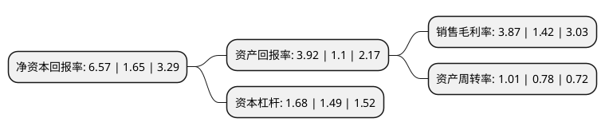

> 本页面由自动化程序生成于 2022年5月20日 01:06
> 内容可能存在错误，如有bug请提交issue至：https://github.com/Eroleice/doc-pi/issues
{.is-warning}

# 上市公司基本情况

## 基本资料

天津普林电路股份有限公司（以下简称“天津普林”）成立于1988年04月27日，天津市。于2007年05月16日在深交所中小板上市。

天津普林注册资本24,584.977万元，主营业务:生产，销售双面和多层印刷电路板以下是详细信息：

- 公司名称: 天津普林电路股份有限公司
- 股票代码: 002134.SZ
- 所在地: 天津 - 天津市
- 成立日期: 1988年04月27日
- 注册资本: 24,584.977万元
- 法定代表人: 邵光洁
- 主营业务: 主营业务:生产，销售双面和多层印刷电路板
- 公司官网: www.toppcb.com
- 公司介绍: 公司是一家印制板生产企业，专业生产与销售高精密度刚性印制板、高密度互连(HDI)印制板、刚挠结合板及铝基板等产品。产品广泛应用于航空航天、计算机网络、数字通讯、汽车电子、工业控制、仪器仪表、医疗器械、消费电子等领域。公司致力于为全球客户提供高品质产品与专业的服务，目前年产能90万M2，同时具备大批量及中小批量订单的交付能力；产品表面处理工艺齐全，基材类型包括FR-4(高Tg \无卤素、铝基板等)，所有产品种类均已通过UL及ISO9001、QS9000、ISO/TS16949、ISO-14001、OHSAS-18001、RoHS等专业认证；客户覆盖全球，出口比例约占60%左右，与众多知名品牌客户保持良好合作。

## 股东及高管情况

上市公司第一大股东为TCL科技集团(天津)有限公司，持股66,026,154股，占比26.86%，**疑似为**上市公司实际控制人。

截至2022年04月18日，上市公司的前十大股东中，共有5名自然人股东，4名机构股东，1个产品账户，其中5%以上大股东共有3名。上市公司前十大股东明细如下：

> 未能通过持股比例判定出上市公司实际控制人（持股30%以上）
> 可能存在通过间接持股、联合持股、协议控制等方式拥有实际控制权的主体，具体请参考上市公司定期公告！
{.is-warning}

> 截至2022年04月18日，上市公司前十大股东信息如下：

| 股东名称 | 持股数量（股） | 持股比例 |
| --- | --- | --- |
| TCL科技集团(天津)有限公司 | 66,026,154 | 26.86% |
| TCL科技集团(天津)有限公司 | 66,026,154 | 26.86% |
| 天津津融投资服务集团有限公司 | 16,030,000 | 6.5202% |
| 苏明 | 12,274,183 | 4.99% |
| 天津市中环投资有限公司 | 6,499,600 | 2.64% |
| 肖红星 | 4,554,175 | 1.85% |
| 郑志刚 | 3,580,000 | 1.46% |
| 广州市玄元投资管理有限公司-玄元科新256号私募证券投资基金 | 3,550,450 | 1.44% |
| 陈潮海 | 3,395,000 | 1.38% |
| 陆引才 | 2,836,300 | 1.15% |

## 利润表分析

上市公司2021年总收入为7亿元，净利润为0.27亿元，实现盈利。

## 杜邦分析

> 数据列示周期：2021年 | 2020年 | 2019年
{.is-info}

上市公司的净资产收益率在近一年有所上升，上升幅度为298.18%，其变化情况分解如下：
- 上市公司的销售毛利率在近一年上升了172.54%，可能是生产效率的提升、商品原材料价格下跌或商品价格的上涨所致。
- 上市公司的资产周转率在近一年上升了29.49%，可能是源自于更快的销售回款或库存管理效果提升。
- 上市公司的财务杠杆比率在近一年上升了12.75%，可能是增加负债扩大生产规模。

