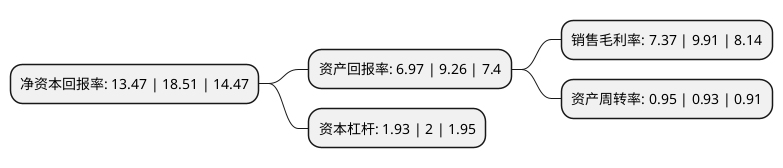

> 本页面由自动化程序生成于 2022年5月20日 01:06
> 内容可能存在错误，如有bug请提交issue至：https://github.com/Eroleice/doc-pi/issues
{.is-warning}

# 上市公司基本情况

## 基本资料

深圳拓邦股份有限公司（以下简称“拓邦股份”）成立于1996年02月09日，深圳市。于2007年06月29日在深交所中小板上市。

拓邦股份注册资本125,697.807万元，主要产品:家电类的电子智能控制产品。以下是详细信息：

- 公司名称: 深圳拓邦股份有限公司
- 股票代码: 002139.SZ
- 所在地: 广东 - 深圳市
- 成立日期: 1996年02月09日
- 注册资本: 125,697.807万元
- 法定代表人: 武永强
- 主营业务: 主要产品:家电类的电子智能控制产品
- 公司官网: www.topband.com.cn
- 公司介绍: 拓邦股份是国内智能控制行业开创者和领导者，1996年在深圳南山科技园成立后，专注为家用电器、电动工具、工业设备、个人护理、商业设备、医疗器械、汽车电子等领域厂商提供智能控制解决方案，已成为全球领先的智能控制方案提供商。公司研发人员超过1000人，在感知检测、控制处理、智能物联和人机交互等领域拥有一系列核心技术，并拥有业界领先的体系化管理能力。在智能时代，公司依托智能控制器核心技术优势和丰富的行业经验，成立了一站式智能电器解决方案平台T-SMART，秉承专业让智能更简单的理念，为客户提供从智能控制器、通讯模块、云服务到应用软件开发的全方位服务，以及从客户需求到产品量产的一站式智能电器解决方案。

## 股东及高管情况

上市公司第一大股东为武永强，持股212,008,715股，占比16.87%，**疑似为**上市公司实际控制人。

截至2022年03月31日，上市公司的前十大股东中，共有4名自然人股东，5个产品账户，1个海外主体，其中5%以上大股东共有2名。上市公司前十大股东明细如下：

> 未能通过持股比例判定出上市公司实际控制人（持股30%以上）
> 可能存在通过间接持股、联合持股、协议控制等方式拥有实际控制权的主体，具体请参考上市公司定期公告！
{.is-warning}

> 截至2022年03月31日，上市公司前十大股东信息如下：

| 股东名称 | 持股数量（股） | 持股比例 |
| --- | --- | --- |
| 武永强 | 212,008,715 | 16.87% |
| 香港中央结算有限公司(陆股通) | 84,519,057 | 6.72% |
| 纪树海 | 27,318,642 | 2.17% |
| 东方证券股份有限公司-中庚价值先锋股票型证券投资基金 | 26,972,626 | 2.15% |
| 中国农业银行股份有限公司-国泰智能汽车股票型证券投资基金 | 25,324,131 | 2.01% |
| 谢仁国 | 21,561,088 | 1.72% |
| 首域投资管理(英国)有限公司-首域环球伞子基金:首域中国增长基金 | 17,948,155 | 1.43% |
| 中国银行股份有限公司-国泰智能装备股票型证券投资基金 | 17,023,450 | 1.35% |
| 基本养老保险基金一二零六组合 | 11,985,756 | 0.95% |
| 李红 | 9,450,376 | 0.75% |

## 利润表分析

上市公司2021年总收入为77.67亿元，净利润为5.72亿元，实现盈利。

## 杜邦分析

> 数据列示周期：2021年 | 2020年 | 2019年
{.is-info}

上市公司的净资产收益率在近一年有所下降，下降幅度为-27.23%，其变化情况分解如下：
- 上市公司的销售毛利率在近一年下降了-25.63%，可能是生产效率的下降、商品原材料价格上涨或商品价格的下跌所致。
- 上市公司的资产周转率在近一年上升了2.15%，可能是源自于更快的销售回款或库存管理效果提升。
- 上市公司的财务杠杆比率在近一年下降了-3.5%，可能是减少负债降低财务费用。

