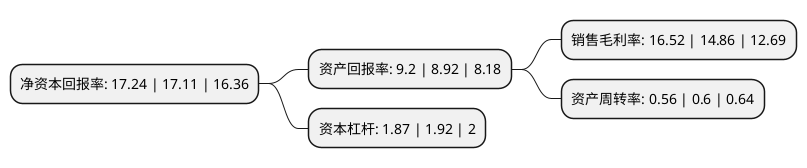

> 本页面由自动化程序生成于 2022年5月20日 01:06
> 内容可能存在错误，如有bug请提交issue至：https://github.com/Eroleice/doc-pi/issues
{.is-warning}

# 上市公司基本情况

## 基本资料

中航光电科技股份有限公司（以下简称“中航光电”）成立于2002年12月31日，洛阳市。于2007年11月01日在深交所中小板上市。

中航光电注册资本113,544.64万元，主要业务为电连接器，光器件和线缆组件的研发，生产和销售。主要生产电连接器和光器件。以下是详细信息：

- 公司名称: 中航光电科技股份有限公司
- 股票代码: 002179.SZ
- 所在地: 河南 - 洛阳市
- 成立日期: 2002年12月31日
- 注册资本: 113,544.64万元
- 法定代表人: 郭泽义
- 主营业务: 主要业务为电连接器，光器件和线缆组件的研发，生产和销售主要生产电连接器和光器件
- 公司官网: www.jonhon.cn
- 公司介绍: 公司是中国专业为军工防务及高端制造领域提供互连技术解决方案的高科技企业。公司产品广泛应用于航空航天和军事领域、通讯网络与数据中心、轨道交通、新能源汽车、电力、石油装备、医疗设备以及智能装备等民用高端制造领域；产品远销欧洲、美国、以色列、澳大利亚、韩国、印度等海外多个国家和地区。公司总部拥有“国家认定企业技术中心”、“博士后科研工作站”以及国家和国防认可实验室，专业从事中高端光、电、流体连接技术与设备的研究与开发。公司通过了AS9100国际航空航天质量管理体系认证、ISO9001(2000)质量体系认证、TS16949体系认证、ISO14001环境体系认证、OHSAS18001职业健康安全管理体系认证等。公司多项重点产品通过了UL、CUL、CE、TUV、CB等安规认证。

## 股东及高管情况

上市公司第一大股东为中国航空科技工业股份有限公司，持股427,837,092股，占比37.68%，为上市公司实际控制人。

截至2022年03月31日，上市公司的前十大股东中，共有3名机构股东，5个产品账户，1个海外主体，1名其他股东，其中5%以上大股东共有2名。上市公司前十大股东明细如下：

> 截至2022年03月31日，上市公司前十大股东信息如下：

| 股东名称 | 持股数量（股） | 持股比例 |
| --- | --- | --- |
| 中国航空科技工业股份有限公司 | 427,837,092 | 37.68% |
| 河南投资集团有限公司 | 101,476,112 | 8.94% |
| 中国建设银行股份有限公司-易方达国防军工混合型证券投资基金 | 18,212,903 | 1.6% |
| 中国空空导弹研究院 | 17,016,397 | 1.5% |
| 国家军民融合产业投资基金有限责任公司 | 8,370,827 | 0.74% |
| 全国社保基金一零二组合 | 7,534,881 | 0.66% |
| 赛维航电科技有限公司 | 7,463,102 | 0.66% |
| 香港中央结算有限公司(陆股通) | 6,837,899 | 0.6% |
| 中国建设银行股份有限公司-国泰中证军工交易型开放式指数证券投资基金 | 6,750,796 | 0.59% |
| 全国社保基金一一五组合 | 6,600,000 | 0.58% |

## 利润表分析

上市公司2021年总收入为128.66亿元，净利润为21.25亿元，实现盈利。

## 杜邦分析

> 数据列示周期：2021年 | 2020年 | 2019年
{.is-info}

上市公司的净资产收益率在近一年有所上升，上升幅度为0.76%，其变化情况分解如下：
- 上市公司的销售毛利率在近一年上升了11.17%，可能是生产效率的提升、商品原材料价格下跌或商品价格的上涨所致。
- 上市公司的资产周转率在近一年下降了-6.67%，可能是源自于更慢的销售回款或库存管理效果下降。
- 上市公司的财务杠杆比率在近一年下降了-2.6%，可能是减少负债降低财务费用。

