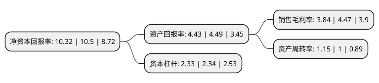

> 本页面由自动化程序生成于 2022年5月20日 01:06
> 内容可能存在错误，如有bug请提交issue至：https://github.com/Eroleice/doc-pi/issues
{.is-warning}

# 上市公司基本情况

## 基本资料

中光学集团股份有限公司（以下简称“中光学”）成立于1995年04月05日，南阳市。于2007年12月03日在深交所中小板上市。

中光学注册资本26,240.617万元，主营业务为光学元件，光学辅材，光敏电阻等光电产品的研发，生产和销售。主要产品包括光学棱镜，光学透镜等精密光学元件，光学辅材，光敏电阻等。以下是详细信息：

- 公司名称: 中光学集团股份有限公司
- 股票代码: 002189.SZ
- 所在地: 河南 - 南阳市
- 成立日期: 1995年04月05日
- 注册资本: 26,240.617万元
- 法定代表人: 李智超
- 主营业务: 主营业务为光学元件，光学辅材，光敏电阻等光电产品的研发，生产和销售主要产品包括光学棱镜，光学透镜等精密光学元件，光学辅材，光敏电阻等
- 公司官网: www.hn508.com.cn
- 公司介绍: 公司是国内大批量生产微显示投影系统光学元(组)件的主要企业，主要从事精密光学元组件、光学辅料、光敏电阻等光电产品的研发、设计、生产、销售，主要业务分布在数码光学、薄膜光学、安防车载光学与军用光学四个细分领域，产品主要应用于数字投影机、数码相机、智能手机、安防监控产品等，主导产品是透镜、棱镜、光学镜头、光学辅料、光敏电阻等。目前，公司是全球投影显示领域光学元件配套最齐全的企业，数码光学精密零组件世界市场占有率稳居领先地位，光学薄膜装备水平与规模化生产能力国内领先。2018年,公司收购中光学100%股权，主营业务新增产品将涵盖微光及红外瞄准镜、手持光电探测系统、光电对抗系统、智能化要地防御系统等光电防务产品以及投影机、投影机核心部件等光电行业下游产品，公司将打造光电元组件与军工业务的双核心企业。

## 股东及高管情况

上市公司第一大股东为中国兵器装备集团有限公司，持股103,359,556股，占比39.39%，为上市公司实际控制人。

截至2022年03月31日，上市公司的前十大股东中，共有5名自然人股东，4名机构股东，1个产品账户，其中5%以上大股东共有1名。上市公司前十大股东明细如下：

> 截至2022年03月31日，上市公司前十大股东信息如下：

| 股东名称 | 持股数量（股） | 持股比例 |
| --- | --- | --- |
| 中国兵器装备集团有限公司 | 103,359,556 | 39.39% |
| 南方工业资产管理有限责任公司 | 6,844,351 | 2.61% |
| 易方达基金-中央汇金资产管理有限责任公司-易方达基金-汇金资管单一资产管理计划 | 5,457,900 | 2.08% |
| 南阳市金坤光电仪器有限责任公司 | 3,760,848 | 1.43% |
| 赖垂燕 | 2,311,412 | 0.88% |
| 朱水胜 | 2,300,000 | 0.88% |
| 王雄 | 1,502,600 | 0.57% |
| 深圳市旅游(集团)股份有限公司 | 1,433,829 | 0.55% |
| 郭惠发 | 1,070,000 | 0.41% |
| 肖连栋 | 1,040,000 | 0.4% |

## 杜邦分析

> 数据列示周期：2021年 | 2020年 | 2019年
{.is-info}

上市公司的净资产收益率在近一年有所下降，下降幅度为-1.71%，其变化情况分解如下：
- 上市公司的销售毛利率在近一年下降了-14.09%，可能是生产效率的下降、商品原材料价格上涨或商品价格的下跌所致。
- 上市公司的资产周转率在近一年上升了15%，可能是源自于更快的销售回款或库存管理效果提升。
- 上市公司的财务杠杆比率在近一年下降了-0.43%，可能是减少负债降低财务费用。

