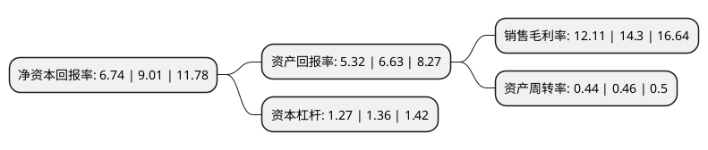

> 本页面由自动化程序生成于 2022年5月20日 01:07
> 内容可能存在错误，如有bug请提交issue至：https://github.com/Eroleice/doc-pi/issues
{.is-warning}

# 上市公司基本情况

## 基本资料

浙江水晶光电科技股份有限公司（以下简称“水晶光电”）成立于2002年08月02日，台州市。于2008年09月19日在深交所中小板上市。

水晶光电注册资本139,063.222万元，主要产品:光学低通滤波器，红外截止滤光片，红外截止滤光片组立件，投影机散热板及光学窗口片等。以下是详细信息：

- 公司名称: 浙江水晶光电科技股份有限公司
- 股票代码: 002273.SZ
- 所在地: 浙江 - 台州市
- 成立日期: 2002年08月02日
- 注册资本: 139,063.222万元
- 法定代表人: 林敏
- 主营业务: 主要产品:光学低通滤波器，红外截止滤光片，红外截止滤光片组立件，投影机散热板及光学窗口片等
- 公司官网: www.crystal-optech.com
- 公司介绍: 公司是国内专业从事精密薄膜光学产品研发、生产和销售的知名光电元器件制造的企业，是浙江省高新技术企业和国家火炬计划重点高新技术企业。公司主要产品应用于数码相机、可拍照手机摄像头、安防监控摄像头、电脑摄像头及其它数字摄像镜头、半导体照明、微型投影仪、视频眼镜、公路交通标志、安全防护等产品，主导产品光学低通滤波器(OLPF)和红外截止滤光片(IRCF)两大产品产销量居全球前列。公司是数码产业及手机通讯产业多家国际知名企业或行业龙头企业的主要配套供应商。公司拥有精密光学冷加工技术、超硬材料光学加工技术、精密光学薄膜、半导体加工、涂覆、植珠等核心技术，光学低通滤波器、红外截止滤光片及组立件、窄带滤光片、投影机散热板、LED蓝宝石衬底、微型投影、反光材料等系列产品均具有国内、国际领先水平。

## 股东及高管情况

上市公司第一大股东为星星集团有限公司，持股123,753,273股，占比8.9%，**疑似为**上市公司实际控制人。

截至2022年03月31日，上市公司的前十大股东中，共有1名自然人股东，6名机构股东，2个产品账户，1个海外主体，其中5%以上大股东共有2名。上市公司前十大股东明细如下：

> 未能通过持股比例判定出上市公司实际控制人（持股30%以上）
> 可能存在通过间接持股、联合持股、协议控制等方式拥有实际控制权的主体，具体请参考上市公司定期公告！
{.is-warning}

> 上市公司第一大股东持股不超过10%，请检查是否存在公司控制权风险！
{.is-danger}

> 截至2022年03月31日，上市公司前十大股东信息如下：

| 股东名称 | 持股数量（股） | 持股比例 |
| --- | --- | --- |
| 星星集团有限公司 | 123,753,273 | 8.9% |
| 杭州深改哲新企业管理合伙企业(有限合伙) | 73,404,741 | 5.28% |
| 香港中央结算有限公司(陆股通) | 58,072,681 | 4.18% |
| 天风证券资管-邮储银行-天风天时领航定增分级3号集合资产管理计划 | 30,744,811 | 2.21% |
| 中信证券股份有限公司 | 28,285,422 | 2.03% |
| 林敏 | 25,546,405 | 1.84% |
| 华夏人寿保险股份有限公司-自有资金 | 19,778,655 | 1.42% |
| 台州市椒江城市发展投资集团有限公司 | 19,215,987 | 1.38% |
| 台州市椒江工业投资集团有限公司 | 19,215,987 | 1.38% |
| 北京才誉资产管理企业(有限合伙)-才誉中国价值多策略对冲1号私募证券投资基金 | 13,365,928 | 0.96% |

## 利润表分析

上市公司2021年总收入为38.09亿元，净利润为4.61亿元，实现盈利。

## 杜邦分析

> 数据列示周期：2021年 | 2020年 | 2019年
{.is-info}

上市公司的净资产收益率在近一年有所下降，下降幅度为-25.19%，其变化情况分解如下：
- 上市公司的销售毛利率在近一年下降了-15.31%，可能是生产效率的下降、商品原材料价格上涨或商品价格的下跌所致。
- 上市公司的资产周转率在近一年下降了-4.35%，可能是源自于更慢的销售回款或库存管理效果下降。
- 上市公司的财务杠杆比率在近一年下降了-6.62%，可能是减少负债降低财务费用。

