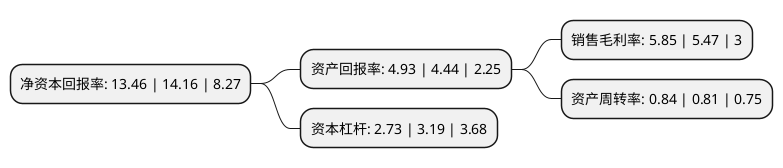

> 本页面由自动化程序生成于 2022年5月20日 01:08
> 内容可能存在错误，如有bug请提交issue至：https://github.com/Eroleice/doc-pi/issues
{.is-warning}

# 上市公司基本情况

## 基本资料

苏州东山精密制造股份有限公司（以下简称“东山精密”）成立于1998年10月28日，苏州市。于2010年04月09日在深交所中小板上市。

东山精密注册资本170,986.733万元，主营业务:精密钣金件和精密铸件的制造与服务。公司产品主要包括精密钣金和精密铸件的制造与服务。以下是详细信息：

- 公司名称: 苏州东山精密制造股份有限公司
- 股票代码: 002384.SZ
- 所在地: 江苏 - 苏州市
- 成立日期: 1998年10月28日
- 注册资本: 170,986.733万元
- 法定代表人: 袁永刚
- 主营业务: 主营业务:精密钣金件和精密铸件的制造与服务公司产品主要包括精密钣金和精密铸件的制造与服务
- 公司官网: www.dsbj.com
- 公司介绍: 公司是中国最大的专业从事精密钣金结构件工艺设计、制造服务企业，全球最大的基站天线精密钣金零部件提供商。公司集研发、生产、销售、服务业务为一体，为客户提供精密钣金件和精密铸件的制造与服务，已形成了产品结构研发、精密钣金制造、精密铸件制造、表面处理、精密组装、及时配送等在内的完整精密金属制造服务体系。通过了通讯设备制造商爱立信、朗讯、波尔威、安德鲁、安弗施，精密机床制造商沙迪克、阿奇夏米尔，核能设备制造商阿海珐，金融设备制造商NCR等客户严格的认证考核，并与其建立长期稳定的合作关系，为其全球分支机构提供可靠的产品和专业服务。

## 股东及高管情况

上市公司第一大股东为袁永峰，持股222,388,153股，占比13.01%，**疑似为**上市公司实际控制人。

截至2022年04月25日，上市公司的前十大股东中，共有3名自然人股东，2名机构股东，4个产品账户，1个海外主体，其中5%以上大股东共有2名。上市公司前十大股东明细如下：

> 未能通过持股比例判定出上市公司实际控制人（持股30%以上）
> 可能存在通过间接持股、联合持股、协议控制等方式拥有实际控制权的主体，具体请参考上市公司定期公告！
{.is-warning}

> 截至2022年04月25日，上市公司前十大股东信息如下：

| 股东名称 | 持股数量（股） | 持股比例 |
| --- | --- | --- |
| 袁永峰 | 222,388,153 | 13.01% |
| 袁永刚 | 202,226,196 | 11.83% |
| 袁富根 | 58,796,052 | 3.44% |
| 香港中央结算有限公司(陆股通) | 56,933,410 | 3.33% |
| 中国工商银行股份有限公司-广发多因子灵活配置混合型证券投资基金 | 36,654,279 | 2.14% |
| 中国人寿保险股份有限公司-分红-个人分红-005L-FH002深 | 22,522,966 | 1.32% |
| 中国人寿保险股份有限公司-传统-普通保险产品-005L-CT001深 | 22,406,723 | 1.31% |
| 陕西省国际信托股份有限公司-陕国投·东山精密第二期员工持股集合资金信托计划 | 21,914,118 | 1.28% |
| 张家港产业资本投资有限公司 | 19,074,681 | 1.12% |
| 平安安赢股票型养老金产品-中国银行股份有限公司 | 18,487,897 | 1.08% |

## 杜邦分析

> 数据列示周期：2021年 | 2020年 | 2019年
{.is-info}

上市公司的净资产收益率在近一年有所下降，下降幅度为-4.94%，其变化情况分解如下：
- 上市公司的销售毛利率在近一年上升了6.95%，可能是生产效率的提升、商品原材料价格下跌或商品价格的上涨所致。
- 上市公司的资产周转率在近一年上升了3.7%，可能是源自于更快的销售回款或库存管理效果提升。
- 上市公司的财务杠杆比率在近一年下降了-14.42%，可能是减少负债降低财务费用。

