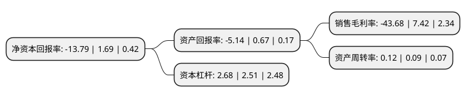

> 本页面由自动化程序生成于 2022年5月20日 01:08
> 内容可能存在错误，如有bug请提交issue至：https://github.com/Eroleice/doc-pi/issues
{.is-warning}

# 上市公司基本情况

## 基本资料

维信诺科技股份有限公司（以下简称“维信诺”）成立于1998年01月07日，苏州市。于2010年04月13日在深交所中小板上市。

维信诺注册资本138,253.815万元，主要产品为第6代有源矩阵有机发光显示器件以下是详细信息：

- 公司名称: 维信诺科技股份有限公司
- 股票代码: 002387.SZ
- 所在地: 江苏 - 苏州市
- 成立日期: 1998年01月07日
- 注册资本: 138,253.815万元
- 法定代表人: 张德强
- 主营业务: 主要产品为第6代有源矩阵有机发光显示器件
- 公司官网: www.visionox.com
- 公司介绍: 公司是一家新型显示整体解决方案创新型供应商，前身是1996年成立的清华大学OLED项目组。公司以“拓展视界，提升人类视觉享受”为愿景，专注OLED事业20余年，已发展成为集研发、生产、销售于一体的全球OLED产业领军企业。公司坚持自主创新，掌握多项OLED关键技术，荣获了由国务院颁发的“国家技术发明奖一等奖”、联合国世界知识产权组织和我国国家知识产权局共同颁发的“中国专利金奖”等重要奖项。主导制定了多项OLED国际标准和国家标准。公司聚焦前沿技术领域，创造多项世界第一，包括全球首款AMOLED全卷曲显示屏、任意弯折柔性屏全模组及全球首款可量产的屏下摄像解决方案等产品，柔性OLED技术达到世界先进水平。公司秉承“创新是企业的灵魂”的理念，不断追求卓越，向致力于“视觉享受升级”、提供新型显示一体化解决方案的全球知名科技企业迈进。

## 股东及高管情况

上市公司第一大股东为西藏知合资本管理有限公司，持股240,000,097股，占比17.36%，**疑似为**上市公司实际控制人。

截至2022年03月31日，上市公司的前十大股东中，共有2名自然人股东，4名机构股东，4个产品账户，其中5%以上大股东共有3名。上市公司前十大股东明细如下：

> 未能通过持股比例判定出上市公司实际控制人（持股30%以上）
> 可能存在通过间接持股、联合持股、协议控制等方式拥有实际控制权的主体，具体请参考上市公司定期公告！
{.is-warning}

> 截至2022年03月31日，上市公司前十大股东信息如下：

| 股东名称 | 持股数量（股） | 持股比例 |
| --- | --- | --- |
| 西藏知合资本管理有限公司 | 240,000,097 | 17.36% |
| 合肥建曙投资有限公司 | 160,000,000 | 11.57% |
| 昆山经济技术开发区集体资产经营有限公司 | 131,730,538 | 9.53% |
| 建信基金-工商银行-建信华润信托兴晟6号资产管理计划 | 67,365,269 | 4.87% |
| 光大保德信资管-光大银行-光大保德信耀财富富增9号专项资产管理计划 | 65,868,263 | 4.76% |
| 农银汇理(上海)资产-农业银行-华宝信托-投资【6】号集合资金信托计划 | 65,868,263 | 4.76% |
| 金鹰基金-中信银行-华宝信托-华宝-中信1号单一资金信托 | 59,880,239 | 4.33% |
| 国投泰康信托有限公司-国投泰康信托金雕681号单一资金信托 | 21,702,144 | 1.57% |
| 林利娥 | 14,202,543 | 1.03% |
| 赵桂荣 | 12,051,100 | 0.87% |

## 利润表分析

上市公司2021年总收入为45.44亿元，净利润为-19.86亿元，**未实现盈利**。

## 杜邦分析

> 数据列示周期：2021年 | 2020年 | 2019年
{.is-info}

上市公司的净资产收益率在近一年有所下降，下降幅度为-915.98%，其变化情况分解如下：
- 上市公司的销售毛利率在近一年下降了-688.68%，可能是生产效率的下降、商品原材料价格上涨或商品价格的下跌所致。
- 上市公司的资产周转率在近一年上升了33.33%，可能是源自于更快的销售回款或库存管理效果提升。
- 上市公司的财务杠杆比率在近一年上升了6.77%，可能是增加负债扩大生产规模。

