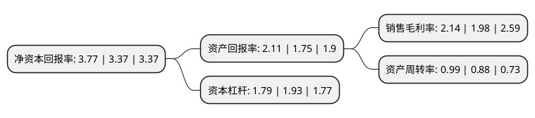

> 本页面由自动化程序生成于 2022年5月20日 01:08
> 内容可能存在错误，如有bug请提交issue至：https://github.com/Eroleice/doc-pi/issues
{.is-warning}

# 上市公司基本情况

## 基本资料

新亚电子制程(广东)股份有限公司（以下简称“新亚制程”）成立于2003年01月10日，珠海市。于2010年04月13日在深交所中小板上市。

新亚制程注册资本51,046.41万元，主营业务:针对电子制造业，专业提供电子制程系统解决方案及实施方案涉及的电子制程产品。以下是详细信息：

- 公司名称: 新亚电子制程(广东)股份有限公司
- 股票代码: 002388.SZ
- 所在地: 广东 - 珠海市
- 成立日期: 2003年01月10日
- 注册资本: 51,046.41万元
- 法定代表人: 许雷宇
- 主营业务: 主营业务:针对电子制造业，专业提供电子制程系统解决方案及实施方案涉及的电子制程产品
- 公司官网: www.sunyes.cn
- 公司介绍: 公司作为“电子制程解决方案”的倡导者，专业从事电子制程方案研发推广和电子制程产品系统供应服务。公司的主营业务主要围绕电子信息行业开展，根据业务性质不同可分为“电子制程方案服务”、“电子制程产品服务”及“产业配套服务”。“电子制程”是指电子产品的生产制造工艺流程。任何电子产品均需经过技术研发、物料采购、生产制造三大主要环节，而将元器件、零件、组件等通过特定工艺生产成为最终所需产品的整个制造过程就是电子制程流程。公司的“电子制程方案服务”包括电子制程工艺方案的设计与咨询、制程管理服务等，“电子制程产品服务”包括提供制程方案所涉及的电子设备、化工辅料、电子工具、仪器仪表、静电净化等产品服务、“产业配套服务”包括产业内的融资租赁服务、供应链服务、应收账款服务等。多年来，新亚与众多国际著名企业建立起战略合作伙伴关系，形成了高保障、低成本的产品供应链，已成功为近万家国际知名企业导入电子制程方案的应用技术支持及配套服务。

## 股东及高管情况

上市公司第一大股东为深圳市新力达电子集团有限公司，持股160,895,463股，占比31.52%，为上市公司实际控制人。

截至2022年03月31日，上市公司的前十大股东中，共有6名自然人股东，2名机构股东，2个产品账户，其中5%以上大股东共有2名。上市公司前十大股东明细如下：

> 截至2022年03月31日，上市公司前十大股东信息如下：

| 股东名称 | 持股数量（股） | 持股比例 |
| --- | --- | --- |
| 深圳市新力达电子集团有限公司 | 160,895,463 | 31.52% |
| 珠海格力股权投资基金管理有限公司-珠海格金六号股权投资基金合伙企业(有限合伙) | 51,046,410 | 10% |
| 徐琦 | 20,985,560 | 4.11% |
| 张寿春 | 15,111,802 | 2.96% |
| 江西伟宸信息技术有限公司 | 10,416,660 | 2.04% |
| 许珊怡 | 6,295,667 | 1.23% |
| 浦忠琴 | 3,429,800 | 0.67% |
| 许伟明 | 2,000,000 | 0.39% |
| 康泰安 | 1,859,500 | 0.36% |
| 深圳市新亚电子制程股份有限公司-2021年员工持股计划 | 1,742,500 | 0.34% |

## 杜邦分析

> 数据列示周期：2021年 | 2020年 | 2019年
{.is-info}

上市公司的净资产收益率在近一年有所上升，上升幅度为11.87%，其变化情况分解如下：
- 上市公司的销售毛利率在近一年上升了8.08%，可能是生产效率的提升、商品原材料价格下跌或商品价格的上涨所致。
- 上市公司的资产周转率在近一年上升了12.5%，可能是源自于更快的销售回款或库存管理效果提升。
- 上市公司的财务杠杆比率在近一年下降了-7.25%，可能是减少负债降低财务费用。

