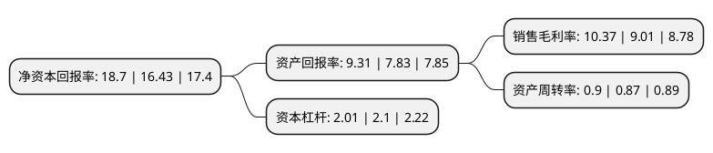

> 本页面由自动化程序生成于 2022年5月20日 01:08
> 内容可能存在错误，如有bug请提交issue至：https://github.com/Eroleice/doc-pi/issues
{.is-warning}

# 上市公司基本情况

## 基本资料

深圳和而泰智能控制股份有限公司（以下简称“和而泰”）成立于2000年01月12日，深圳市。于2010年05月11日在深交所中小板上市。

和而泰注册资本91,401.693万元，公司主营业务为智能控制器的研发，生产与销售，包括智能控制技术的研究，对应的嵌入式软件与算法的开发，技术解决方案的提供，产品设计服务等。以下是详细信息：

- 公司名称: 深圳和而泰智能控制股份有限公司
- 股票代码: 002402.SZ
- 所在地: 广东 - 深圳市
- 成立日期: 2000年01月12日
- 注册资本: 91,401.693万元
- 法定代表人: 刘建伟
- 主营业务: 公司主营业务为智能控制器的研发，生产与销售，包括智能控制技术的研究，对应的嵌入式软件与算法的开发，技术解决方案的提供，产品设计服务等
- 公司官网: www.szhittech.com
- 公司介绍: 公司是专业从事智能控制器技术研发、产品设计、软件服务、产品制造的高新技术企业，各项指标均名列国内同类企业前茅，是国内智能控制器行业具有领导地位的龙头企业。产品包括家用电器、健康与护理产品、电动工具、智能建筑与家居、汽车电子等领域的智能控制器。公司研发了中国第一套低成本商品化网络型冰箱控制系统、第一套直流变频冰箱控制系统、第一套DSP直流变频洗衣机控制系统、第一套无位置传感器正弦无刷直流变频洗衣机控制系统等多项领先技术与产品。公司已成为伊莱克斯、西门子、松下等全球著名跨国公司在国内少数的技术开发与产品合作伙伴。

## 股东及高管情况

上市公司第一大股东为刘建伟，持股148,475,000股，占比16.24%，**疑似为**上市公司实际控制人。

截至2022年03月31日，上市公司的前十大股东中，共有2名自然人股东，7个产品账户，1个海外主体，其中5%以上大股东共有1名。上市公司前十大股东明细如下：

> 未能通过持股比例判定出上市公司实际控制人（持股30%以上）
> 可能存在通过间接持股、联合持股、协议控制等方式拥有实际控制权的主体，具体请参考上市公司定期公告！
{.is-warning}

> 截至2022年03月31日，上市公司前十大股东信息如下：

| 股东名称 | 持股数量（股） | 持股比例 |
| --- | --- | --- |
| 刘建伟 | 148,475,000 | 16.24% |
| 全国社保基金四零六组合 | 33,482,530 | 3.66% |
| 中国工商银行股份有限公司-富国军工主题混合型证券投资基金 | 32,919,379 | 3.6% |
| 中国工商银行股份有限公司-富国天惠精选成长混合型证券投资基金(LOF) | 30,000,000 | 3.28% |
| 香港中央结算有限公司(陆股通) | 18,678,620 | 2.04% |
| 中国银行-易方达稳健收益债券型证券投资基金 | 13,306,142 | 1.46% |
| 中国工商银行股份有限公司-易方达新兴成长灵活配置混合型证券投资基金 | 12,965,097 | 1.42% |
| 唐武盛 | 10,893,000 | 1.19% |
| 中国工商银行股份有限公司-易方达价值精选混合型证券投资基金 | 7,650,120 | 0.84% |
| 中国工商银行股份有限公司-汇添富价值精选混合型证券投资基金 | 7,354,000 | 0.8% |

## 利润表分析

上市公司2021年总收入为59.85亿元，净利润为6.2亿元，实现盈利。

## 杜邦分析

> 数据列示周期：2021年 | 2020年 | 2019年
{.is-info}

上市公司的净资产收益率在近一年有所上升，上升幅度为13.82%，其变化情况分解如下：
- 上市公司的销售毛利率在近一年上升了15.09%，可能是生产效率的提升、商品原材料价格下跌或商品价格的上涨所致。
- 上市公司的资产周转率在近一年上升了3.45%，可能是源自于更快的销售回款或库存管理效果提升。
- 上市公司的财务杠杆比率在近一年下降了-4.29%，可能是减少负债降低财务费用。

