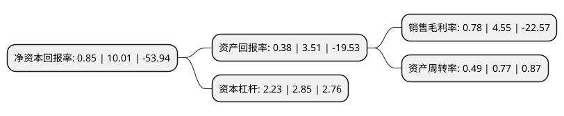

> 本页面由自动化程序生成于 2022年5月20日 01:09
> 内容可能存在错误，如有bug请提交issue至：https://github.com/Eroleice/doc-pi/issues
{.is-warning}

# 上市公司基本情况

## 基本资料

苏州胜利精密制造科技股份有限公司（以下简称“胜利精密”）成立于2003年12月05日，苏州市。于2010年06月08日在深交所中小板上市。

胜利精密注册资本344,151.772万元，本公司是专业的结构模组制造服务商。主要面向全球平板电视生产厂商，从事结构模组的研发，设计，生产，后续改进等全流程服务，开发与制造结构模组所需的精密模具。主要产品包括精密金属结构件，精密塑胶结构件，Base，精密模具等。以下是详细信息：

- 公司名称: 苏州胜利精密制造科技股份有限公司
- 股票代码: 002426.SZ
- 所在地: 江苏 - 苏州市
- 成立日期: 2003年12月05日
- 注册资本: 344,151.772万元
- 法定代表人: 高玉根
- 主营业务: 本公司是专业的结构模组制造服务商主要面向全球平板电视生产厂商，从事结构模组的研发，设计，生产，后续改进等全流程服务，开发与制造结构模组所需的精密模具主要产品包括精密金属结构件，精密塑胶结构件，Base，精密模具等
- 公司官网: www.vicsz.com
- 公司介绍: 公司是一家以精密制造为基石，智能制造和新能源业务为驱动的科技服务型企业集团，行业主要覆盖3C消费电子、智能制造和新能源汽车领域。其中，精密制造业务包括生产研发TV、NB、手机、AR/VR等智能终端的精密结构模组和盖板玻璃，及其渠道分销服务；智能制造业务为客户提供软硬件在内的智能制造整体解决方案，可实现全产线完整工艺流程的配套服务，已建成国家智能制造示范工厂；新能源业务包括锂电池湿法隔膜和智能汽车制造，专注于新能源汽车领域的新材料、新产品的生产和研发。

## 股东及高管情况

上市公司第一大股东为高玉根，持股346,055,941股，占比10.06%，**疑似为**上市公司实际控制人。

截至2022年03月31日，上市公司的前十大股东中，共有6名自然人股东，1名机构股东，3个产品账户，其中5%以上大股东共有2名。上市公司前十大股东明细如下：

> 未能通过持股比例判定出上市公司实际控制人（持股30%以上）
> 可能存在通过间接持股、联合持股、协议控制等方式拥有实际控制权的主体，具体请参考上市公司定期公告！
{.is-warning}

> 截至2022年03月31日，上市公司前十大股东信息如下：

| 股东名称 | 持股数量（股） | 持股比例 |
| --- | --- | --- |
| 高玉根 | 346,055,941 | 10.06% |
| 百年人寿保险股份有限公司-传统保险产品 | 204,214,013 | 5.93% |
| 东吴创业投资有限公司-证券行业支持民企发展系列之东吴证券1号私募股权投资基金(契约型) | 166,500,000 | 4.84% |
| 宁夏文佳顺景投资管理中心(有限合伙) | 136,363,636 | 3.96% |
| 张健 | 76,727,987 | 2.23% |
| 陈延良 | 63,352,673 | 1.84% |
| 百年人寿保险股份有限公司-分红保险产品 | 55,996,275 | 1.63% |
| 徐家进 | 45,493,450 | 1.32% |
| 陆小萍 | 42,000,000 | 1.22% |
| 皋雪松 | 26,223,666 | 0.76% |

## 利润表分析

上市公司2021年总收入为50.04亿元，净利润为0.38亿元，实现盈利。

## 杜邦分析

> 数据列示周期：2021年 | 2020年 | 2019年
{.is-info}

上市公司的净资产收益率在近一年有所下降，下降幅度为-91.51%，其变化情况分解如下：
- 上市公司的销售毛利率在近一年下降了-82.86%，可能是生产效率的下降、商品原材料价格上涨或商品价格的下跌所致。
- 上市公司的资产周转率在近一年下降了-36.36%，可能是源自于更慢的销售回款或库存管理效果下降。
- 上市公司的财务杠杆比率在近一年下降了-21.75%，可能是减少负债降低财务费用。

