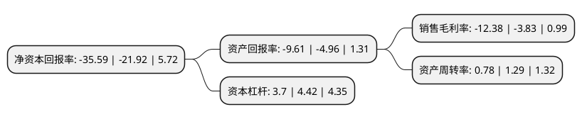

> 本页面由自动化程序生成于 2022年5月20日 01:09
> 内容可能存在错误，如有bug请提交issue至：https://github.com/Eroleice/doc-pi/issues
{.is-warning}

# 上市公司基本情况

## 基本资料

欧菲光集团股份有限公司（以下简称“欧菲光”）成立于2001年03月12日，深圳市。于2010年08月03日在深交所中小板上市。

欧菲光注册资本325,781.749万元，主要产品，劳务触摸屏，摄像头模组，红外截止滤光片及镜座组件，光纤头镀膜及其他精密光电薄膜元器件。以下是详细信息：

- 公司名称: 欧菲光集团股份有限公司
- 股票代码: 002456.SZ
- 所在地: 广东 - 深圳市
- 成立日期: 2001年03月12日
- 注册资本: 325,781.749万元
- 法定代表人: 蔡荣军
- 主营业务: 主要产品，劳务触摸屏，摄像头模组，红外截止滤光片及镜座组件，光纤头镀膜及其他精密光电薄膜元器件
- 公司官网: www.ofilm.com
- 公司介绍: 公司的主营业务为触控显示类业务、摄像通讯类业务和生物识别类业务，主营业务产品有触控和液晶显示模组、微摄像头模组和指纹识别模组等，同时大力布局智能汽车、车联网和智慧城市领域。公司产品广泛应用于以智能手机、平板电脑、智能汽车、智能可穿戴电子产品等为代表的消费电子领域。公司拥有垂直一体化的全产业链布局，具备为客户大规模稳定供货能力，高效的嵌入式研发模式和自主创新的核心技术使公司生产具备高度的灵活性和及时应变能力。作为全球触控行业龙头，公司和国内外知名品牌企业建立了长期稳定合作关系，以此为基础，微摄像头模组和指纹识别模组产品在近年来呈爆发式增长，目前跻身国内市场前列。公司积极布局智能汽车和车联网领域，充分利用自有核心技术，在智能中控、自动驾驶、车身电子等核心领域打造汽车智能化一站式解决方案，提供高质量、高性价比的产品和服务，力争成为汽车智能化的核心供应商及有竞争力的国际一流品牌。

## 股东及高管情况

上市公司第一大股东为深圳市欧菲投资控股有限公司，持股333,953,812股，占比10.25%，**疑似为**上市公司实际控制人。

截至2022年03月31日，上市公司的前十大股东中，共有8名机构股东，1个产品账户，1个海外主体，其中5%以上大股东共有2名。上市公司前十大股东明细如下：

> 未能通过持股比例判定出上市公司实际控制人（持股30%以上）
> 可能存在通过间接持股、联合持股、协议控制等方式拥有实际控制权的主体，具体请参考上市公司定期公告！
{.is-warning}

> 截至2022年03月31日，上市公司前十大股东信息如下：

| 股东名称 | 持股数量（股） | 持股比例 |
| --- | --- | --- |
| 深圳市欧菲投资控股有限公司 | 333,953,812 | 10.25% |
| 裕高(中国)有限公司 | 284,251,960 | 8.73% |
| 南昌市国金工业投资有限公司 | 162,772,028 | 5% |
| 合肥合屏投资有限公司 | 160,771,704 | 4.93% |
| 共青城安芯投资合伙企业(有限合伙) | 69,131,832 | 2.12% |
| 香港中央结算有限公司(陆股通) | 49,909,397 | 1.53% |
| 广东恒阔投资管理有限公司 | 48,231,511 | 1.48% |
| 江西赣江新区开发投资集团有限责任公司 | 32,154,340 | 0.99% |
| 广州市城投投资有限公司 | 32,154,340 | 0.99% |
| 广东恒健资产管理有限公司-广东恒会股权投资基金(有限合伙) | 32,154,340 | 0.99% |

## 利润表分析

上市公司2021年总收入为228.43亿元，净利润为-28.28亿元，**未实现盈利**。

## 杜邦分析

> 数据列示周期：2021年 | 2020年 | 2019年
{.is-info}

上市公司的净资产收益率在近一年有所上升，上升幅度为62.36%，其变化情况分解如下：
- 上市公司的销售毛利率在近一年上升了223.24%，可能是生产效率的提升、商品原材料价格下跌或商品价格的上涨所致。
- 上市公司的资产周转率在近一年下降了-39.53%，可能是源自于更慢的销售回款或库存管理效果下降。
- 上市公司的财务杠杆比率在近一年下降了-16.29%，可能是减少负债降低财务费用。

