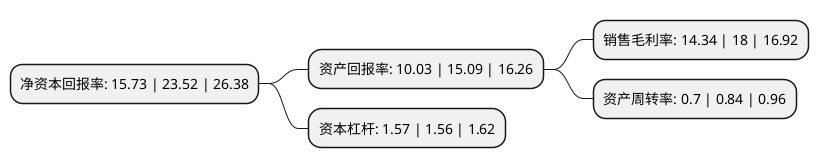

> 本页面由自动化程序生成于 2022年5月20日 01:09
> 内容可能存在错误，如有bug请提交issue至：https://github.com/Eroleice/doc-pi/issues
{.is-warning}

# 上市公司基本情况

## 基本资料

沪士电子股份有限公司（以下简称“沪电股份”）成立于1992年04月14日，苏州市。于2010年08月18日在深交所中小板上市。

沪电股份注册资本189,665.877万元，主营业务为印制电路板的研发，生产和销售。主要产品包括企业通讯市场板，汽车板，办公及工业设备板等，主导品为14-28层企业通讯市场板，并以高阶汽车板，办公及工业设备板和航空航天板为有力补充，上述主要产品系列可广泛应用于通讯设备，汽车，游戏机，复印机，工控机，航空航天，微波射频等众多领域。以下是详细信息：

- 公司名称: 沪士电子股份有限公司
- 股票代码: 002463.SZ
- 所在地: 江苏 - 苏州市
- 成立日期: 1992年04月14日
- 注册资本: 189,665.877万元
- 法定代表人: 吴礼淦
- 主营业务: 主营业务为印制电路板的研发，生产和销售主要产品包括企业通讯市场板，汽车板，办公及工业设备板等，主导品为14-28层企业通讯市场板，并以高阶汽车板，办公及工业设备板和航空航天板为有力补充，上述主要产品系列可广泛应用于通讯设备，汽车，游戏机，复印机，工控机，航空航天，微波射频等众多领域
- 公司官网: www.wuscn.com
- 公司介绍: 公司自成立以来一直立足于印制电路板的研发设计和生产制造。在全体员工的努力下，经过多年的市场拓展和品牌经营，现已发展成为是印制电路板行业内的重要品牌之一，在行业内享有盛誉。目前，公司主导产品为应用于通讯、通信设备以及汽车的印制电路板。公司专注于各类印制电路板的生产、销售及相关售后服务。目前公司主导产品为14-38层企业通讯市场板、中高阶汽车板，并以工业设备板等为有力补充，可广泛应用于通讯设备、汽车、工业设备、微波射频等多个领域。在激烈的市场竞争中，公司已经在技术、质量、成本、品牌、规模等方面形成竞争优势，居行业领先地位，连续多年入选行业研究机构N.T.Information发布的世界PCB制造企业百强以及中国印制电路行业协会(CPCA)发布的中国PCB百强企业，并被CPCA评为优秀民族品牌企业。

## 股东及高管情况

上市公司第一大股东为BIGGERING(BVI) HOLDINGS CO., LTD.，持股371,799,937股，占比19.6%，**疑似为**上市公司实际控制人。

截至2022年03月31日，上市公司的前十大股东中，共有6个产品账户，4个海外主体，其中5%以上大股东共有3名。上市公司前十大股东明细如下：

> 未能通过持股比例判定出上市公司实际控制人（持股30%以上）
> 可能存在通过间接持股、联合持股、协议控制等方式拥有实际控制权的主体，具体请参考上市公司定期公告！
{.is-warning}

> 截至2022年03月31日，上市公司前十大股东信息如下：

| 股东名称 | 持股数量（股） | 持股比例 |
| --- | --- | --- |
| BIGGERING(BVI) HOLDINGS CO., LTD. | 371,799,937 | 19.6% |
| WUS GROUP HOLDINGS CO., LTD. | 243,710,963 | 12.85% |
| 香港中央结算有限公司(陆股通) | 137,451,300 | 7.25% |
| HAPPY UNION INVESTMENT LIMITED | 19,811,263 | 1.04% |
| 中国农业银行股份有限公司-国泰智能汽车股票型证券投资基金 | 19,586,978 | 1.03% |
| 中国工商银行股份有限公司-富国军工主题混合型证券投资基金 | 15,213,034 | 0.8% |
| 中国银行股份有限公司-国泰智能装备股票型证券投资基金 | 14,382,022 | 0.76% |
| 中国工商银行股份有限公司-富国创新科技混合型证券投资基金 | 13,910,314 | 0.73% |
| 中国银行股份有限公司-富国创新趋势股票型证券投资基金 | 13,898,863 | 0.73% |
| 中国工商银行股份有限公司-富国天惠精选成长混合型证券投资基金(LOF) | 13,504,859 | 0.71% |

## 利润表分析

上市公司2021年总收入为74.18亿元，净利润为10.63亿元，实现盈利。

## 杜邦分析

> 数据列示周期：2021年 | 2020年 | 2019年
{.is-info}

上市公司的净资产收益率在近一年有所下降，下降幅度为-33.12%，其变化情况分解如下：
- 上市公司的销售毛利率在近一年下降了-20.33%，可能是生产效率的下降、商品原材料价格上涨或商品价格的下跌所致。
- 上市公司的资产周转率在近一年下降了-16.67%，可能是源自于更慢的销售回款或库存管理效果下降。
- 上市公司的财务杠杆比率在近一年上升了0.64%，可能是增加负债扩大生产规模。

