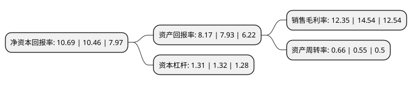

> 本页面由自动化程序生成于 2022年5月20日 01:09
> 内容可能存在错误，如有bug请提交issue至：https://github.com/Eroleice/doc-pi/issues
{.is-warning}

# 上市公司基本情况

## 基本资料

南通江海电容器股份有限公司（以下简称“江海股份”）成立于1958年10月01日，南通市。于2010年09月29日在深交所中小板上市。

江海股份注册资本82,546.844万元，公司主要从事电容器及其材料，配件的研发，生产，销售和服务，公司的主要产品为:铝电解电容器全系列产品及其主要原材料化成(即电极箔的成品形式)。以下是详细信息：

- 公司名称: 南通江海电容器股份有限公司
- 股票代码: 002484.SZ
- 所在地: 江苏 - 南通市
- 成立日期: 1958年10月01日
- 注册资本: 82,546.844万元
- 法定代表人: 陈卫东
- 主营业务: 公司主要从事电容器及其材料，配件的研发，生产，销售和服务，公司的主要产品为:铝电解电容器全系列产品及其主要原材料化成(即电极箔的成品形式)
- 公司官网: www.jianghai.com
- 公司介绍: 公司是专业从事电容器及其材料、配件的研发、生产、销售和服务的骨干企业。主产品铝电解电容器是电子产品不可或缺的关键基础元件，广泛应用于家用电器、数字音像、通讯、工业控制、航空航天、能源、军工等领域，年生产能力20亿只。对比国内铝电解电容器企业，公司在技术水平、产品结构及产业整合方面均处于领先地位。公司先后通过了ISO9001、QS9000质量体系认证和ISO14001环保体系认证，CD29X和CD13X系列产品通过美国UL产品安全体系认证，江海商标是江苏省著名商标，是众多国际国内知名品牌的配套首选和免检产品。

## 股东及高管情况

上市公司第一大股东为億威投資有限公司，持股259,584,000股，占比31.07%，为上市公司实际控制人。

截至2022年03月31日，上市公司的前十大股东中，共有5名自然人股东，1名机构股东，3个产品账户，1个海外主体，其中5%以上大股东共有2名。上市公司前十大股东明细如下：

> 截至2022年03月31日，上市公司前十大股东信息如下：

| 股东名称 | 持股数量（股） | 持股比例 |
| --- | --- | --- |
| 億威投資有限公司 | 259,584,000 | 31.07% |
| 朱祥 | 66,238,913 | 7.93% |
| 香港中央结算有限公司(陆股通) | 19,529,491 | 2.34% |
| 陈卫东 | 19,083,348 | 2.28% |
| 陆军 | 12,611,040 | 1.51% |
| 中国建设银行股份有限公司-兴全社会责任混合型证券投资基金 | 7,495,345 | 0.9% |
| 中国建设银行股份有限公司-信达澳银新能源产业股票型证券投资基金 | 7,431,218 | 0.89% |
| 顾义明 | 6,251,424 | 0.75% |
| 中国农业银行股份有限公司-大成高新技术产业股票型证券投资基金 | 6,228,500 | 0.75% |
| 邵国柱 | 5,834,784 | 0.7% |

## 利润表分析

上市公司2021年总收入为35.49亿元，净利润为4.38亿元，实现盈利。

## 杜邦分析

> 数据列示周期：2021年 | 2020年 | 2019年
{.is-info}

上市公司的净资产收益率在近一年有所上升，上升幅度为2.2%，其变化情况分解如下：
- 上市公司的销售毛利率在近一年下降了-15.06%，可能是生产效率的下降、商品原材料价格上涨或商品价格的下跌所致。
- 上市公司的资产周转率在近一年上升了20%，可能是源自于更快的销售回款或库存管理效果提升。
- 上市公司的财务杠杆比率在近一年下降了-0.76%，可能是减少负债降低财务费用。

