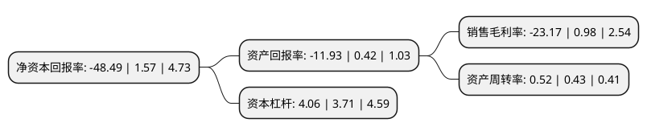

> 本页面由自动化程序生成于 2022年5月20日 01:09
> 内容可能存在错误，如有bug请提交issue至：https://github.com/Eroleice/doc-pi/issues
{.is-warning}

# 上市公司基本情况

## 基本资料

福州达华智能科技股份有限公司（以下简称“达华智能”）成立于1993年08月10日，福州市。于2010年12月03日在深交所中小板上市。

达华智能注册资本114,709.453万元，主要产品:非接触IC卡和电子标签两个系列。主营业务:非接触IC卡，电子标签等各类RFID产品的研发，生产和销售的高新技术企业。以下是详细信息：

- 公司名称: 福州达华智能科技股份有限公司
- 股票代码: 002512.SZ
- 所在地: 福建 - 福州市
- 成立日期: 1993年08月10日
- 注册资本: 114,709.453万元
- 法定代表人: 陈融圣
- 主营业务: 主要产品:非接触IC卡和电子标签两个系列主营业务:非接触IC卡，电子标签等各类RFID产品的研发，生产和销售的高新技术企业
- 公司官网: www.twh.com.cn
- 公司介绍: 公司是一家集软、硬件产品设计、开发、销售、服务为一体的RFID整体解决方案提供商，智能卡行业的领军企业之一。公司产品涵盖整体解决方案、行业解决方案、电子标签、智能卡、软硬件开发等，尤其是面向各行业推出的物联网——RFID系统应用解决方案，已经广泛覆盖了智能交通、智慧教育、智能家居、农业溯源、互联网金融、仓储物流等众多领域。公司致力于提升在物联网领域的应用及服务能力，增强在物联网整体解决方案方面的提供能力，努力朝着物联网整体解决方案提供商方向进一步迈进。

## 股东及高管情况

上市公司第一大股东为蔡小如，持股98,979,863股，占比8.63%，**疑似为**上市公司实际控制人。

截至2022年03月31日，上市公司的前十大股东中，共有4名自然人股东，3名机构股东，3个产品账户，其中5%以上大股东共有4名。上市公司前十大股东明细如下：

> 未能通过持股比例判定出上市公司实际控制人（持股30%以上）
> 可能存在通过间接持股、联合持股、协议控制等方式拥有实际控制权的主体，具体请参考上市公司定期公告！
{.is-warning}

> 上市公司第一大股东持股不超过10%，请检查是否存在公司控制权风险！
{.is-danger}

> 截至2022年03月31日，上市公司前十大股东信息如下：

| 股东名称 | 持股数量（股） | 持股比例 |
| --- | --- | --- |
| 蔡小如 | 98,979,863 | 8.63% |
| 珠海植诚投资中心(有限合伙) | 92,976,809 | 8.11% |
| 珠海植远投资中心(有限合伙) | 87,424,806 | 7.62% |
| 陈融圣 | 61,329,099 | 5.35% |
| 蔡小文 | 22,281,600 | 1.94% |
| 领颐(上海)资产管理有限公司-领颐16号私募证券投资基金 | 20,000,000 | 1.74% |
| 百年人寿保险股份有限公司-分红保险产品 | 15,311,864 | 1.33% |
| 百年人寿保险股份有限公司-传统保险产品 | 14,170,997 | 1.24% |
| 方江涛 | 10,000,000 | 0.87% |
| 百年人寿保险股份有限公司-百年人寿-分红自营 | 9,149,896 | 0.8% |

## 利润表分析

上市公司2021年总收入为22.41亿元，净利润为-5.2亿元，**未实现盈利**。

## 杜邦分析

> 数据列示周期：2021年 | 2020年 | 2019年
{.is-info}

上市公司的净资产收益率在近一年有所下降，下降幅度为-3188.54%，其变化情况分解如下：
- 上市公司的销售毛利率在近一年下降了-2464.29%，可能是生产效率的下降、商品原材料价格上涨或商品价格的下跌所致。
- 上市公司的资产周转率在近一年上升了20.93%，可能是源自于更快的销售回款或库存管理效果提升。
- 上市公司的财务杠杆比率在近一年上升了9.43%，可能是增加负债扩大生产规模。

