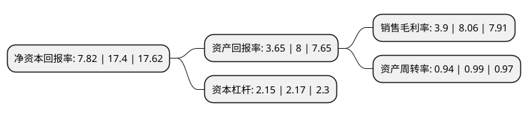

> 本页面由自动化程序生成于 2022年5月20日 01:10
> 内容可能存在错误，如有bug请提交issue至：https://github.com/Eroleice/doc-pi/issues
{.is-warning}

# 上市公司基本情况

## 基本资料

广东领益智造股份有限公司（以下简称“领益智造”）成立于1975年07月01日，江门市。于2011年07月15日在深交所中小板上市。

领益智造注册资本707,111.4万元，主营业务为新型电子元器件，手机及电脑配件的生产和销售以下是详细信息：

- 公司名称: 广东领益智造股份有限公司
- 股票代码: 002600.SZ
- 所在地: 广东 - 江门市
- 成立日期: 1975年07月01日
- 注册资本: 707,111.4万元
- 法定代表人: 曾芳勤
- 主营业务: 主营业务为新型电子元器件，手机及电脑配件的生产和销售
- 公司官网: www.lingyiitech.com
- 公司介绍: 公司是国内大型铁氧体磁性材料元件制造商之一。主要产品包括铁氧体永磁元件、铁氧体软磁元件。2018年，公司通过重大资产重组，购买领益科技100%股权，公司的主营业务将由原来的磁性材料生产和销售变更为新型电子元器件、手机及电脑配件的生产和销售，公司成为拥有磁性材料、贸易及物流服务、平板显示、精密结构件、精密功能器件等业务并行的上市公司。领益科技的主营业务为新型电子元器件、导电材料、导热绝缘材料、屏蔽防辐射材料的技术开发、生产经营新型电子元器件、手机及电脑配件。

## 股东及高管情况

上市公司第一大股东为领胜投资(深圳)有限公司，持股4,139,524,021股，占比58.54%，为上市公司实际控制人。

截至2022年04月07日，上市公司的前十大股东中，共有4名自然人股东，3名机构股东，2个产品账户，1个海外主体，其中5%以上大股东共有1名。上市公司前十大股东明细如下：

> 截至2022年04月07日，上市公司前十大股东信息如下：

| 股东名称 | 持股数量（股） | 持股比例 |
| --- | --- | --- |
| 领胜投资(深圳)有限公司 | 4,139,524,021 | 58.54% |
| 曾芳勤 | 144,536,846 | 2.04% |
| 香港中央结算有限公司(陆股通) | 129,635,936 | 1.83% |
| 汪南东 | 100,122,744 | 1.42% |
| 曹云 | 37,871,329 | 0.54% |
| 新加坡政府投资有限公司 | 34,464,034 | 0.49% |
| 中国华融资产管理股份有限公司 | 32,223,415 | 0.46% |
| 陈国狮 | 30,223,700 | 0.43% |
| 中国银行股份有限公司-华夏中证5G通信主题交易型开放式指数证券投资基金 | 21,715,381 | 0.31% |
| 汇安基金-华能信托·聚华2号单一资金信托-汇安基金汇鑫37号单一资产管理计划 | 21,482,277 | 0.3% |

## 利润表分析

上市公司2021年总收入为303.84亿元，净利润为11.83亿元，实现盈利。

## 杜邦分析

> 数据列示周期：2021年 | 2020年 | 2019年
{.is-info}

上市公司的净资产收益率在近一年有所下降，下降幅度为-55.06%，其变化情况分解如下：
- 上市公司的销售毛利率在近一年下降了-51.61%，可能是生产效率的下降、商品原材料价格上涨或商品价格的下跌所致。
- 上市公司的资产周转率在近一年下降了-5.05%，可能是源自于更慢的销售回款或库存管理效果下降。
- 上市公司的财务杠杆比率在近一年下降了-0.92%，可能是减少负债降低财务费用。

