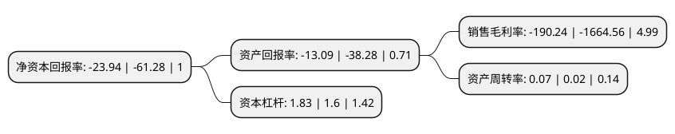

> 本页面由自动化程序生成于 2022年5月20日 01:10
> 内容可能存在错误，如有bug请提交issue至：https://github.com/Eroleice/doc-pi/issues
{.is-warning}

# 上市公司基本情况

## 基本资料

深圳丹邦科技股份有限公司（以下简称“*ST丹邦”）成立于2001年11月20日，深圳市。于2011年09月20日在深交所中小板上市。

*ST丹邦注册资本54,792万元，主营业务是FPC，COF柔性封装基板及COF产品的研发，生产与销售。主要产品为FPC，COF柔性封装基板及COF产品以下是详细信息：

- 公司名称: 深圳丹邦科技股份有限公司
- 股票代码: 002618.SZ
- 所在地: 广东 - 深圳市
- 成立日期: 2001年11月20日
- 注册资本: 54,792万元
- 法定代表人: 刘萍
- 主营业务: 主营业务是FPC，COF柔性封装基板及COF产品的研发，生产与销售主要产品为FPC，COF柔性封装基板及COF产品
- 公司官网: www.danbang.com
- 公司介绍: 公司自成立以来专注于FPC、COF柔性封装基板及COF产品的研发、生产与销售，致力于在微电子领域为客户提供全面的柔性互连解决方案及基于柔性基板技术的芯片封装方案。公司生产的FPC、COF柔性封装基板及COF产品具有配线密度高、厚度薄、重量轻、配线空间限制少、可折叠、灵活度高等优点，广泛应用于空间狭小、可移动、可折叠的各类电子信息产品。公司是全球极少数有完整产业链布局的厂商，是国内极少数不依赖进口封装基材，而通过自产封装基材批量制造COF柔性封装基板的厂商。

## 股东及高管情况

上市公司第一大股东为深圳丹邦投资集团有限公司，持股44,168,298股，占比8.0611%，**疑似为**上市公司实际控制人。

截至2022年04月21日，上市公司的前十大股东中，共有7名自然人股东，3名机构股东，其中5%以上大股东共有1名。上市公司前十大股东明细如下：

> 未能通过持股比例判定出上市公司实际控制人（持股30%以上）
> 可能存在通过间接持股、联合持股、协议控制等方式拥有实际控制权的主体，具体请参考上市公司定期公告！
{.is-warning}

> 上市公司第一大股东持股不超过10%，请检查是否存在公司控制权风险！
{.is-danger}

> 截至2022年04月21日，上市公司前十大股东信息如下：

| 股东名称 | 持股数量（股） | 持股比例 |
| --- | --- | --- |
| 深圳丹邦投资集团有限公司 | 44,168,298 | 8.0611% |
| 深圳市丹侬科技有限公司 | 17,397,544 | 3.18% |
| 李华锋 | 13,708,150 | 2.5% |
| 深圳市浩石投资企业(有限合伙) | 12,435,853 | 2.27% |
| 谢锦和 | 10,025,665 | 1.83% |
| 张淑娟 | 7,918,200 | 1.45% |
| 陈荣 | 7,050,842 | 1.29% |
| 林培 | 5,760,800 | 1.05% |
| 王永超 | 5,632,000 | 1.03% |
| 杜景葱 | 5,480,700 | 1% |

## 利润表分析

上市公司2021年总收入为1.16亿元，净利润为-2.22亿元，**未实现盈利**。

## 杜邦分析

> 数据列示周期：2021年 | 2020年 | 2019年
{.is-info}

上市公司的净资产收益率在近一年有所下降，下降幅度为-60.93%，其变化情况分解如下：
- 上市公司的销售毛利率在近一年下降了-88.57%，可能是生产效率的下降、商品原材料价格上涨或商品价格的下跌所致。
- 上市公司的资产周转率在近一年上升了250%，可能是源自于更快的销售回款或库存管理效果提升。
- 上市公司的财务杠杆比率在近一年上升了14.38%，可能是增加负债扩大生产规模。

