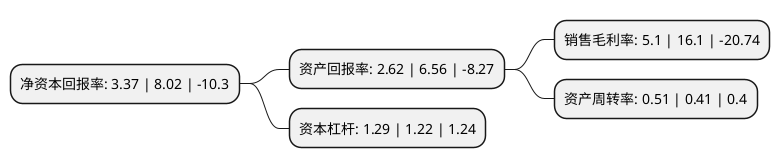

> 本页面由自动化程序生成于 2022年5月20日 01:10
> 内容可能存在错误，如有bug请提交issue至：https://github.com/Eroleice/doc-pi/issues
{.is-warning}

# 上市公司基本情况

## 基本资料

苏州安洁科技股份有限公司（以下简称“安洁科技”）成立于1999年12月16日，苏州市。于2011年11月25日在深交所中小板上市。

安洁科技注册资本68,324.42万元，主营业务为消费电子和新能源汽车精密功能性器件和精密金属零件。以下是详细信息：

- 公司名称: 苏州安洁科技股份有限公司
- 股票代码: 002635.SZ
- 所在地: 江苏 - 苏州市
- 成立日期: 1999年12月16日
- 注册资本: 68,324.42万元
- 法定代表人: 吕莉
- 主营业务: 主营业务为消费电子和新能源汽车精密功能性器件和精密金属零件
- 公司官网: www.anjiesz.com
- 公司介绍: 公司专业为智能手机、台式电脑及笔记本电脑、平板电脑、智能穿戴设备和智能家居产品等中高端消费电子产品和新能源汽车提供精密功能性器件生产和整体解决方案。公司从事消费电子精密功能性器件产品系列包括：粘贴类、绝缘类、缓冲类、屏蔽类、遮光类、散热类、导电类和光学胶膜等内部功能性器件，及装饰类、触控面板、视窗防护玻璃等外部功能性器件。公司生产的消费电子精密功能性器件主要为智能手机、台式及笔记本电脑、平板电脑、智能穿戴和智能家居产品等消费电子产品提供配套精密功能件。公司通过ISO/TS16949:汽车业供方质量保证体系认证，公司将精密功能性器件的运用范围不断拓宽，目前公司业务已经从消费电子业务扩展到新能源汽车业务。

## 股东及高管情况

上市公司第一大股东为吕莉，持股204,050,714股，占比29.86%，**疑似为**上市公司实际控制人。

截至2022年03月31日，上市公司的前十大股东中，共有3名自然人股东，2名机构股东，4个产品账户，1个海外主体，其中5%以上大股东共有2名。上市公司前十大股东明细如下：

> 未能通过持股比例判定出上市公司实际控制人（持股30%以上）
> 可能存在通过间接持股、联合持股、协议控制等方式拥有实际控制权的主体，具体请参考上市公司定期公告！
{.is-warning}

> 截至2022年03月31日，上市公司前十大股东信息如下：

| 股东名称 | 持股数量（股） | 持股比例 |
| --- | --- | --- |
| 吕莉 | 204,050,714 | 29.86% |
| 王春生 | 146,988,500 | 21.51% |
| 香港中央结算有限公司(陆股通) | 12,948,286 | 1.9% |
| 兴业银行股份有限公司-兴全趋势投资混合型证券投资基金 | 11,499,744 | 1.68% |
| 招商银行股份有限公司-兴全轻资产投资混合型证券投资基金(LOF) | 8,526,033 | 1.25% |
| 练厚桂 | 7,268,154 | 1.06% |
| 中车金证投资有限公司 | 6,207,324 | 0.91% |
| 中国国际金融股份有限公司 | 5,066,240 | 0.74% |
| 中国银行股份有限公司-华泰柏瑞创新升级混合型证券投资基金 | 3,570,655 | 0.52% |
| 中国建设银行股份有限公司-华泰柏瑞景气优选混合型证券投资基金 | 1,850,895 | 0.27% |

## 利润表分析

上市公司2021年总收入为38.83亿元，净利润为1.98亿元，实现盈利。

## 杜邦分析

> 数据列示周期：2021年 | 2020年 | 2019年
{.is-info}

上市公司的净资产收益率在近一年有所下降，下降幅度为-57.98%，其变化情况分解如下：
- 上市公司的销售毛利率在近一年下降了-68.32%，可能是生产效率的下降、商品原材料价格上涨或商品价格的下跌所致。
- 上市公司的资产周转率在近一年上升了24.39%，可能是源自于更快的销售回款或库存管理效果提升。
- 上市公司的财务杠杆比率在近一年上升了5.74%，可能是增加负债扩大生产规模。

