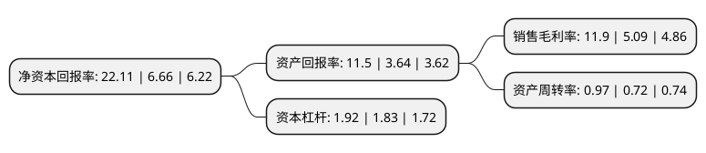

> 本页面由自动化程序生成于 2022年5月20日 01:10
> 内容可能存在错误，如有bug请提交issue至：https://github.com/Eroleice/doc-pi/issues
{.is-warning}

# 上市公司基本情况

## 基本资料

金安国纪科技股份有限公司（以下简称“金安国纪”）成立于2000年10月19日，上海市。于2011年11月25日在深交所中小板上市。

金安国纪注册资本72,800万元，主营业务为各种FR-4，CEM-3覆铜板及半固化片的研发，生产和销售。产品包括各种高等级FR-4，CEM-3系列覆铜板产品。作为国家级高新技术企业，公司重视新产品的开发和技术创新，技术研发中心陆续开发生产出高Tg，高CTI，无卤素以及适合于无铅工艺的中，高耐热覆铜板等一系列新产品。以下是详细信息：

- 公司名称: 金安国纪科技股份有限公司
- 股票代码: 002636.SZ
- 所在地: 上海 - 上海市
- 成立日期: 2000年10月19日
- 注册资本: 72,800万元
- 法定代表人: 韩涛
- 主营业务: 主营业务为各种FR-4，CEM-3覆铜板及半固化片的研发，生产和销售产品包括各种高等级FR-4，CEM-3系列覆铜板产品作为国家级高新技术企业，公司重视新产品的开发和技术创新，技术研发中心陆续开发生产出高Tg，高CTI，无卤素以及适合于无铅工艺的中，高耐热覆铜板等一系列新产品
- 公司官网: www.goldenmax.cn
- 公司介绍: 公司是专注于印制电路用覆铜箔层压板产品的研发、生产和销售的国家级高新技术企业。主要产品是印刷电路用覆铜箔层压板及相关产品。公司拥有“金安”和“国纪”两个覆铜板品牌，其中“金安”为代表行业中最高品质的覆铜板品牌之一。公司拥有无卤素FR-4、高耐热覆铜板、高CTI覆铜板、高导热覆铜板的制造方法等专利技术。公司是中国印制电路行业协会(CPCA)会员及覆铜板材料分会(CCLA)会员，银行3A级信用企业。公司先后获得“国家火炬计划项目证书”、“上海市高新技术企业”、“上海市著名商标证书”等荣誉。

## 股东及高管情况

上市公司第一大股东为上海东临投资发展有限公司，持股289,926,000股，占比39.83%，为上市公司实际控制人。

截至2022年03月31日，上市公司的前十大股东中，共有5名自然人股东，4名机构股东，1个海外主体，其中5%以上大股东共有2名。上市公司前十大股东明细如下：

> 截至2022年03月31日，上市公司前十大股东信息如下：

| 股东名称 | 持股数量（股） | 持股比例 |
| --- | --- | --- |
| 上海东临投资发展有限公司 | 289,926,000 | 39.83% |
| 金安国际科技集团有限公司 | 186,732,000 | 25.65% |
| 宁波金禾企业管理咨询有限公司 | 14,742,000 | 2.03% |
| 韩涛 | 6,523,704 | 0.9% |
| 香港中央结算有限公司(陆股通) | 4,257,333 | 0.58% |
| 成来茵 | 1,827,992 | 0.25% |
| 杨正跃 | 1,200,000 | 0.16% |
| 汤伟霞 | 1,070,000 | 0.15% |
| 许达军 | 1,067,600 | 0.15% |
| 陕西省国际信托股份有限公司 | 985,000 | 0.14% |

## 利润表分析

上市公司2021年总收入为58.91亿元，净利润为7.01亿元，实现盈利。

## 杜邦分析

> 数据列示周期：2021年 | 2020年 | 2019年
{.is-info}

上市公司的净资产收益率在近一年有所上升，上升幅度为231.98%，其变化情况分解如下：
- 上市公司的销售毛利率在近一年上升了133.79%，可能是生产效率的提升、商品原材料价格下跌或商品价格的上涨所致。
- 上市公司的资产周转率在近一年上升了34.72%，可能是源自于更快的销售回款或库存管理效果提升。
- 上市公司的财务杠杆比率在近一年上升了4.92%，可能是增加负债扩大生产规模。

