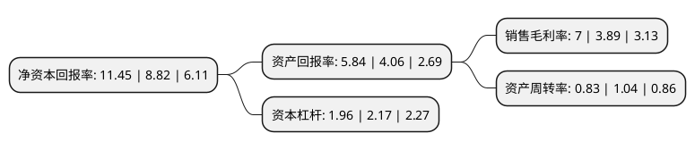

> 本页面由自动化程序生成于 2022年5月20日 01:11
> 内容可能存在错误，如有bug请提交issue至：https://github.com/Eroleice/doc-pi/issues
{.is-warning}

# 上市公司基本情况

## 基本资料

共达电声股份有限公司（以下简称“共达电声”）成立于2001年04月10日，潍坊市。于2012年02月17日在深交所中小板上市。

共达电声注册资本36,000万元，主营业务为微型电声元器件及电声组件的研发，生产和销售，主要产品包括微型麦克风，微型扬声器/受话器及其阵列模组，广泛应用于移动通讯设备及其周边产品，笔记本电脑，平板电视，个人数码产品，汽车电子等消费类电子产品领域。以下是详细信息：

- 公司名称: 共达电声股份有限公司
- 股票代码: 002655.SZ
- 所在地: 山东 - 潍坊市
- 成立日期: 2001年04月10日
- 注册资本: 36,000万元
- 法定代表人: 傅爱善
- 主营业务: 主营业务为微型电声元器件及电声组件的研发，生产和销售，主要产品包括微型麦克风，微型扬声器/受话器及其阵列模组，广泛应用于移动通讯设备及其周边产品，笔记本电脑，平板电视，个人数码产品，汽车电子等消费类电子产品领域
- 公司官网: www.gettopacoustic.com
- 公司介绍: 公司是专业的电声元器件及电声组件制造商、服务商和电声技术整体解决方案提供商，是国家级高新技术企业、中国电子元件百强企业。公司致力于成为世界一流的电声技术整体解决方案提供商，主要产品包括微型麦克风、微型扬声器/受话器及其阵列模组，广泛应用于移动通讯设备及其周边产品、笔记本电脑、平板电视、个人数码产品、汽车电子等消费类电子产品领域。公司先后通过了ISO9001质量管理体系、ISO/TS16949汽车供方质量管理体系、ISO14001环境管理体系、OHSAS18001职业健康安全体系、QC080000有害物质过程管理体系认证。公司拥有“山东省企业技术中心”、“山东省声学元件工程技术研究中心”，与中国科学院声学所成立了“电声联合实验室”，在北欧设立了共达电声欧洲研发有限公司。公司被山东省科学技术厅、山东省知识产权局认定为“中国专利山东明星企业”，两度获得“山东省科学技术奖”。

## 股东及高管情况

上市公司第一大股东为无锡韦感半导体有限公司，持股37,000,000股，占比10.28%，**疑似为**上市公司实际控制人。

截至2022年03月31日，上市公司的前十大股东中，共有1名自然人股东，2名机构股东，7个产品账户，其中5%以上大股东共有1名。上市公司前十大股东明细如下：

> 未能通过持股比例判定出上市公司实际控制人（持股30%以上）
> 可能存在通过间接持股、联合持股、协议控制等方式拥有实际控制权的主体，具体请参考上市公司定期公告！
{.is-warning}

> 截至2022年03月31日，上市公司前十大股东信息如下：

| 股东名称 | 持股数量（股） | 持股比例 |
| --- | --- | --- |
| 无锡韦感半导体有限公司 | 37,000,000 | 10.28% |
| 潍坊爱声声学科技有限公司 | 17,980,000 | 4.99% |
| 全国社保基金五零三组合 | 11,000,000 | 3.06% |
| 共达电声股份有限公司-第一期员工持股计划 | 5,955,600 | 1.65% |
| 中国建设银行股份有限公司-南方信息创新混合型证券投资基金 | 5,620,609 | 1.56% |
| 中国银行股份有限公司-鹏华高质量增长混合型证券投资基金 | 4,607,000 | 1.28% |
| 中国银行股份有限公司-上投摩根远见两年持有期混合型证券投资基金 | 4,124,100 | 1.15% |
| 兴业银行股份有限公司-万家成长优选灵活配置混合型证券投资基金 | 4,026,867 | 1.12% |
| 吴春鸣 | 3,304,400 | 0.92% |
| 中国建设银行股份有限公司-万家科创主题3年封闭运作灵活配置混合型证券投资基金 | 2,889,515 | 0.8% |

## 利润表分析

上市公司2021年总收入为9.36亿元，净利润为0.65亿元，实现盈利。

## 杜邦分析

> 数据列示周期：2021年 | 2020年 | 2019年
{.is-info}

上市公司的净资产收益率在近一年有所上升，上升幅度为29.82%，其变化情况分解如下：
- 上市公司的销售毛利率在近一年上升了79.95%，可能是生产效率的提升、商品原材料价格下跌或商品价格的上涨所致。
- 上市公司的资产周转率在近一年下降了-20.19%，可能是源自于更慢的销售回款或库存管理效果下降。
- 上市公司的财务杠杆比率在近一年下降了-9.68%，可能是减少负债降低财务费用。

