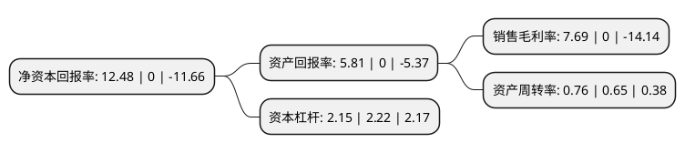

> 本页面由自动化程序生成于 2022年5月20日 01:12
> 内容可能存在错误，如有bug请提交issue至：https://github.com/Eroleice/doc-pi/issues
{.is-warning}

# 上市公司基本情况

## 基本资料

蓝黛科技集团股份有限公司（以下简称“蓝黛科技”）成立于1996年05月08日，重庆市。于2015年06月12日在深交所中小板上市。

蓝黛科技注册资本58,262.529万元，主要产品:乘用车手动变速器总成，乘用车手动变速器齿轮，乘用车自动变速器零部件及壳体等零部件，汽车发动机缸体等。主营业务:乘用车变速器总成，乘用车变速器齿轮及壳体等零部件，汽车发动机缸体及摩托车主副轴组件的研发，生产与销售。以下是详细信息：

- 公司名称: 蓝黛科技集团股份有限公司
- 股票代码: 002765.SZ
- 所在地: 重庆 - 重庆市
- 成立日期: 1996年05月08日
- 注册资本: 58,262.529万元
- 法定代表人: 朱堂福
- 主营业务: 主要产品:乘用车手动变速器总成，乘用车手动变速器齿轮，乘用车自动变速器零部件及壳体等零部件，汽车发动机缸体等主营业务:乘用车变速器总成，乘用车变速器齿轮及壳体等零部件，汽车发动机缸体及摩托车主副轴组件的研发，生产与销售
- 公司官网: www.cqld.com
- 公司介绍: 公司主营业务是乘用车变速器齿轮及壳体等零部件、变速器总成、摩托车主副轴组件的研发、生产与销售，产品主要应用于主机市场。公司是吉利汽车、奇瑞汽车、力帆股份、众泰汽车等多家知名乘用车企业动力传动部件供应商，部分产品出口到中东地区、印度，初步形成了内销外销同步发展的业务格局。在乘用车变速器齿轮份额和品牌影响力不断增加的基础上，公司继续加强产品和技术的开发，将竞争优势向乘用车变速器总成领域延伸，在手动变速器总成已经在力帆股份、赛帕汽车、众泰汽车得到规模应用的基础上，未来将进一步拓展自动变速器、混合动力变速器市场。公司注重技术创新和人才培养，建立了重庆市市级研发中心，并与重庆大学机械传动国家重点实验室建立战略合作关系，进行汽车动力传动产品技术攻关。作为国家科技重大专项项目牵头单位，“蓝黛轿车变速器总成及零部件”、“蓝黛轿车变速器总成8A4+1”获得“重庆市名牌产品”称号，“LD517MF变速器总成”、“LD型汽车变速器总成”被认定为“重庆市高新技术产品”，取得了多项授权专利。

## 股东及高管情况

上市公司第一大股东为朱堂福，持股166,260,320股，占比28.54%，**疑似为**上市公司实际控制人。

截至2022年03月31日，上市公司的前十大股东中，共有5名自然人股东，2名机构股东，3个产品账户，其中5%以上大股东共有2名。上市公司前十大股东明细如下：

> 未能通过持股比例判定出上市公司实际控制人（持股30%以上）
> 可能存在通过间接持股、联合持股、协议控制等方式拥有实际控制权的主体，具体请参考上市公司定期公告！
{.is-warning}

> 截至2022年03月31日，上市公司前十大股东信息如下：

| 股东名称 | 持股数量（股） | 持股比例 |
| --- | --- | --- |
| 朱堂福 | 166,260,320 | 28.54% |
| 熊敏 | 29,265,600 | 5.02% |
| 杨军 | 29,130,800 | 5% |
| 北京中元帮管理咨询中心(有限合伙) | 12,799,087 | 2.2% |
| 招商银行股份有限公司-华安安华灵活配置混合型证券投资基金 | 8,771,500 | 1.51% |
| 侯立权 | 6,511,705 | 1.12% |
| 中国银行股份有限公司-华安文体健康主题灵活配置混合型证券投资基金 | 6,134,100 | 1.05% |
| 朱俊翰 | 5,465,600 | 0.94% |
| 平阳县晟方股权投资有限公司 | 4,100,375 | 0.7% |
| 招商银行股份有限公司-华安产业精选混合型证券投资基金 | 3,779,988 | 0.65% |

## 利润表分析

上市公司2021年总收入为31.39亿元，净利润为2.41亿元，实现盈利。

## 杜邦分析

> 数据列示周期：2021年 | 2020年 | 2019年
{.is-info}

上市公司的净资产收益率在近一年有所下降，下降幅度为-Infinity%，其变化情况分解如下：
- 上市公司的销售毛利率在近一年下降了-Infinity%，可能是生产效率的下降、商品原材料价格上涨或商品价格的下跌所致。
- 上市公司的资产周转率在近一年上升了16.92%，可能是源自于更快的销售回款或库存管理效果提升。
- 上市公司的财务杠杆比率在近一年下降了-3.15%，可能是减少负债降低财务费用。

