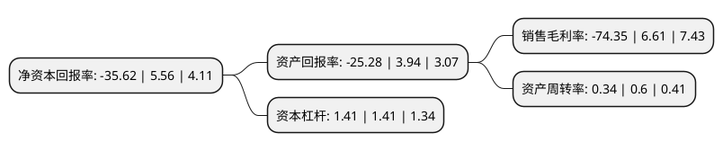

> 本页面由自动化程序生成于 2022年5月20日 01:12
> 内容可能存在错误，如有bug请提交issue至：https://github.com/Eroleice/doc-pi/issues
{.is-warning}

# 上市公司基本情况

## 基本资料

苏州恒久光电科技股份有限公司（以下简称“恒久科技”）成立于2002年03月27日，苏州市。于2016年08月12日在深交所中小板上市。

恒久科技注册资本26,880万元，主营业务是激光有机光导鼓(Organic Photo-Conductor Drum，简称“激光OPC鼓”)系列产品的研发，生产和销售业务。激光有机光导鼓是一类在激光的照射下能使光生载流子形成并迁移的新型高技术信息处理器件，是激光打印机，数码复印机，激光传真机及多功能一体机等现代办公设备中最为核心的光电转换及成像部件，直接决定打印，复印等影像输出的质量，是集现代功能材料，现代先进制造技术于一体的高集成，高附加值的有机光电子信息产品。以下是详细信息：

- 公司名称: 苏州恒久光电科技股份有限公司
- 股票代码: 002808.SZ
- 所在地: 江苏 - 苏州市
- 成立日期: 2002年03月27日
- 注册资本: 26,880万元
- 法定代表人: 余荣清
- 主营业务: 主营业务是激光有机光导鼓(Organic Photo-Conductor Drum，简称“激光OPC鼓”)系列产品的研发，生产和销售业务激光有机光导鼓是一类在激光的照射下能使光生载流子形成并迁移的新型高技术信息处理器件，是激光打印机，数码复印机，激光传真机及多功能一体机等现代办公设备中最为核心的光电转换及成像部件，直接决定打印，复印等影像输出的质量，是集现代功能材料，现代先进制造技术于一体的高集成，高附加值的有机光电子信息产品
- 公司官网: www.sgt21.com
- 公司介绍: 公司是一家以留学归国博士为核心组建的高新技术企业，专业研制及生产新一代激光打印机、数码复印机、激光传真机及多功能信息一体机等现代办公设备中最为核心的光电转换及成像器件——激光光导鼓(OrganicPhoto-ConductorDrum,简称OPC鼓)。经过自主研发和集成创新，公司掌握并拥有生产激光OPC鼓整套核心技术和装备集成能力，首次在国内建成了具有完全自主知识产权的高度自动化生产线及相关技术装备，实现了激光光导鼓的国产化与产业化。公司研制生产的激光光导鼓获得“高新技术产品”证书，并通过国家信息产业部组织的部级技术鉴定。公司被国家认定为“高新技术企业”，申请了多项国家专利，拥有有效授权专利十多项，并受邀参与了三项国家标准的制订工作。多项科研成果获得苏州市科技进步一等奖和江苏省科技进步二等奖，并得到包括国家电子发展基金、国家创新基金、江苏省科技成果转化基金在内的多项科技攻关项目支持。公司已培养建立了一支包括海外归国博士、“863”项目专家教授及高级工程师、工程师在内的核心技术团队，并与国内外相关高校和科研机构广泛开展“产学研”合作，不断强化自身技术优势，积极为未来发展进行技术储备。

## 股东及高管情况

上市公司第一大股东为余荣清，持股87,420,512股，占比32.52%，为上市公司实际控制人。

截至2022年03月31日，上市公司的前十大股东中，共有9名自然人股东，1名机构股东，其中5%以上大股东共有3名。上市公司前十大股东明细如下：

> 截至2022年03月31日，上市公司前十大股东信息如下：

| 股东名称 | 持股数量（股） | 持股比例 |
| --- | --- | --- |
| 余荣清 | 87,420,512 | 32.52% |
| 兰山英 | 19,592,534 | 7.29% |
| 佘虹达 | 13,500,000 | 5.02% |
| 苏州恒久荣盛科技投资有限公司 | 13,156,266 | 4.89% |
| 雷刚 | 4,050,000 | 1.51% |
| 常鑫民 | 3,828,796 | 1.42% |
| 余仲清 | 2,938,880 | 1.09% |
| 孙忠良 | 1,836,800 | 0.68% |
| 刘瑜 | 1,648,600 | 0.61% |
| 王成华 | 1,460,700 | 0.54% |

## 利润表分析

上市公司2021年总收入为2.37亿元，净利润为-1.77亿元，**未实现盈利**。

## 杜邦分析

> 数据列示周期：2021年 | 2020年 | 2019年
{.is-info}

上市公司的净资产收益率在近一年有所下降，下降幅度为-740.65%，其变化情况分解如下：
- 上市公司的销售毛利率在近一年下降了-1224.81%，可能是生产效率的下降、商品原材料价格上涨或商品价格的下跌所致。
- 上市公司的资产周转率在近一年下降了-43.33%，可能是源自于更慢的销售回款或库存管理效果下降。
- 上市公司的财务杠杆比率在近一年下降了0%，可能是减少负债降低财务费用。

