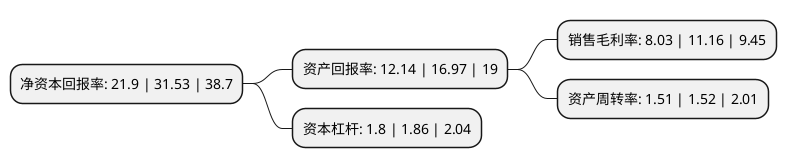

> 本页面由自动化程序生成于 2022年5月20日 01:12
> 内容可能存在错误，如有bug请提交issue至：https://github.com/Eroleice/doc-pi/issues
{.is-warning}

# 上市公司基本情况

## 基本资料

广州视源电子科技股份有限公司（以下简称“视源股份”）成立于2005年12月28日，广州市。于2017年01月19日在深交所中小板上市。

视源股份注册资本66,654.971万元，主营业务为液晶显示主控板卡，交互智能平板，移动智能终端等电子类产品的设计，研发和销售。主要产品包括液晶显示主控板卡，交互智能平板，移动智能终端等。以下是详细信息：

- 公司名称: 广州视源电子科技股份有限公司
- 股票代码: 002841.SZ
- 所在地: 广东 - 广州市
- 成立日期: 2005年12月28日
- 注册资本: 66,654.971万元
- 法定代表人: 王毅然
- 主营业务: 主营业务为液晶显示主控板卡，交互智能平板，移动智能终端等电子类产品的设计，研发和销售主要产品包括液晶显示主控板卡，交互智能平板，移动智能终端等
- 公司官网: www.cvte.com
- 公司介绍: 公司主营业务方向为液晶显示主控板卡、工业电源、交互智能平板、移动智能终端和医疗等产品的设计、研发和销售，旗下有两个品牌，一个是教育信息化应用工具提供商希沃(seewo)，一个是高效会议平台MAXHUB。公司始终致力于提升电子产品更加丰富与高效的信息沟通体验，依托在显示驱动、信号处理、电源管理、人机交互、应用开发、系统集成等技术领域的开发经验，面向应用层面进行资源整合与产品开发，通过技术创新不断延伸和丰富产品结构，产品已广泛应用于消费电子领域和商用电子领域。公司作为高科技企业，对研发和创新的投入亦是重点，拥有多个综合实验室，如投资千万建造的EMC实验室。通过多年的努力，公司目前已获得高新技术企业、国家知识产权示范企业、广东省第一批战略性新兴产业骨干培育企业、广东省创新型企业、广东省工程技术研究开发中心等资质认证，同时也是海关认定的AA类报关企业。

## 股东及高管情况

上市公司第一大股东为黄正聪，持股77,616,000股，占比11.64%，**疑似为**上市公司实际控制人。

截至2022年03月31日，上市公司的前十大股东中，共有9名自然人股东，1名机构股东，其中5%以上大股东共有5名。上市公司前十大股东明细如下：

> 未能通过持股比例判定出上市公司实际控制人（持股30%以上）
> 可能存在通过间接持股、联合持股、协议控制等方式拥有实际控制权的主体，具体请参考上市公司定期公告！
{.is-warning}

> 截至2022年03月31日，上市公司前十大股东信息如下：

| 股东名称 | 持股数量（股） | 持股比例 |
| --- | --- | --- |
| 黄正聪 | 77,616,000 | 11.64% |
| 王毅然 | 75,856,000 | 11.38% |
| 孙永辉 | 75,275,200 | 11.29% |
| 于伟 | 36,960,000 | 5.54% |
| 周开琪 | 34,636,800 | 5.2% |
| 尤天远 | 27,280,000 | 4.09% |
| 云南视迅企业管理有限公司 | 24,750,000 | 3.71% |
| 吴彩平 | 18,420,009 | 2.76% |
| 任锐 | 16,896,000 | 2.53% |
| 方掀 | 16,082,000 | 2.41% |

## 利润表分析

上市公司2021年总收入为212.25亿元，净利润为17.03亿元，实现盈利。

## 杜邦分析

> 数据列示周期：2021年 | 2020年 | 2019年
{.is-info}

上市公司的净资产收益率在近一年有所下降，下降幅度为-30.54%，其变化情况分解如下：
- 上市公司的销售毛利率在近一年下降了-28.05%，可能是生产效率的下降、商品原材料价格上涨或商品价格的下跌所致。
- 上市公司的资产周转率在近一年下降了-0.66%，可能是源自于更慢的销售回款或库存管理效果下降。
- 上市公司的财务杠杆比率在近一年下降了-3.23%，可能是减少负债降低财务费用。

