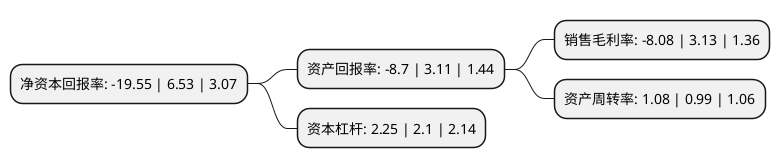

> 本页面由自动化程序生成于 2022年5月20日 01:12
> 内容可能存在错误，如有bug请提交issue至：https://github.com/Eroleice/doc-pi/issues
{.is-warning}

# 上市公司基本情况

## 基本资料

东莞捷荣技术股份有限公司（以下简称“捷荣技术”）成立于2007年09月25日，东莞市。于2017年03月21日在深交所中小板上市。

捷荣技术注册资本25,061.24万元，主营业务为非金属制品模具，精冲模，精密型腔模，模具标准件，手机外壳，塑胶五金制品等产品的设计与制造。主要产品包括精密模具，手机精密结构件，其他精密结构件等。以下是详细信息：

- 公司名称: 东莞捷荣技术股份有限公司
- 股票代码: 002855.SZ
- 所在地: 广东 - 东莞市
- 成立日期: 2007年09月25日
- 注册资本: 25,061.24万元
- 法定代表人: 郑杰
- 主营业务: 主营业务为非金属制品模具，精冲模，精密型腔模，模具标准件，手机外壳，塑胶五金制品等产品的设计与制造主要产品包括精密模具，手机精密结构件，其他精密结构件等
- 公司官网: www.chitwing.com
- 公司介绍: 公司主营业务为非金属制品模具、精冲模、精密型腔模、模具标准件、手机外壳、塑胶五金制品等产品的设计与制造，主要业务是为全球消费电子产品领域中最大类的手机、平板电脑、无线网卡等提供精密模具的开发制造与精密结构件产品的生产。公司自设立以来，主营业务未发生变化。经过公司多年的客户、技术积累，目前已经形成了以手机精密模具及结构件为主、其他精密模具及结构件为辅的营销客户体系；并结合消费电子市场的未来发展趋势，形成了模具新材料应用、表面处理新工艺为重点突破，模具加工自动化、产品生产精细化为重点的研发体系。

## 股东及高管情况

上市公司第一大股东为捷荣科技集团有限公司，持股126,000,000股，占比50.28%，为上市公司实际控制人。

截至2022年03月31日，上市公司的前十大股东中，共有7名自然人股东，3名机构股东，其中5%以上大股东共有2名。上市公司前十大股东明细如下：

> 截至2022年03月31日，上市公司前十大股东信息如下：

| 股东名称 | 持股数量（股） | 持股比例 |
| --- | --- | --- |
| 捷荣科技集团有限公司 | 126,000,000 | 50.28% |
| 捷荣汇盈投资管理(香港)有限公司 | 30,600,000 | 12.21% |
| 深圳长城开发科技股份有限公司 | 9,739,000 | 3.89% |
| 孙立 | 1,360,300 | 0.54% |
| 瞿建乐 | 900,000 | 0.36% |
| 卢斌 | 619,000 | 0.25% |
| 许斌 | 610,200 | 0.24% |
| 李莉 | 506,900 | 0.2% |
| 李玲 | 381,300 | 0.15% |
| 田玲娜 | 377,700 | 0.15% |

## 利润表分析

上市公司2021年总收入为30.91亿元，净利润为-2.5亿元，**未实现盈利**。

## 杜邦分析

> 数据列示周期：2021年 | 2020年 | 2019年
{.is-info}

上市公司的净资产收益率在近一年有所下降，下降幅度为-399.39%，其变化情况分解如下：
- 上市公司的销售毛利率在近一年下降了-358.15%，可能是生产效率的下降、商品原材料价格上涨或商品价格的下跌所致。
- 上市公司的资产周转率在近一年上升了9.09%，可能是源自于更快的销售回款或库存管理效果提升。
- 上市公司的财务杠杆比率在近一年上升了7.14%，可能是增加负债扩大生产规模。

