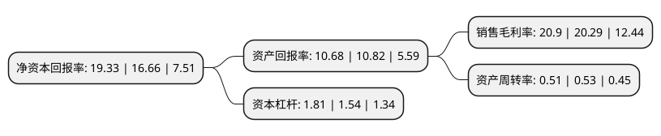

> 本页面由自动化程序生成于 2022年5月20日 01:12
> 内容可能存在错误，如有bug请提交issue至：https://github.com/Eroleice/doc-pi/issues
{.is-warning}

# 上市公司基本情况

## 基本资料

浙江洁美电子科技股份有限公司（以下简称“洁美科技”）成立于2001年04月09日，湖州市。于2017年04月07日在深交所中小板上市。

洁美科技注册资本41,002.096万元，主要产品:纸质载带，胶带，塑料载带等，其中纸质载带产品包括分切纸带，打孔纸带和压孔纸带(不打穿孔纸带)等，胶带产品包括上胶带，下胶带等。主营业务:电子元器件薄型载带的研发，生产和销售。以下是详细信息：

- 公司名称: 浙江洁美电子科技股份有限公司
- 股票代码: 002859.SZ
- 所在地: 浙江 - 湖州市
- 成立日期: 2001年04月09日
- 注册资本: 41,002.096万元
- 法定代表人: 方隽云
- 主营业务: 主要产品:纸质载带，胶带，塑料载带等，其中纸质载带产品包括分切纸带，打孔纸带和压孔纸带(不打穿孔纸带)等，胶带产品包括上胶带，下胶带等主营业务:电子元器件薄型载带的研发，生产和销售
- 公司官网: www.jmkj.com
- 公司介绍: 公司是一家专业为片式电子元器件(包括被动元件、分立器件、集成电路及LED)配套生产电子薄型载带、上下胶带、转移胶带(离型膜)等产品的企业，主要产品有分切纸带、打孔纸带、不打穿孔纸带、上下胶带、塑料载带及其配套盖带、塑料卷盘、转移胶带(离型膜)等，实现配套供应，可为客户提供薄型载带整体解决方案的集成供应商，多项产品拥有自主知识产权。公司拥有世界先进水平的生产线，包括2640宽幅纸机、SLT-250型分切机、打孔烧毛机、涂胶挤覆生产线、电子专用胶带分切设备、精密离型膜涂布生产线等，具备核心原材料垂直一体化的竞争优势，拥有从原纸制造到后端深加工的完整产业链。

## 股东及高管情况

上市公司第一大股东为浙江元龙股权投资管理集团有限公司，持股201,421,240股，占比49.12%，为上市公司实际控制人。

截至2022年03月31日，上市公司的前十大股东中，共有1名自然人股东，4名机构股东，3个产品账户，1个海外主体，1名其他股东，其中5%以上大股东共有1名。上市公司前十大股东明细如下：

> 截至2022年03月31日，上市公司前十大股东信息如下：

| 股东名称 | 持股数量（股） | 持股比例 |
| --- | --- | --- |
| 浙江元龙股权投资管理集团有限公司 | 201,421,240 | 49.12% |
| 香港中央结算有限公司(陆股通) | 10,390,411 | 2.53% |
| 方隽云 | 9,292,336 | 2.27% |
| 安吉百顺投资合伙企业(有限合伙) | 6,896,527 | 1.68% |
| 招商银行股份有限公司-易方达丰华债券型证券投资基金 | 5,432,047 | 1.32% |
| 友邦人寿保险有限公司-分红 | 5,107,100 | 1.25% |
| 基本养老保险基金一六零二一组合 | 3,000,120 | 0.73% |
| 澳门金融管理局-自有资金 | 2,840,281 | 0.69% |
| 中国建设银行股份有限公司-富国天博创新主题混合型证券投资基金 | 2,682,500 | 0.65% |
| 友邦人寿保险有限公司-传统 | 2,497,400 | 0.61% |

## 利润表分析

上市公司2021年总收入为18.61亿元，净利润为3.88亿元，实现盈利。

## 杜邦分析

> 数据列示周期：2021年 | 2020年 | 2019年
{.is-info}

上市公司的净资产收益率在近一年有所上升，上升幅度为16.03%，其变化情况分解如下：
- 上市公司的销售毛利率在近一年上升了3.01%，可能是生产效率的提升、商品原材料价格下跌或商品价格的上涨所致。
- 上市公司的资产周转率在近一年下降了-3.77%，可能是源自于更慢的销售回款或库存管理效果下降。
- 上市公司的财务杠杆比率在近一年上升了17.53%，可能是增加负债扩大生产规模。

