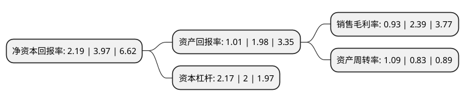

> 本页面由自动化程序生成于 2022年5月20日 01:13
> 内容可能存在错误，如有bug请提交issue至：https://github.com/Eroleice/doc-pi/issues
{.is-warning}

# 上市公司基本情况

## 基本资料

深圳市京泉华科技股份有限公司（以下简称“京泉华”）成立于1996年06月25日，深圳市。于2017年06月27日在深交所中小板上市。

京泉华注册资本18,000万元，主营业务:磁性元器件，电源及特种变压器研发，生产及销售业务;主要产品:高频变压器，低频变压器，适配器电源，裸板电源，光伏逆变电源，数字电源，三相变压器，特种电抗器等。以下是详细信息：

- 公司名称: 深圳市京泉华科技股份有限公司
- 股票代码: 002885.SZ
- 所在地: 广东 - 深圳市
- 成立日期: 1996年06月25日
- 注册资本: 18,000万元
- 法定代表人: 张立品
- 主营业务: 主营业务:磁性元器件，电源及特种变压器研发，生产及销售业务;主要产品:高频变压器，低频变压器，适配器电源，裸板电源，光伏逆变电源，数字电源，三相变压器，特种电抗器等
- 公司官网: www.everrise.net
- 公司介绍: 公司专注于电子元器件行业，主要从事磁性元器件、电源及特种变压器研发、生产及销售业务。公司主要产品包括高频变压器、低频变压器、适配器电源、裸板电源、光伏逆变电源、数字电源、三相变压器、特种电抗器等。公司的产品广泛应用于家用电器、消费电子、UPS电源应用、LED照明、通信、光伏发电等领域，主要客户包括施耐德集团、富士康集团、松下集团、GE集团、伊顿集团、ABB集团、霍尼韦尔集团、格力集团、华为等国内外知名企业。公司以磁性元器件生产为基础，以电源及特种变压器同步开发为特色，形成了可靠性高、质量稳定、技术先进、应用领域广泛、规格品种齐全的产品线。随着技术水平和综合实力的不断提高，已建立了较为成熟的研发和销售团队，积累了丰富的开发、设计、生产和销售的经验，并在技术研发能力、产品质量、优质的客户资源、TPM管理及持续优化创新和快速市场反应等方面拥有较大优势，目前已发展成为国内磁性元器件和电源行业具有领先竞争优势和品牌影响力的专业供应商。

## 股东及高管情况

上市公司第一大股东为张立品，持股35,874,799股，占比19.93%，**疑似为**上市公司实际控制人。

截至2022年03月31日，上市公司的前十大股东中，共有7名自然人股东，1名机构股东，2个产品账户，其中5%以上大股东共有2名。上市公司前十大股东明细如下：

> 未能通过持股比例判定出上市公司实际控制人（持股30%以上）
> 可能存在通过间接持股、联合持股、协议控制等方式拥有实际控制权的主体，具体请参考上市公司定期公告！
{.is-warning}

> 截至2022年03月31日，上市公司前十大股东信息如下：

| 股东名称 | 持股数量（股） | 持股比例 |
| --- | --- | --- |
| 张立品 | 35,874,799 | 19.93% |
| 深圳远致富海高新投资企业(有限合伙) | 26,220,766 | 14.57% |
| 汪兆华 | 7,792,580 | 4.33% |
| 张礼扬 | 7,593,750 | 4.22% |
| 鞠万金 | 6,874,380 | 3.82% |
| 程扬 | 6,874,345 | 3.82% |
| 窦晓月 | 5,793,750 | 3.22% |
| 李战功 | 2,953,590 | 1.64% |
| 中国农业银行股份有限公司-交银施罗德先进制造混合型证券投资基金 | 2,555,004 | 1.42% |
| 招商银行股份有限公司-交银施罗德均衡成长一年持有期混合型证券投资基金 | 2,500,800 | 1.39% |

## 利润表分析

上市公司2021年总收入为19.09亿元，净利润为0.17亿元，实现盈利。

## 杜邦分析

> 数据列示周期：2021年 | 2020年 | 2019年
{.is-info}

上市公司的净资产收益率在近一年有所下降，下降幅度为-44.84%，其变化情况分解如下：
- 上市公司的销售毛利率在近一年下降了-61.09%，可能是生产效率的下降、商品原材料价格上涨或商品价格的下跌所致。
- 上市公司的资产周转率在近一年上升了31.33%，可能是源自于更快的销售回款或库存管理效果提升。
- 上市公司的财务杠杆比率在近一年上升了8.5%，可能是增加负债扩大生产规模。

