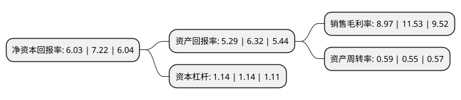

> 本页面由自动化程序生成于 2022年5月20日 01:13
> 内容可能存在错误，如有bug请提交issue至：https://github.com/Eroleice/doc-pi/issues
{.is-warning}

# 上市公司基本情况

## 基本资料

广州惠威电声科技股份有限公司（以下简称“惠威科技”）成立于1997年06月24日，广州市。于2017年07月21日在深交所中小板上市。

惠威科技注册资本14,961.168万元，主营业务:各类音响设备，扬声器的研发，生产和销售;主要产品:多媒体音响，家庭影院，专业音响，汽车音响，公共广播等。以下是详细信息：

- 公司名称: 广州惠威电声科技股份有限公司
- 股票代码: 002888.SZ
- 所在地: 广东 - 广州市
- 成立日期: 1997年06月24日
- 注册资本: 14,961.168万元
- 法定代表人: HONGBO YAO
- 主营业务: 主营业务:各类音响设备，扬声器的研发，生产和销售;主要产品:多媒体音响，家庭影院，专业音响，汽车音响，公共广播等
- 公司官网: www.hivi.com
- 公司介绍: 公司主要从事各类音响设备、扬声器的研发、生产和销售，拥有从扬声器单元、音响到各类电声产品的完整产业链。公司经过20年的发展，将电声科技结合精密制造技术，已成为全球知名的高级音响制造公司。公司产品定位以中高端为主，拥有核心品牌“惠威”、“HiVi”，自设立以来一直专注于各类音响产品的研发，不断丰富和扩充产品种类和系列，主要有多媒体音响、公共广播、家庭影院、专业音响、汽车音响等。多年的深厚技术积淀使得公司产品多次获得美国国际消费电子展(CES)创新与工程设计大奖；公司各细分系列产品拥有较高的市场评价，获得了数个细分领域的奖项。公司的“HiVi惠威”品牌产品荣获“广东省名牌产品”。

## 股东及高管情况

上市公司第一大股东为HONGBO YAO，持股93,923,539股，占比62.78%，为上市公司实际控制人。

截至2022年03月31日，上市公司的前十大股东中，共有2名自然人股东，3名机构股东，3个产品账户，2个海外主体，其中5%以上大股东共有1名。上市公司前十大股东明细如下：

> 截至2022年03月31日，上市公司前十大股东信息如下：

| 股东名称 | 持股数量（股） | 持股比例 |
| --- | --- | --- |
| HONGBO YAO | 93,923,539 | 62.78% |
| HUIFANG CHEN | 5,302,800 | 3.54% |
| 广州惠威电声科技股份有限公司回购专用证券账户 | 1,866,660 | 1.25% |
| 招商信诺人寿保险有限公司-分红保险产品 | 1,409,080 | 0.94% |
| 广州耀琪商务咨询有限公司 | 1,402,560 | 0.94% |
| 广州卓茂企业管理咨询有限公司 | 593,280 | 0.4% |
| 广州安洪盈企业管理咨询有限公司 | 565,620 | 0.38% |
| 中国工商银行股份有限公司-大成中证360互联网+大数据100指数型证券投资基金 | 457,960 | 0.31% |
| 陈峰 | 444,140 | 0.3% |
| 蔡志刚 | 431,287 | 0.29% |

## 利润表分析

上市公司2021年总收入为2.89亿元，净利润为0.25亿元，实现盈利。

## 杜邦分析

> 数据列示周期：2021年 | 2020年 | 2019年
{.is-info}

上市公司的净资产收益率在近一年有所下降，下降幅度为-16.48%，其变化情况分解如下：
- 上市公司的销售毛利率在近一年下降了-22.2%，可能是生产效率的下降、商品原材料价格上涨或商品价格的下跌所致。
- 上市公司的资产周转率在近一年上升了7.27%，可能是源自于更快的销售回款或库存管理效果提升。
- 上市公司的财务杠杆比率在近一年下降了0%，可能是减少负债降低财务费用。

