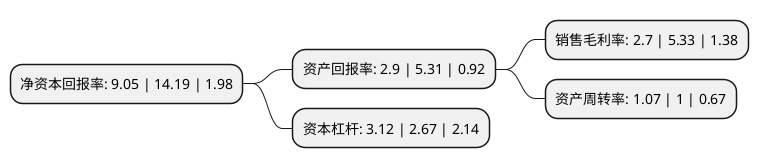

> 本页面由自动化程序生成于 2022年5月20日 01:13
> 内容可能存在错误，如有bug请提交issue至：https://github.com/Eroleice/doc-pi/issues
{.is-warning}

# 上市公司基本情况

## 基本资料

温州意华接插件股份有限公司（以下简称“意华股份”）成立于1995年12月23日，温州市。于2017年09月07日在深交所中小板上市。

意华股份注册资本17,067.2万元，主要业务:以通讯为主的连接器及其组件产品研发，生产和销售，为客户提供完善的互连产品应用解决方案。主营产品:包括应用于数据通信领域的RJ系列连接器产品和SFP，SFP+系列高速连接器产品，应用于消费电子领域的USB，HDMI系列连接器产品，汽车连接器等其他连接器及组件产品。以下是详细信息：

- 公司名称: 温州意华接插件股份有限公司
- 股票代码: 002897.SZ
- 所在地: 浙江 - 温州市
- 成立日期: 1995年12月23日
- 注册资本: 17,067.2万元
- 法定代表人: 蔡胜才
- 主营业务: 以通讯为主的连接器及其组件产品研发，生产和销售，为客户提供完善的互连产品应用解决方案主营产品:包括应用于数据通信领域的RJ系列连接器产品和SFP，SFP+系列高速连接器产品，应用于消费电子领域的USB，HDMI系列连接器产品，汽车连接器等其他连接器及组件产品
- 公司官网: www.czt.cn
- 公司介绍: 公司是一家专注于以通讯为主的连接器及其组件产品研发、生产和销售的企业，为客户提供完善的互连产品应用解决方案。在传统RJ类通讯连接器领域，公司凭借成熟的产品开发及生产经验、优秀的产品品质及供货能力，综合实力位居国内行业前列；在高速通讯连接器领域，公司把握行业发展先机，技术研发和生产均处于行业领先地位；同时凭借通讯连接器领域积累的客户资源与技术优势，公司不断加强对消费电子连接器产品的拓展与提升，并对汽车等其他连接器领域进行战略布局，进一步完善公司产品线，延伸产品应用领域及销售市场。公司的互连产品已进入网路及网路设备、光电通讯网路及设备、消费电子产品、云计算及大数据设备等行业，主要包括应用于数据通信领域的RJ系列连接器产品和SFP、SFP+系列高速连接器产品，应用于消费电子领域的USB、HDMI系列连接器产品，汽车连接器等其他连接器及组件产品。公司产品已通过ISO9001、TS16949、ISO14001及QC080000等国际国内标准体系认证，具备较强的国际竞争力。

## 股东及高管情况

上市公司第一大股东为意华控股集团有限公司，持股76,706,594股，占比44.94%，为上市公司实际控制人。

截至2022年03月31日，上市公司的前十大股东中，共有4名自然人股东，2名机构股东，4个产品账户，其中5%以上大股东共有1名。上市公司前十大股东明细如下：

> 截至2022年03月31日，上市公司前十大股东信息如下：

| 股东名称 | 持股数量（股） | 持股比例 |
| --- | --- | --- |
| 意华控股集团有限公司 | 76,706,594 | 44.94% |
| 招商证券股份有限公司-建信中小盘先锋股票型证券投资基金 | 4,423,579 | 2.59% |
| 方建斌 | 4,174,859 | 2.45% |
| 陈献孟 | 3,629,668 | 2.13% |
| 蒋友安 | 3,605,666 | 2.11% |
| 方建文 | 2,941,748 | 1.72% |
| 中国工商银行-建信优化配置混合型证券投资基金 | 2,772,708 | 1.62% |
| 爱仕达集团有限公司 | 2,167,254 | 1.27% |
| 中金公司-建设银行-中金新锐股票型集合资产管理计划 | 1,816,380 | 1.06% |
| 上海浦东发展银行股份有限公司-易方达瑞程灵活配置混合型证券投资基金 | 1,738,216 | 1.02% |

## 利润表分析

上市公司2021年总收入为44.89亿元，净利润为1.21亿元，实现盈利。

## 杜邦分析

> 数据列示周期：2021年 | 2020年 | 2019年
{.is-info}

上市公司的净资产收益率在近一年有所下降，下降幅度为-36.22%，其变化情况分解如下：
- 上市公司的销售毛利率在近一年下降了-49.34%，可能是生产效率的下降、商品原材料价格上涨或商品价格的下跌所致。
- 上市公司的资产周转率在近一年上升了7%，可能是源自于更快的销售回款或库存管理效果提升。
- 上市公司的财务杠杆比率在近一年上升了16.85%，可能是增加负债扩大生产规模。

