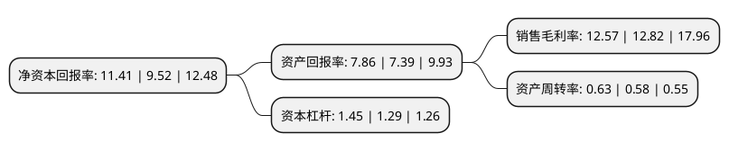

> 本页面由自动化程序生成于 2022年5月20日 01:13
> 内容可能存在错误，如有bug请提交issue至：https://github.com/Eroleice/doc-pi/issues
{.is-warning}

# 上市公司基本情况

## 基本资料

广东德生科技股份有限公司（以下简称“德生科技”）成立于1999年08月13日，广州市。于2017年10月20日在深交所中小板上市。

德生科技注册资本20,083.105万元，主要产品:包括社保卡，社保服务终端，社保信息化服务解决方案，身份证服务终端及解决方案等。主营业务:专业从事社保卡的生产，销售及信息化服务。以下是详细信息：

- 公司名称: 广东德生科技股份有限公司
- 股票代码: 002908.SZ
- 所在地: 广东 - 广州市
- 成立日期: 1999年08月13日
- 注册资本: 20,083.105万元
- 法定代表人: 虢晓彬
- 主营业务: 主要产品:包括社保卡，社保服务终端，社保信息化服务解决方案，身份证服务终端及解决方案等主营业务:专业从事社保卡的生产，销售及信息化服务
- 公司官网: www.e-tecsun.com
- 公司介绍: 公司是一家A股上市的高新技术企业，成立于1999年8月，主营业务为面向人社、就业、金融、医疗、大数据等领域提供信息系统建设和相关运营服务，涵盖社保(制发)卡、社保卡应用环境建设、基于社保卡应用的运营服务等综合信息技术服务，积极推进以城市为单位的人力资源与社会保障事业运营服务。公司已取得30余项国家专利，160余项著作权。20年来，公司在人社领域已经拥有较为全面的行业覆盖，业务已覆盖25个省份、150余个城市，服务群体过亿。凭借多年来深耕社保领域累积的客户和技术优势，公司提出了“以城市为单位，以服务推动应用”的理念，基于社保卡和人社业务需求，推动和创造各种与社保卡关联的应用场景，协助政府部门向企业和个人提供包括就业服务、补贴发放、即时补换卡等城市人力资源与社会保障事业运营服务。

## 股东及高管情况

上市公司第一大股东为虢晓彬，持股80,027,150股，占比36.31%，为上市公司实际控制人。

截至2022年05月06日，上市公司的前十大股东中，共有9名自然人股东，1个产品账户，其中5%以上大股东共有2名。上市公司前十大股东明细如下：

> 截至2022年05月06日，上市公司前十大股东信息如下：

| 股东名称 | 持股数量（股） | 持股比例 |
| --- | --- | --- |
| 虢晓彬 | 80,027,150 | 36.31% |
| 孙狂飙 | 18,601,050 | 8.44% |
| 李竹 | 1,672,000 | 0.76% |
| 余建华 | 1,355,700 | 0.62% |
| 刘峻峰 | 1,277,160 | 0.58% |
| 高敏 | 1,207,406 | 0.55% |
| 金洪庆 | 1,089,600 | 0.49% |
| 基本养老保险基金三零九组合 | 1,058,100 | 0.48% |
| 赖新颜 | 847,800 | 0.38% |
| 朱会东 | 845,184 | 0.38% |

## 利润表分析

上市公司2021年总收入为7.42亿元，净利润为0.93亿元，实现盈利。

## 杜邦分析

> 数据列示周期：2021年 | 2020年 | 2019年
{.is-info}

上市公司的净资产收益率在近一年有所上升，上升幅度为19.85%，其变化情况分解如下：
- 上市公司的销售毛利率在近一年下降了-1.95%，可能是生产效率的下降、商品原材料价格上涨或商品价格的下跌所致。
- 上市公司的资产周转率在近一年上升了8.62%，可能是源自于更快的销售回款或库存管理效果提升。
- 上市公司的财务杠杆比率在近一年上升了12.4%，可能是增加负债扩大生产规模。

