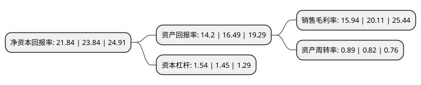

> 本页面由自动化程序生成于 2022年5月20日 01:13
> 内容可能存在错误，如有bug请提交issue至：https://github.com/Eroleice/doc-pi/issues
{.is-warning}

# 上市公司基本情况

## 基本资料

厦门盈趣科技股份有限公司（以下简称“盈趣科技”）成立于2011年05月24日，厦门市。于2018年01月15日在深交所中小板上市。

盈趣科技注册资本78,284.841万元，公司以自主创新的UDM模式(也称为ODM智能制造模式)为基础，主要为客户提供智能控制部件，创新消费电子等产品的研发，生产，并为中小型企业提供智能制造解决方案。以下是详细信息：

- 公司名称: 厦门盈趣科技股份有限公司
- 股票代码: 002925.SZ
- 所在地: 福建 - 厦门市
- 成立日期: 2011年05月24日
- 注册资本: 78,284.841万元
- 法定代表人: 林松华
- 主营业务: 公司以自主创新的UDM模式(也称为ODM智能制造模式)为基础，主要为客户提供智能控制部件，创新消费电子等产品的研发，生产，并为中小型企业提供智能制造解决方案
- 公司官网: www.intretech.com
- 公司介绍: 公司是万利达旗下公司，适应工业制造智能化、“互联网+”的发展趋势，公司以自主创新的UDM模式(也称为ODM智能制造模式)为基础，形成了高度信息化、自动化的智能制造体系，满足协同开发、定制服务、柔性生产、信息互联等综合服务需求，为客户提供智能控制部件、创新消费电子等产品的研发、生产，并为中小型企业提供智能制造解决方案。集特有的UDM业务模式优势、技术研发优势、智能制造优势、质量控制优势、客户优势及管理优势等于一身，公司为国际知名企业及科技型企业提供创新性强、可靠性高、一致性高的产品研发及制造服务。目前公司已与国际知名企业及科技型企业建立起全方位、深层次的战略合作关系。公司荣获“国家企业技术中心”、“国家技术创新示范企业”、“国家绿色供应链示范企业”、“国家工信部智能制造试点示范项目”、“国家级工业设计中心”、“国家高新技术企业”、“福建省工业互联与民用物联重点实验室”、“福建省服务型制造示范企业”、“福建省知识产权优势企业”、“福建省工业企业质量标杆”、“厦门市政府质量奖”等多项荣誉称号，并通过ISO/TS16949、CMMI-ML3等国际资质认证。

## 股东及高管情况

上市公司第一大股东为深圳万利达电子工业有限公司，持股382,026,400股，占比48.8%，为上市公司实际控制人。

截至2022年03月31日，上市公司的前十大股东中，共有1名自然人股东，4名机构股东，5个产品账户，其中5%以上大股东共有4名。上市公司前十大股东明细如下：

> 截至2022年03月31日，上市公司前十大股东信息如下：

| 股东名称 | 持股数量（股） | 持股比例 |
| --- | --- | --- |
| 深圳万利达电子工业有限公司 | 382,026,400 | 48.8% |
| 常州趣惠创业投资合伙企业(有限合伙) | 42,656,738 | 5.45% |
| 厦门赢得未来创业投资合伙企业(有限合伙) | 41,609,880 | 5.32% |
| 林松华 | 41,444,347 | 5.29% |
| 建瓯山坡松投资合伙企业(有限合伙) | 17,037,750 | 2.18% |
| 中国银行股份有限公司-嘉实价值精选股票型证券投资基金 | 16,759,438 | 2.14% |
| 全国社保基金一零三组合 | 13,306,553 | 1.7% |
| 招商银行股份有限公司-嘉实价值长青混合型证券投资基金 | 13,043,219 | 1.67% |
| 中国工商银行股份有限公司-东方红睿玺三年定期开放灵活配置混合型证券投资基金 | 11,138,889 | 1.42% |
| 中国银行股份有限公司-招商瑞文混合型证券投资基金 | 6,836,472 | 0.87% |

## 利润表分析

上市公司2021年总收入为70.6亿元，净利润为11.25亿元，实现盈利。

## 杜邦分析

> 数据列示周期：2021年 | 2020年 | 2019年
{.is-info}

上市公司的净资产收益率在近一年有所下降，下降幅度为-8.39%，其变化情况分解如下：
- 上市公司的销售毛利率在近一年下降了-20.74%，可能是生产效率的下降、商品原材料价格上涨或商品价格的下跌所致。
- 上市公司的资产周转率在近一年上升了8.54%，可能是源自于更快的销售回款或库存管理效果提升。
- 上市公司的财务杠杆比率在近一年上升了6.21%，可能是增加负债扩大生产规模。

