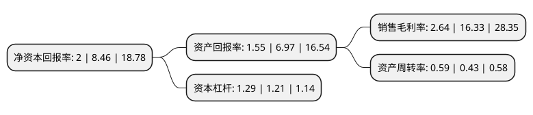

> 本页面由自动化程序生成于 2022年5月20日 01:13
> 内容可能存在错误，如有bug请提交issue至：https://github.com/Eroleice/doc-pi/issues
{.is-warning}

# 上市公司基本情况

## 基本资料

苏州恒铭达电子科技股份有限公司（以下简称“恒铭达”）成立于2011年07月27日，苏州市。于2019年02月01日在深交所中小板上市。

恒铭达注册资本22,889.397万元，主营业务:消费电子功能性器件，消费电子防护产品，消费电子外盒保护膜的设计，研发，生产与销售。主要产品为手机，平板电脑，笔记本电脑，智能穿戴设备等消费电子产品的精密功能性器件，具有非标准化，品种多，规格型号多，精密度高等特点，按照使用功能划分，主要包括粘贴，固定，屏蔽，绝缘，缓冲，散热，防尘，防护等功能性器件。以下是详细信息：

- 公司名称: 苏州恒铭达电子科技股份有限公司
- 股票代码: 002947.SZ
- 所在地: 江苏 - 苏州市
- 成立日期: 2011年07月27日
- 注册资本: 22,889.397万元
- 法定代表人: 荆天平
- 主营业务: 主营业务:消费电子功能性器件，消费电子防护产品，消费电子外盒保护膜的设计，研发，生产与销售主要产品为手机，平板电脑，笔记本电脑，智能穿戴设备等消费电子产品的精密功能性器件，具有非标准化，品种多，规格型号多，精密度高等特点，按照使用功能划分，主要包括粘贴，固定，屏蔽，绝缘，缓冲，散热，防尘，防护等功能性器件
- 公司官网: www.hengmingda.com
- 公司介绍: 公司是一家专业为消费电子产品提供高附加值精密功能性器件的科技企业，凭借在消费电子功能性器件领域的技术研发优势、丰富的生产经验、创新的生产工艺、高精密与高品质的产品及快速响应能力，能够参与终端品牌客户产品的设计、研发环节，为客户提供功能性器件的设计研发、材料选型、产品试制和测试、批量生产、及时配送、后续跟踪服务等一体化综合解决方案;为国家高新技术企业，拥有6项发明专利，27项实用新型专利。公司具有自主研发与自主改进设备、自主研发自动化控制系统与OEE生产管理系统、快速响应客户需求的能力。通过不断改进生产设备，优化精密模具设计，创新工艺流程，公司实现了原材料复合、模切、转贴、排废等多种工艺流程的一体化作业，有效提高了设备的生产效率、原材料的利用率及产品良率，降低了生产成本，提高了产品品质与市场竞争力。

## 股东及高管情况

上市公司第一大股东为荆世平，持股78,461,331股，占比34.28%，为上市公司实际控制人。

截至2022年03月31日，上市公司的前十大股东中，共有5名自然人股东，3名机构股东，2个产品账户，其中5%以上大股东共有2名。上市公司前十大股东明细如下：

> 截至2022年03月31日，上市公司前十大股东信息如下：

| 股东名称 | 持股数量（股） | 持股比例 |
| --- | --- | --- |
| 荆世平 | 78,461,331 | 34.28% |
| 深圳市恒世达投资有限公司 | 13,520,000 | 5.91% |
| 中国工商银行股份有限公司-中欧价值智选回报混合型证券投资基金 | 10,764,790 | 4.7% |
| 夏琛 | 10,526,750 | 4.6% |
| 荆京平 | 8,788,250 | 3.84% |
| 上海崴城企业管理中心(有限合伙) | 4,500,363 | 1.97% |
| 深圳市恒世丰资产管理中心(有限合伙) | 4,056,000 | 1.77% |
| 平安银行股份有限公司-中欧新兴价值一年持有期混合型证券投资基金 | 2,799,963 | 1.22% |
| 荆江 | 2,568,455 | 1.12% |
| 吴玉娜 | 1,616,915 | 0.71% |

## 利润表分析

上市公司2021年总收入为11.3亿元，净利润为0.29亿元，实现盈利。

## 杜邦分析

> 数据列示周期：2021年 | 2020年 | 2019年
{.is-info}

上市公司的净资产收益率在近一年有所下降，下降幅度为-76.36%，其变化情况分解如下：
- 上市公司的销售毛利率在近一年下降了-83.83%，可能是生产效率的下降、商品原材料价格上涨或商品价格的下跌所致。
- 上市公司的资产周转率在近一年上升了37.21%，可能是源自于更快的销售回款或库存管理效果提升。
- 上市公司的财务杠杆比率在近一年上升了6.61%，可能是增加负债扩大生产规模。

