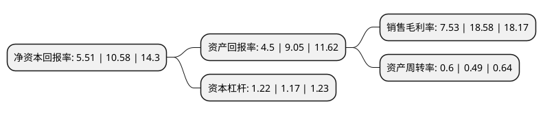

> 本页面由自动化程序生成于 2022年5月20日 01:13
> 内容可能存在错误，如有bug请提交issue至：https://github.com/Eroleice/doc-pi/issues
{.is-warning}

# 上市公司基本情况

## 基本资料

亚世光电(集团)股份有限公司（以下简称“亚世光电”）成立于2012年07月09日，鞍山市。于2019年03月28日在深交所中小板上市。

亚世光电注册资本16,434万元，液晶显示屏及模组的研发，生产和销售以下是详细信息：

- 公司名称: 亚世光电(集团)股份有限公司
- 股票代码: 002952.SZ
- 所在地: 辽宁 - 鞍山市
- 成立日期: 2012年07月09日
- 注册资本: 16,434万元
- 法定代表人: 贾继涛
- 主营业务: 液晶显示屏及模组的研发，生产和销售
- 公司官网: www.yes-lcd.com
- 公司介绍: 公司下设全资子公司亚世光电(鞍山)有限公司。公司属于国内液晶领域领先企业，拥有2条国际领先水平的液晶显示屏生产线和8条光电显示模组生产线。能够研发和生产高、中、低档各系列液晶显示产品，逐步具备了引领行业市场发展的产品研发能力。在TN/STN液晶显示屏及模组产品领域，公司凭借积累优秀的制造技术，在主要细分市场上具有明显的竞争优势，产品在行业内具有良好品牌效应和品质优势。公司具有完善、系统的组织架构及管理、技术、品质、生产、商务等各项管理体系，并能够按照公司发展需求进行不断的自我完善和自我提升。公司先后取得了ISO9000质量管理体系认证证书和ISO14000环境管理体系认证证书以及国际汽车工作组(IATF)ISO/TS16949质量管理体系认证，公司的质量管理体系符合所在行业一流公司的要求。公司于2014年10月22日获得高新技术企业证书，于2014年10月31日被授予辽宁省创新型中小企业称号。

## 股东及高管情况

上市公司第一大股东为亚世光电(香港)有限公司，持股60,223,500股，占比36.65%，为上市公司实际控制人。

截至2022年04月26日，上市公司的前十大股东中，共有8名自然人股东，1名机构股东，1个海外主体，其中5%以上大股东共有4名。上市公司前十大股东明细如下：

> 截至2022年04月26日，上市公司前十大股东信息如下：

| 股东名称 | 持股数量（股） | 持股比例 |
| --- | --- | --- |
| 亚世光电(香港)有限公司 | 60,223,500 | 36.65% |
| 边瑞群 | 22,761,000 | 13.85% |
| 林雪峰 | 20,879,983 | 12.71% |
| 解治刚 | 13,909,500 | 8.46% |
| JIA JITAO | 1,299,975 | 0.79% |
| 徐兴妹 | 428,300 | 0.26% |
| 邓招男 | 420,000 | 0.26% |
| 孙美燕 | 411,100 | 0.25% |
| 陈文军 | 368,850 | 0.22% |
| 苏仙凤 | 359,100 | 0.22% |

## 利润表分析

上市公司2021年总收入为6.1亿元，净利润为0.45亿元，实现盈利。

## 杜邦分析

> 数据列示周期：2021年 | 2020年 | 2019年
{.is-info}

上市公司的净资产收益率在近一年有所下降，下降幅度为-47.92%，其变化情况分解如下：
- 上市公司的销售毛利率在近一年下降了-59.47%，可能是生产效率的下降、商品原材料价格上涨或商品价格的下跌所致。
- 上市公司的资产周转率在近一年上升了22.45%，可能是源自于更快的销售回款或库存管理效果提升。
- 上市公司的财务杠杆比率在近一年上升了4.27%，可能是增加负债扩大生产规模。

