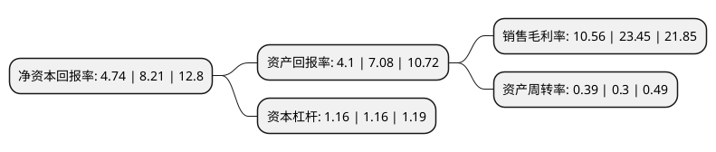

> 本页面由自动化程序生成于 2022年5月20日 01:13
> 内容可能存在错误，如有bug请提交issue至：https://github.com/Eroleice/doc-pi/issues
{.is-warning}

# 上市公司基本情况

## 基本资料

湖北五方光电股份有限公司（以下简称“五方光电”）成立于2012年06月11日，荆州市。于2019年09月17日在深交所中小板上市。

五方光电注册资本29,405.376万元，主营业务为精密光电薄膜元器件的研发，生产和销售。精密光电薄膜元器件包括红外截止滤光片(IRCF)，生物识别滤光片等。报告期内，公司的主要产品为红外截止滤光片。以下是详细信息：

- 公司名称: 湖北五方光电股份有限公司
- 股票代码: 002962.SZ
- 所在地: 湖北 - 荆州市
- 成立日期: 2012年06月11日
- 注册资本: 29,405.376万元
- 法定代表人: 廖彬斌
- 主营业务: 主营业务为精密光电薄膜元器件的研发，生产和销售精密光电薄膜元器件包括红外截止滤光片(IRCF)，生物识别滤光片等报告期内，公司的主要产品为红外截止滤光片
- 公司官网: www.w-olf.com
- 公司介绍: 公司成立于2012年6月11日，是一家专业光学镀膜产品制造商，主营业务为精密光电薄膜元器件的研发,生产和销售.精密光电薄膜元器件包括红外截止滤光片(IRCF),生物识别滤光片等.报告期内,公司的主要产品为红外截止滤光片.公司专注于高像素摄像头领域的镀膜技术创新，成为国内外各大知名手机品牌的核心供应商。先后首发了2000万像素及双摄像头的蓝玻璃组件产品。公司于2016年被评为国家级高新技术企业。公司拥有国家级发明及实用新型专利共50多项。

## 股东及高管情况

上市公司第一大股东为廖彬斌，持股82,954,368股，占比28.21%，**疑似为**上市公司实际控制人。

截至2022年03月31日，上市公司的前十大股东中，共有6名自然人股东，3名机构股东，1个产品账户，其中5%以上大股东共有3名。上市公司前十大股东明细如下：

> 未能通过持股比例判定出上市公司实际控制人（持股30%以上）
> 可能存在通过间接持股、联合持股、协议控制等方式拥有实际控制权的主体，具体请参考上市公司定期公告！
{.is-warning}

> 截至2022年03月31日，上市公司前十大股东信息如下：

| 股东名称 | 持股数量（股） | 持股比例 |
| --- | --- | --- |
| 廖彬斌 | 82,954,368 | 28.21% |
| 罗虹 | 25,750,084 | 8.76% |
| 魏蕾 | 18,952,992 | 6.45% |
| 荆州市五方群兴光电技术服务中心(有限合伙) | 14,333,760 | 4.87% |
| 奂微微 | 13,608,000 | 4.63% |
| 深圳市华信资本管理有限公司-深圳市恒鑫汇诚股权投资中心(有限合伙) | 6,912,000 | 2.35% |
| 湖北高金生物科技创业投资基金合伙企业(有限合伙) | 4,320,000 | 1.47% |
| 长江证券创新投资(湖北)有限公司 | 3,628,800 | 1.23% |
| 周红 | 3,377,400 | 1.15% |
| 刘峰 | 2,247,500 | 0.76% |

## 利润表分析

上市公司2021年总收入为7.88亿元，净利润为0.83亿元，实现盈利。

## 杜邦分析

> 数据列示周期：2021年 | 2020年 | 2019年
{.is-info}

上市公司的净资产收益率在近一年有所下降，下降幅度为-42.27%，其变化情况分解如下：
- 上市公司的销售毛利率在近一年下降了-54.97%，可能是生产效率的下降、商品原材料价格上涨或商品价格的下跌所致。
- 上市公司的资产周转率在近一年上升了30%，可能是源自于更快的销售回款或库存管理效果提升。
- 上市公司的财务杠杆比率在近一年下降了0%，可能是减少负债降低财务费用。

