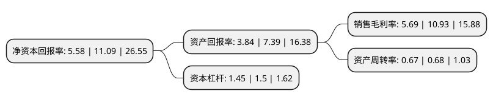

> 本页面由自动化程序生成于 2022年5月20日 01:13
> 内容可能存在错误，如有bug请提交issue至：https://github.com/Eroleice/doc-pi/issues
{.is-warning}

# 上市公司基本情况

## 基本资料

苏州瑞玛精密工业股份有限公司（以下简称“瑞玛精密”）成立于2012年03月22日，苏州市。于2020年03月06日在深交所中小板上市。

瑞玛精密注册资本12,000万元，主营业务:移动通信，汽车，电力电气等行业精密金属零部件及相应模具的研发，生产，销售。以下是详细信息：

- 公司名称: 苏州瑞玛精密工业股份有限公司
- 股票代码: 002976.SZ
- 所在地: 江苏 - 苏州市
- 成立日期: 2012年03月22日
- 注册资本: 12,000万元
- 法定代表人: 陈晓敏
- 主营业务: 主营业务:移动通信，汽车，电力电气等行业精密金属零部件及相应模具的研发，生产，销售
- 公司官网: www.cheersson.com
- 公司介绍: 公司是致力于通迅、电子、汽车、医疗等行业高精拉伸模具及金属冲压件的研发、制造与销售的先进企业。主要从事移动通信、汽车、电力电气等行业精密金属零部件及相应模具的研发、生产、销售，公司凭借研发实力及模具开发能力突出、成本管理能力较强、响应和服务速度快等优势，定位高端市场，不断优化客户和产品结构。公司积累了多项领先的核心技术，开发出适应下游行业小型化、轻量化、集成化发展趋势的产品，直接向诺基亚、爱立信、哈曼、采埃孚天合、敏实、大陆、麦格纳等国内外知名客户提供服务，依托这些大客户，公司业务实现较快增长，公司已通过多家知名的跨国移动通信主设备商、汽车零部件供应商和电子制造服务商的认证，并与之形成了长期稳定的合作关系。公司移动通信行业制造主要服务于诺基亚、爱立信两家全球移动通信主设备商以及伟创力、捷普、新美亚等知名电子制造服务商；汽车行业制造主要服务于敏实、哈曼、采埃孚天合、大陆、麦格纳等全球汽车零部件供应商百强企业。公司凭借优质的产品、快速的反应取得了采埃孚天合最佳交付奖、诺基亚铱金(Iridium)供应商等荣誉。

## 股东及高管情况

上市公司第一大股东为陈晓敏，持股67,998,096股，占比56.67%，为上市公司实际控制人。

截至2022年03月31日，上市公司的前十大股东中，共有9名自然人股东，1名机构股东，其中5%以上大股东共有3名。上市公司前十大股东明细如下：

> 截至2022年03月31日，上市公司前十大股东信息如下：

| 股东名称 | 持股数量（股） | 持股比例 |
| --- | --- | --- |
| 陈晓敏 | 67,998,096 | 56.67% |
| 翁荣荣 | 6,449,904 | 5.37% |
| 苏州工业园区众全信投资企业(有限合伙) | 6,175,800 | 5.15% |
| 鲁存聪 | 1,438,200 | 1.2% |
| 杨瑞义 | 1,269,000 | 1.06% |
| 麻国林 | 1,269,000 | 1.06% |
| 徐声波 | 1,077,400 | 0.9% |
| 王学谦 | 641,700 | 0.53% |
| 谭健 | 530,000 | 0.44% |
| 李京 | 500,000 | 0.42% |

## 利润表分析

上市公司2021年总收入为7.54亿元，净利润为0.42亿元，实现盈利。

## 杜邦分析

> 数据列示周期：2021年 | 2020年 | 2019年
{.is-info}

上市公司的净资产收益率在近一年有所下降，下降幅度为-49.68%，其变化情况分解如下：
- 上市公司的销售毛利率在近一年下降了-47.94%，可能是生产效率的下降、商品原材料价格上涨或商品价格的下跌所致。
- 上市公司的资产周转率在近一年下降了-1.47%，可能是源自于更慢的销售回款或库存管理效果下降。
- 上市公司的财务杠杆比率在近一年下降了-3.33%，可能是减少负债降低财务费用。

