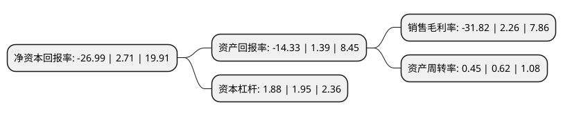

> 本页面由自动化程序生成于 2022年5月20日 01:13
> 内容可能存在错误，如有bug请提交issue至：https://github.com/Eroleice/doc-pi/issues
{.is-warning}

# 上市公司基本情况

## 基本资料

深圳市宝明科技股份有限公司（以下简称“宝明科技”）成立于2006年08月10日，深圳市。于2020年08月03日在深交所中小板上市。

宝明科技注册资本17,934.924万元，专业从事LED背光源和电容式触摸屏等新型平板显示器件的研发，设计，生产和销售，产品可广泛应用于智能手机，平板电脑，数码相机，车载显示器，医用显示仪，工控显示器等领域。以下是详细信息：

- 公司名称: 深圳市宝明科技股份有限公司
- 股票代码: 002992.SZ
- 所在地: 广东 - 深圳市
- 成立日期: 2006年08月10日
- 注册资本: 17,934.924万元
- 法定代表人: 李军
- 主营业务: 专业从事LED背光源和电容式触摸屏等新型平板显示器件的研发，设计，生产和销售，产品可广泛应用于智能手机，平板电脑，数码相机，车载显示器，医用显示仪，工控显示器等领域
- 公司官网: www.bmseiko.com
- 公司介绍: 公司是一家专业从事LED/CCFL背光源及触摸屏研发、生产和销售的高科技企业,专业从事LED背光源和电容式触摸屏等新型平板显示器件的研发、设计、生产和销售，已通过ISO9001:2000质量管理体系及ISO14000环境管理体系国际认证，并获得深圳市科技局颁发的“深圳市高新技术企业”证书.公司在产品研发、生产工艺、质量管理、供货能力等方面稳步提升至行业先进水平，获得下游客户的广泛认可，已进入京东方、天马、信利、华显光电、德普特、东山精密、立德通讯、深超光电、群创光电等知名企业的供应链体系，产品被应用于华为、小米、OPPO、vivo、三星等知名品牌的终端智能手机上。

## 股东及高管情况

上市公司第一大股东为深圳市宝明投资有限公司，持股55,068,000股，占比30.7%，为上市公司实际控制人。

截至2022年03月31日，上市公司的前十大股东中，共有6名自然人股东，4名机构股东，其中5%以上大股东共有2名。上市公司前十大股东明细如下：

> 截至2022年03月31日，上市公司前十大股东信息如下：

| 股东名称 | 持股数量（股） | 持股比例 |
| --- | --- | --- |
| 深圳市宝明投资有限公司 | 55,068,000 | 30.7% |
| 李军 | 21,320,000 | 11.89% |
| 李云龙 | 6,812,000 | 3.8% |
| 甘翠 | 6,240,000 | 3.48% |
| 深圳市汇利投资有限公司 | 6,196,204 | 3.45% |
| 刘刚 | 5,719,791 | 3.19% |
| 深圳市惠明投资有限公司 | 4,203,796 | 2.34% |
| 黄聿 | 4,160,000 | 2.32% |
| 天津年利丰创业投资合伙企业(有限合伙) | 3,835,043 | 2.14% |
| 张盛容 | 3,457,800 | 1.93% |

## 利润表分析

上市公司2021年总收入为11.15亿元，净利润为-3.55亿元，**未实现盈利**。

## 杜邦分析

> 数据列示周期：2021年 | 2020年 | 2019年
{.is-info}

上市公司的净资产收益率在近一年有所下降，下降幅度为-1095.94%，其变化情况分解如下：
- 上市公司的销售毛利率在近一年下降了-1507.96%，可能是生产效率的下降、商品原材料价格上涨或商品价格的下跌所致。
- 上市公司的资产周转率在近一年下降了-27.42%，可能是源自于更慢的销售回款或库存管理效果下降。
- 上市公司的财务杠杆比率在近一年下降了-3.59%，可能是减少负债降低财务费用。

