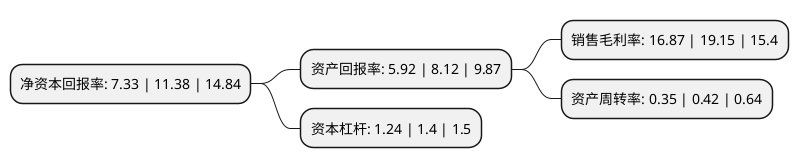

> 本页面由自动化程序生成于 2022年5月20日 01:13
> 内容可能存在错误，如有bug请提交issue至：https://github.com/Eroleice/doc-pi/issues
{.is-warning}

# 上市公司基本情况

## 基本资料

江苏日久光电股份有限公司（以下简称“日久光电”）成立于2010年01月12日，苏州市。于2020年10月21日在深交所中小板上市。

日久光电注册资本28,106.667万元，主要从事柔性光学导电材料的研发，生产和销售，主要产品为ITO导电膜，该产品为具有优异导电性能及光学性能的薄膜材料，是目前制备触摸屏等器件最常应用的高透光学导电膜材料。以下是详细信息：

- 公司名称: 江苏日久光电股份有限公司
- 股票代码: 003015.SZ
- 所在地: 江苏 - 苏州市
- 成立日期: 2010年01月12日
- 注册资本: 28,106.667万元
- 法定代表人: 陈超
- 主营业务: 主要从事柔性光学导电材料的研发，生产和销售，主要产品为ITO导电膜，该产品为具有优异导电性能及光学性能的薄膜材料，是目前制备触摸屏等器件最常应用的高透光学导电膜材料
- 公司官网: www.rnafilms.cn
- 公司介绍: 公司是国内柔性光学导电材料行业的领先公司之一，主要从事柔性光学导电材料的研发、生产和销售，并定制化开展相关功能性薄膜的研发和加工服务。公司目前的主要产品为ITO导电膜，该产品为具有优异导电性能及光学性能的薄膜材料，是目前制备触摸屏等器件最常应用的高透光学导电膜材料。产品可应用于各类触控方式的人机交互终端场景，包括消费电子、商用显示、工业控制、办公、教育等场景。公司通过精密涂布、精密贴合、磁控溅射等核心技术生产柔性光学导电材料及部分定制化产品，并销售给下游的触控模组厂商，通过各知名触控模组厂商客户实现对知名终端客户的覆盖。目前公司下游客户已覆盖合力泰、台冠科技、蓝思科技、南京华睿川、业际电子、信利光电、帝晶光电、骏达光电、贵州达沃斯、联创电子等触控模组厂商，终端客户包括华为、小米、传音、OPPO、联想、魅族、中兴、TCL等知名消费电子品牌及若干国外知名客户。公司为国家高新技术企业，并建有江苏省科技厅批复的江苏省光学导电薄膜工程技术研究中心。公司不断进行研发创新，致力于为各领域客户提供高品质的柔性光学导电材料产品。

## 股东及高管情况

上市公司第一大股东为陈超，持股43,735,444股，占比15.56%，**疑似为**上市公司实际控制人。

截至2022年03月31日，上市公司的前十大股东中，共有4名自然人股东，5名机构股东，1个产品账户，其中5%以上大股东共有2名。上市公司前十大股东明细如下：

> 未能通过持股比例判定出上市公司实际控制人（持股30%以上）
> 可能存在通过间接持股、联合持股、协议控制等方式拥有实际控制权的主体，具体请参考上市公司定期公告！
{.is-warning}

> 截至2022年03月31日，上市公司前十大股东信息如下：

| 股东名称 | 持股数量（股） | 持股比例 |
| --- | --- | --- |
| 陈超 | 43,735,444 | 15.56% |
| 陈晓俐 | 30,196,407 | 10.74% |
| 山东未来产业科技成果转化基金合伙企业(有限合伙) | 10,768,200 | 3.83% |
| 杭州通元优科创业投资合伙企业(有限合伙) | 8,000,000 | 2.85% |
| 昆山兴日投资管理中心(有限合伙) | 8,000,000 | 2.85% |
| 吕敬波 | 6,660,593 | 2.37% |
| 弘湾资本管理有限公司 | 6,000,000 | 2.13% |
| 宁波通元优博创业投资合伙企业(有限合伙) | 4,894,333 | 1.74% |
| 应奔 | 4,003,593 | 1.42% |
| 海宁海睿投资管理有限公司-海宁海睿产业投资合伙企业(有限合伙) | 4,000,000 | 1.42% |

## 利润表分析

上市公司2021年总收入为4.88亿元，净利润为0.82亿元，实现盈利。

## 杜邦分析

> 数据列示周期：2021年 | 2020年 | 2019年
{.is-info}

上市公司的净资产收益率在近一年有所下降，下降幅度为-35.59%，其变化情况分解如下：
- 上市公司的销售毛利率在近一年下降了-11.91%，可能是生产效率的下降、商品原材料价格上涨或商品价格的下跌所致。
- 上市公司的资产周转率在近一年下降了-16.67%，可能是源自于更慢的销售回款或库存管理效果下降。
- 上市公司的财务杠杆比率在近一年下降了-11.43%，可能是减少负债降低财务费用。

