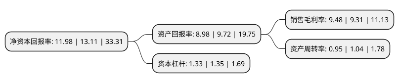

> 本页面由自动化程序生成于 2022年5月20日 01:14
> 内容可能存在错误，如有bug请提交issue至：https://github.com/Eroleice/doc-pi/issues
{.is-warning}

# 上市公司基本情况

## 基本资料

宸展光电(厦门)股份有限公司（以下简称“宸展光电”）成立于2015年04月14日，厦门市。于2020年11月17日在深交所中小板上市。

宸展光电注册资本12,800万元，主要产品包括智能交互显示器，智能交互一体机以及智能交互显示设备零部件。专注于定制化商用智能交互显示设备的研发，设计，生产和销售服务。以下是详细信息：

- 公司名称: 宸展光电(厦门)股份有限公司
- 股票代码: 003019.SZ
- 所在地: 福建 - 厦门市
- 成立日期: 2015年04月14日
- 注册资本: 12,800万元
- 法定代表人: 孙大明
- 主营业务: 主要产品包括智能交互显示器，智能交互一体机以及智能交互显示设备零部件专注于定制化商用智能交互显示设备的研发，设计，生产和销售服务
- 公司官网: www.tes-tec.com.cn
- 公司介绍: 公司是商用智能交互显示设备整体解决方案提供商，专注于定制化商用智能交互显示设备的研发、设计、生产和销售服务。公司产品主要包括智能交互显示器、智能交互一体机和智能交互显示设备零部件，广泛应用于零售、金融、工业自动化、医疗、餐饮、快递物流、游戏娱乐、交通运输、公共事业等终端领域。公司通过个性化的设计服务，能够满足上述领域客户对于产品广色域、色温、亮度、散热、防静电、防干扰、防强光、防误触摸、防尘、防水、抗暴性、防腐蚀等性能的需求，确保产品在各种环境下运行的稳定性、可靠性和耐久性。公司凭借业内领先的产品质量和服务水平，与Elo、NCR、Diebold、Mouse、Acrelec、长城信息、瑞迅、新北洋等国内外知名品牌商客户建立了长期、稳定的合作关系；公司产品目前已销往美洲、欧洲、亚洲等数十个国家及地区，得到了国内外客户的广泛认可。

## 股东及高管情况

上市公司第一大股东为IPC Management Limited，持股39,750,400股，占比31.06%，为上市公司实际控制人。

截至2022年05月13日，上市公司的前十大股东中，共有6名机构股东，1个产品账户，3个海外主体，其中5%以上大股东共有5名。上市公司前十大股东明细如下：

> 截至2022年05月13日，上市公司前十大股东信息如下：

| 股东名称 | 持股数量（股） | 持股比例 |
| --- | --- | --- |
| IPC Management Limited | 39,750,400 | 31.06% |
| IPC Management Limited | 39,750,400 | 31.06% |
| 松堡投資有限公司 | 13,209,500 | 10.32% |
| 松堡投資有限公司 | 13,120,000 | 10.25% |
| 中建投资本管理(天津)有限公司-嘉麟(天津)投资合伙企业(有限合伙) | 7,110,000 | 5.55% |
| LEGEND POINT INTERNATIONAL LTD | 6,362,600 | 4.97% |
| 厦门保生投资有限公司 | 3,590,000 | 2.8% |
| 北京鸿德世纪投资有限公司 | 3,520,000 | 2.75% |
| 中国工商银行股份有限公司-富国创新科技混合型证券投资基金 | 2,624,300 | 2.05% |
| 珠海横琴高立投资合伙企业(有限合伙) | 2,466,400 | 1.93% |

## 利润表分析

上市公司2021年总收入为15.92亿元，净利润为1.5亿元，实现盈利。

## 杜邦分析

> 数据列示周期：2021年 | 2020年 | 2019年
{.is-info}

上市公司的净资产收益率在近一年有所下降，下降幅度为-8.62%，其变化情况分解如下：
- 上市公司的销售毛利率在近一年上升了1.83%，可能是生产效率的提升、商品原材料价格下跌或商品价格的上涨所致。
- 上市公司的资产周转率在近一年下降了-8.65%，可能是源自于更慢的销售回款或库存管理效果下降。
- 上市公司的财务杠杆比率在近一年下降了-1.48%，可能是减少负债降低财务费用。

