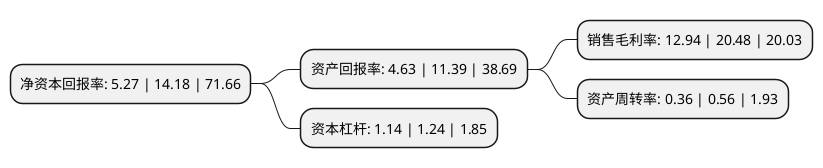

> 本页面由自动化程序生成于 2022年5月20日 01:14
> 内容可能存在错误，如有bug请提交issue至：https://github.com/Eroleice/doc-pi/issues
{.is-warning}

# 上市公司基本情况

## 基本资料

深圳市兆威机电股份有限公司（以下简称“兆威机电”）成立于2001年04月19日，深圳市。于2020年12月04日在深交所中小板上市。

兆威机电注册资本17,143.472万元，公司是一家专业从事微型传动系统，精密注塑件和精密模具的研发，生产与销售的高新技术企业，主要为通信设备，智能手机，汽车电子，智能家居，服务机器人，个人护理，医疗器械等诸多领域的客户提供定制化微型传动系统和精密注塑件。公司主要产品为微型传动系统，精密注塑件和精密模具等。以下是详细信息：

- 公司名称: 深圳市兆威机电股份有限公司
- 股票代码: 003021.SZ
- 所在地: 广东 - 深圳市
- 成立日期: 2001年04月19日
- 注册资本: 17,143.472万元
- 法定代表人: 李海周
- 主营业务: 公司是一家专业从事微型传动系统，精密注塑件和精密模具的研发，生产与销售的高新技术企业，主要为通信设备，智能手机，汽车电子，智能家居，服务机器人，个人护理，医疗器械等诸多领域的客户提供定制化微型传动系统和精密注塑件公司主要产品为微型传动系统，精密注塑件和精密模具等
- 公司官网: www.szzhaowei.net
- 公司介绍: 公司是一家专业从事微型传动系统、精密注塑件和精密模具的研发、生产与销售的高新技术企业，主要为通信设备、智能手机、汽车电子、智能家居、服务机器人、个人护理、医疗器械等诸多领域的客户提供定制化微型传动系统和精密注塑件。自成立以来，公司一直坚持自主创新，不断进行新产品、新技术的开发；同时，公司注重与高等院校、研究院等合作开展产学研项目，共同构建创新机制。公司拥有一支强大的专业技术团队，主要由一批长期从事微型传动系统研发和开发的工程师队伍组成，已形成从研发、设计、制造、装配到检测的系统性、全方位的人才队伍。公司主要研发人员均具有多年的微型传动行业从业经验，专业涵盖微型传动系统设计开发、精密模具设计与制造、精密注塑成型、自动化集成装配、齿轮精度检测和传动系统测试等领域，具有良好的理论技术基础和丰富的研发实践经验。

## 股东及高管情况

上市公司第一大股东为深圳前海兆威金融控股有限公司，持股60,800,000股，占比35.47%，为上市公司实际控制人。

截至2022年03月31日，上市公司的前十大股东中，共有1名自然人股东，3名机构股东，5个产品账户，1个海外主体，其中5%以上大股东共有4名。上市公司前十大股东明细如下：

> 截至2022年03月31日，上市公司前十大股东信息如下：

| 股东名称 | 持股数量（股） | 持股比例 |
| --- | --- | --- |
| 深圳前海兆威金融控股有限公司 | 60,800,000 | 35.47% |
| 李海周 | 31,184,000 | 18.19% |
| 共青城清墨投资管理合伙企业(有限合伙) | 17,600,000 | 10.27% |
| 共青城聚兆德投资管理合伙企业(有限合伙) | 17,600,000 | 10.27% |
| 中国人寿保险股份有限公司-传统-普通保险产品-005L-CT001深 | 1,971,698 | 1.15% |
| 兴业银行股份有限公司-富国兴远优选12个月持有期混合型证券投资基金 | 1,341,273 | 0.78% |
| 中国建设银行股份有限公司-博时主题行业混合型证券投资基金(LOF) | 1,223,820 | 0.71% |
| 香港中央结算有限公司(陆股通) | 1,193,008 | 0.7% |
| 全国社保基金一一四组合 | 996,948 | 0.58% |
| 中国人寿保险(集团)公司-传统-普通保险产品 | 912,304 | 0.53% |

## 利润表分析

上市公司2021年总收入为11.39亿元，净利润为1.47亿元，实现盈利。

## 杜邦分析

> 数据列示周期：2021年 | 2020年 | 2019年
{.is-info}

上市公司的净资产收益率在近一年有所下降，下降幅度为-62.83%，其变化情况分解如下：
- 上市公司的销售毛利率在近一年下降了-36.82%，可能是生产效率的下降、商品原材料价格上涨或商品价格的下跌所致。
- 上市公司的资产周转率在近一年下降了-35.71%，可能是源自于更慢的销售回款或库存管理效果下降。
- 上市公司的财务杠杆比率在近一年下降了-8.06%，可能是减少负债降低财务费用。

