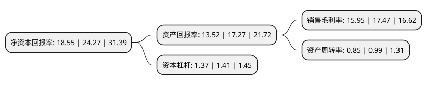

> 本页面由自动化程序生成于 2022年5月20日 01:14
> 内容可能存在错误，如有bug请提交issue至：https://github.com/Eroleice/doc-pi/issues
{.is-warning}

# 上市公司基本情况

## 基本资料

深圳市振邦智能科技股份有限公司（以下简称“振邦智能”）成立于1999年07月15日，深圳市。于2020年12月28日在深交所中小板上市。

振邦智能注册资本11,100.288万元，公司系行业内知名的高端智能控制器，变频驱动器，数字电源以及智能物联模块供应商，产品主要用于终端设备中的电能变换，控制及应用。以下是详细信息：

- 公司名称: 深圳市振邦智能科技股份有限公司
- 股票代码: 003028.SZ
- 所在地: 广东 - 深圳市
- 成立日期: 1999年07月15日
- 注册资本: 11,100.288万元
- 法定代表人: 陈志杰
- 主营业务: 公司系行业内知名的高端智能控制器，变频驱动器，数字电源以及智能物联模块供应商，产品主要用于终端设备中的电能变换，控制及应用
- 公司官网: www.genbytech.com
- 公司介绍: 公司是国家高新技术企业、深圳市自主创新百强中小企业、深圳市南山区领军企业。公司始终坚持以技术创新作为发展核心驱动力，积极发展高技术附加值、高品质附加值、节能环保、智能物联的产品，不断提升公司核心竞争力。公司研发中心拥有多个专业技术开发平台以及多个现代化实验室，建立了高效的研发组织架构和技术创新机制，培养了一批技术水平高、创新能力强、经验丰富的专业研发团队，形成了一系列先进的平台化技术，处于行业领先水平。2016年，公司“冰箱变频控制技术工程实验室”项目经深圳市政府批准，列入深圳市战略性新兴产业和未来产业发展专项资金扶持计划(节能环保产业类)；2018年，公司研发中心被广东省科技厅认定为嵌入式控制系统及电机变频控制器工程技术研究中心。

## 股东及高管情况

上市公司第一大股东为陈志杰，持股30,240,000股，占比27.24%，**疑似为**上市公司实际控制人。

截至2022年03月31日，上市公司的前十大股东中，共有7名自然人股东，2名机构股东，1个产品账户，其中5%以上大股东共有4名。上市公司前十大股东明细如下：

> 未能通过持股比例判定出上市公司实际控制人（持股30%以上）
> 可能存在通过间接持股、联合持股、协议控制等方式拥有实际控制权的主体，具体请参考上市公司定期公告！
{.is-warning}

> 截至2022年03月31日，上市公司前十大股东信息如下：

| 股东名称 | 持股数量（股） | 持股比例 |
| --- | --- | --- |
| 陈志杰 | 30,240,000 | 27.24% |
| 陈玮钰 | 29,484,000 | 26.56% |
| 唐娟 | 15,876,000 | 14.3% |
| 珠海国汇通管理咨询合伙企业(有限合伙) | 6,050,000 | 5.45% |
| 珠海中天智科管理咨询合伙企业(有限合伙) | 550,000 | 0.5% |
| 郭坚强 | 408,008 | 0.37% |
| 嘉实基金-国新投资有限公司-嘉实基金-国新2号单一资产管理计划 | 402,417 | 0.36% |
| 王贯虹 | 286,308 | 0.26% |
| 刘清 | 237,011 | 0.21% |
| 许辉 | 232,487 | 0.21% |

## 利润表分析

上市公司2021年总收入为13.17亿元，净利润为2.1亿元，实现盈利。

## 杜邦分析

> 数据列示周期：2021年 | 2020年 | 2019年
{.is-info}

上市公司的净资产收益率在近一年有所下降，下降幅度为-23.57%，其变化情况分解如下：
- 上市公司的销售毛利率在近一年下降了-8.7%，可能是生产效率的下降、商品原材料价格上涨或商品价格的下跌所致。
- 上市公司的资产周转率在近一年下降了-14.14%，可能是源自于更慢的销售回款或库存管理效果下降。
- 上市公司的财务杠杆比率在近一年下降了-2.84%，可能是减少负债降低财务费用。

